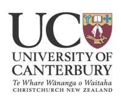

# AboutBestGrid

## Summary

`BG vignette`

BeSTGRID started in 2006 as a [Tertiary Education Commission](http://www.tec.govt.nz) Innovation and Development Fund Project 2006-2008, focused on how to create an eResearch (**[What is eResearch?](/wiki/spaces/BeSTGRID/pages/3818228586)**) ecosystem for New Zealand. This initial project completed successfully in March 2008. BeSTGRID carried on as a collegial community, providing leadership and coordinating operations of research infrastructure in New Zealand.

## Services

>  **Capture, storage and sharing of*data** - [Data theme](https://reannz.atlassian.net/wiki/pages/createpage.action?spaceKey=BeSTGRID&title=Category__Data%20Grid&linkCreation=true&fromPageId=3818228999)
>  ***Computational** processing, analysis and presentation of that data - [Computation theme](https://reannz.atlassian.net/wiki/pages/createpage.action?spaceKey=BeSTGRID&title=Category__Computational%20Grid&linkCreation=true&fromPageId=3818228999)
>  **Multi-discipline, multi-modal*collaboration** - [Collaboration theme](https://reannz.atlassian.net/wiki/pages/createpage.action?spaceKey=BeSTGRID&title=Category__Collaboration&linkCreation=true&fromPageId=3818228999)

## Members

- Founding Institutions

[University of Auckland](http://www.auckland.ac.nz), 

[University of Canterbury](http://www.canterbury.ac.nz), 

[Massey University](http://www.massey.ac.nz).

- Associate Institutions

Victoria University of Wellington

Auckland University of Technology

Otago University

Lincoln University

Waikato University

Landcare Research

## Partners

>  ***[Partner projects and applications](/wiki/spaces/BeSTGRID/pages/3818228898)**

- [Category__Projects](https://reannz.atlassian.net/wiki/pages/createpage.action?spaceKey=BeSTGRID&title=Category__Projects&linkCreation=true&fromPageId=3818228999)

## 15 min Video Summary

[A recorded 15min presentation](/wiki/spaces/BeSTGRID/pages/3818228660) by Paul Bonnington given at the KAREN “Building Communities for Collaboration” Conference early in July 2007 about the BeSTGRID project. It highlights some of the services and demonstrates how one can engage with the computational GRID.

## BeSTGRID

[From KAREN Case Study](http://www.karen.net.nz/bestgrid/)

The KAREN network is providing key infrastructure to enable the development of GRIDs* that support scientific research in New Zealand. 

BeSTGRID started as a project (Broadband enabled Science and Technology GRID) based collaboration between Auckland, Massey and Canterbury universities tasked with building three core GRIDs that together form a new platform for research collaboration in New Zealand:

>  ***[Collaboration](https://reannz.atlassian.net/wiki/pages/createpage.action?spaceKey=BeSTGRID&title=Category__Collaboration&linkCreation=true&fromPageId=3818228999)** tools for enhancing collaboration amongst participants in multiple locations with video-conferencing, shared whiteboards and presentations, visualization tools and project-based online communities,
>  ***[Data](https://reannz.atlassian.net/wiki/pages/createpage.action?spaceKey=BeSTGRID&title=Category__Data_Grid&linkCreation=true&fromPageId=3818228999)** tools and services which allow large amounts of data to be stored and made available in other locations, and
>  ***[Computational GRID](https://reannz.atlassian.net/wiki/pages/createpage.action?spaceKey=BeSTGRID&title=Category__Computational_Grid&linkCreation=true&fromPageId=3818228999)** which allows for the sharing of high-performance computational resources, initially between Auckland, Massey and Canterbury.

“A great deal of scientific research is now computational involving large amounts of data”, says Associate Professor Paul Bonnington, Inaugural Director of BeSTGRID and now Director of eResearch, Monash University in Melbourne. 

“It is based on simulations or data-matching which use large amounts of computer space and time. The plan is to link some of the computational resources of three universities so that they appear to be one big virtual computer with seamless access to the scientific data located across the universities, and tools that facilitate collaboration.”

## What are GRIDs?

[International Science GRID This Week Introduction to GRIDs](http://www.isgtw.org/?pid=1000550)

**A GRID “coordinates resources that are not subject to centralized control using standard, open, general-purpose protocols and Interfaces to deliver nontrivial qualities of service.” (Ian Foster)**

GRIDs are based on applying the resources of many computers in a network to a single problem at the same time. GRIDs may be used to store large amounts of data across different locations but accessible to each. They may be used for sharing computational resources, or for access, for example through video conferencing.

A well-known example of a computational GRID in the public domain is the ongoing SETI (Search for Extraterrestrial Intelligence) @Home project in which thousands of people are sharing the unused processor cycles of their PCs in the vast search for signs of "rational" signals from outer space.

Enabling GRIDs for Research

The functionality of GRIDs in New Zealand will be markedly improved with the introduction of KAREN, making them more suitable to scientific research through allowing research scientists to participate in virtual research communities (known as collaboratories), working together simultaneously, and sharing information on multiple screens.

Currently most GRID deployments face serious data scalability and latency issues leading to increased GRID processing times and low CPU utilisation. It is KAREN’s high bandwidth (allowing large data transfers) and low latency (making real time collaboration and conferencing possible) that enable GRIDs to work more effectively.

_*NOTOC*_
