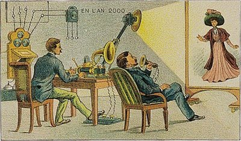
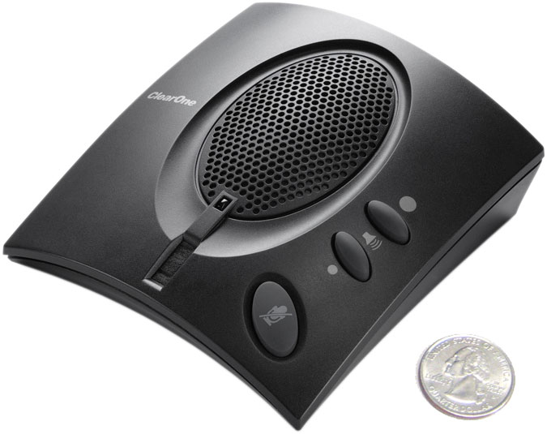
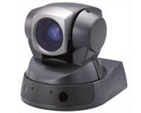

# Access GRID

# [Projects](https://reannz.atlassian.net/wiki/pages/createpage.action?spaceKey=BeSTGRID&title=Category__Projects&linkCreation=true&fromPageId=3816950472)

- [Mathematics](https://reannz.atlassian.net/wiki/pages/createpage.action?spaceKey=BeSTGRID&title=Category__Mathematics&linkCreation=true&fromPageId=3816950472)

[Secondary Mathematics Teachers Content Knowledge](/wiki/spaces/BeSTGRID/pages/3816950926)

# BeSTGRID Access GRID Equipment

- Access GRID Main site
[http://www.accessgrid.org](http://www.accessgrid.org)

## [BeSTGRID/Bioengineering Access GRID Node](https://reannz.atlassian.net/wiki/pages/createpage.action?spaceKey=BeSTGRID&title=BeSTGRID%2FBioengineering%20Access%20GRID%20Node&linkCreation=true&fromPageId=3816950472)

>  ***Status:** Fully Operational (June 2007)
>  ***Design** Graeme Glen
>  ***Operator** Stephen Poon
>  ***Location** 6th Floor 72 Symonds Street, Auckland

- [Further information](https://reannz.atlassian.net/wiki/pages/createpage.action?spaceKey=BeSTGRID&title=BeSTGRID%2FBioengineering%20Access%20GRID%20Node&linkCreation=true&fromPageId=3816950472)

## Proposed [School of Biological Sciences AccessGRID Node](/wiki/spaces/BeSTGRID/pages/3816950932)

>  ***Status:** Planning 2007
>  ***Design** Graeme Glen
>  ***Location** Mac1 Seminar Room, SBS, University of Auckland, Auckland

## [Event Setup procedure for portable AccessGRID nodes](/wiki/spaces/BeSTGRID/pages/3816950738)

## [BeSTGRID Portable Access Grid Node](/wiki/spaces/BeSTGRID/pages/3816950535)

>  ***Status:** Operational

## [Software Configuration for Portable Node](/wiki/spaces/BeSTGRID/pages/3816950602)

## [Access GRID sessions to UK sites](/wiki/spaces/BeSTGRID/pages/3816950471)

## [Advice on using unicast/multicast bridges](https://reannz.atlassian.net/wiki/pages/createpage.action?spaceKey=BeSTGRID&title=Advice%20on%20using%20unicast%2Fmulticast%20bridges&linkCreation=true&fromPageId=3816950472)

## [Advice and discussion on meeting protocols](/wiki/spaces/BeSTGRID/pages/3816950779)

### Suppliers and Specs

- TMC Computers/Playtech:
- **1** Shuttle XPC, Core 2 Duo 2.4GHz 4MB L2 Cache, 2*nVidia 7900DT cards, 2GB RAM, 160GB SATA HDD, DVD+/-RW DL, Wireless keyboard and mouse, Windows Home Ed OEM

- Dell Computers:
- **3** 24" Ultrasharp (Wide) LCD monitor

- [AVW](http://www.avw.co.nz/)
- **1** Clearone Chat50  

- **1** EVID100P Sony PAL camera 

- Ascent
- **1** D-Link DUB-T210, TV Tuner with Audio/Video Convertor MPEG 1/2/4, USB2
