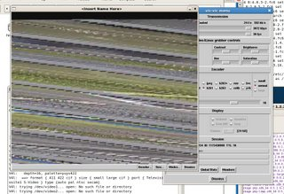

# AccessGrid Under Linux

# Required Software

- Python
- AccessGrid 2.4 or 3 RPMs or source
- Supporting C libraries
- Video for Linux drivers for camera OR
- Video for Linux 2 drivers for camera + patch to Vic software

## Python

AccessGrid is primarily built on Python, so requires that software, most of which is installed per-default with most Linux distributions, but also requires some supporting Python modules (usually packaged with the AccessGrid RPMs or source).

## AccessGrid 2.4

Note that the stand-alone AccessGrid 2.4 source and RPMs no longer work properly. If you wish to use AccessGrid 2.4, then it is better to install with AccessGrid 3. AccessGrid 2.4 is usually available as a module or package within AccessGrid 3.

## C Libraries

AccessGrid is not entirely built on Python. AccessGrid is a front end for the Vic and RAT programs, which are C programs with distributions for different operating systems (make sure that you have the Linux flavour if you are compiling from source). These programs are installed on your machine as part of AccessGrid, and some Linux distributions require some additional C libraries.

In order to find out which C libraries are missing, run Vic or RAT from the command line (AccessGrid should install a symbolic link in /usr/bin).

## Video4Linux Drivers

AccessGrid still uses an older version of the video client software, and will not properly interface with the v4linux2 drivers, which are required by most modern video capture hardware. If you get a video feed from your camera that looks like the image below then your camera is probably not supported by the Video for Linux 1 drivers.

In the case that your camera is not supported by the Video for Linux 1 drivers, it is possible to modify the Vic source code so that it will talk to the video4linux2 drivers; see [Hacking VIC to Use Video4Linux2](/wiki/spaces/BeSTGRID/pages/3816950489).

## Where to Download Software

AccessGrid 2.4 and 3 i386 and x86_64 RPMs for Fedora Core 3,4,5,6 [http://www.vislab.uq.edu.au/accessgrid3/fedora/](http://www.vislab.uq.edu.au/accessgrid3/fedora/).

AccessGrid 2.4 and 3 i386 and x86_64 Source Code for Fedora [http://www.vislab.uq.edu.au/accessgrid3/fedora/](http://www.vislab.uq.edu.au/accessgrid3/fedora/).

# Hardware Known to Work with Linux AccessGrid

## Audio Devices

- Any device connected to on-board audio. (e.g. Logitech headset w/microphone)

## Cameras

- Sony EVI D100P

# Hardware Known to Have Problems with Linux AccessGrid

## Audio Devices

- Any USB-connected audio device {ClearOne 50, Logitech Camera Mic}

# Notes For Specific Distributions

## Kubuntu Edgy Eft

No problems, works without additional setup.

Note that Kubuntu (KDE) uses ARTS for audio, which has no conflict with AccessGrid's RAT audio tool.

May require the hack to vic, in order to use video4linux2 drivers.

Although the AccessGrid RPMs and source are designed for Fedora, you can compile the source code to work with Kubuntu, or use alien[(recommended) to convert the RPMs to DEBs (Debian Packages). Note that alien is in the Ubuntu repositories, and can be installed with *apt-get install alien*.

## Fedora Core 4 and 5

Does not work 'out of the box', however, has been used extensively by Australian universities, who provide a large number of hacks and plugins for older versions of AccessGrid.

[http://www.ap-accessgrid.org/linux/rat/ Patch/Hack for RAT](http://packages.debian.org/stable/admin/alien)] source to allow AccessGrid to use ALSA drivers.

[Hack/Guide for vic](http://www.itee.uq.edu.au/%7Egrangenet/vic_v4l2/) source to allow use of video4linux2 drivers.

## Fedora Core 6

Fedora will not properly allow the use of a 'secondary' audio device for the sound system if you intend to use something other than the on-board audio.

To use a secondary audio device with FC6, you must disable the on-board audio in the system BIOS.

RAT may hang on startup, as it tries to connect to an internally-used IP address. Adjustment of iptables is usually necessary.

It should be possible to hack the RAT source in the same fashion as done for FC4 and FC5, but requires a huge amount of code - no solution yet.
