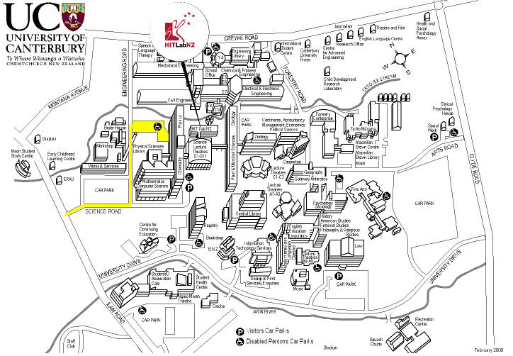

# Advanced Video Conferencing

_*NOTOC*_

# Advanced Video Conferencing

The demonstration facilities will enable trial connections between the University of Auckland and locations in Wellington and Christchurch, and will be open to businesses and representatives of local and regional government, and central government.

This is an opportunity to directly experience business use of high performance communication platforms, for example to engage with partners, suppliers, customers or a branch office.

## Demonstration Platforms

Three Advanced Video Conferencing platforms with be available:

***[LifeSize](http://www.lifesize.com)**: An easy-to-use, high definition video-conferencing system

***[EVO](evo-vignette.md)**: A desktop Web based collaboration platform for video, voice, screen sharing, and shared whiteboards

***Access-Grid**: A powerful collaboration platform for multiple site events, supporting presentations and interactive environments, including seminars and teaching.

## Presentations

The University of Auckland will offer three presentation sessions:

- Thursday, 15 March: 12:30 – 13:00

**Friday, 16 March: 12:30 – 13:30 *CANCELLED** 
- Tuesday, 20 March: 12:30 – 13:30

## Meeting Booking Arrangements

Bookings can be made by calling Simon Riley Ph: (021) 213 2050, simon@netimpact.co.nz

### Confirmed Bookings

**Thurs March 15:**

Auckland node private room is available from **12noon-5pm** only.

Note : 9- 12 noon Wellington Node Set up 

**12:30 Presentation**

Confirmations 

***Auckland**

- 
- Sukumar Verma Director of CLE Auckland District Law Society , Sukumar.Verma@adls.org.nz

***Wellington**

- 
- Gareth Gowan, Massey University , G.Gowan@massey.ac.nz

***Christchurch**

- 
- Irvine Paulin , NZ Trade & Enterprise, irvine.paulin@nzte.govt.nz
- Sue , Creative Logic,  sue@creativelogic.co.nz

Note: Auckland - Wellington Node only 

**Friday March 16:**

Note: Auckland node private room is available from **12noon-2.30pm, 3pm-5pm**. The 3pm-5pm sessions will be in [Room 401, Floor 4,  Building 303, 38 Princes St](room-401-floor-4-building-303-38-princes-st.md), and will feature the Lifesize unit only on a 24" LCD display.

Note: The  Wellington (InternetNZ) demo room will be used for an all day Board meeting

INZ has booked 2 exclusive sessions sessions ( Auckland- Wellington ) on Friday for the following times

- 1:30pm - 2:30 pm INZ ( Welington, Auckland nodes only )

**4:00pm - 5:00 pm INZ (Welington, Auckland nodes. For Auckland, this will be in *****[Room 401, Floor 4,  Building 303, 38 Princes St](room-401-floor-4-building-303-38-princes-st.md)**, and will feature the Lifesize unit only on a 24" LCD display.) 

Note  Friday 12:30 - 13:30 presentation will  be available at  Auckland, Xchurch nodes only 

**Monday, 19 March** 

Note ; Auckland Node unavailable all day 

**Tuesday, 20 March:**

Note: Auckland node private room is available from **12noon-5pm** only.

12:30 – 13:30 Presentation: 

Note :  This slot has been promoted as a members event for Computer Society / InternetNZ members

Confirmations

***Auckland**  

- 
- Helga Arlington , Librarian Auckland District Law Society Library & Research Centre, Helga.Arlington@adls.org.nz
- Elaine Lorimer, Paul Ashton, SPM consultants, elaine@spmconsultants.co.nz
- Brian Cadzow + 1  , Vista Entertainment Solutions, Brian.Cadzow@vista.co.nz
- Elizabeth Ginda, National IT - Operations Manager, Bell Gully,  elizabeth.ginda@bellgully.com
- Margaret.Farrell, Auckland Plus, Margaret.Farrell@aucklandplus.com
- Paul Thompson, Auckland Plus , Paul.Thompson@aucklandplus.com>
- Paull.Wilson, Mobility Marketing & Business Development Manager, HP New Zealand, Paull.Wilson@hp.com
- Ian McDonald, Connect New Zealand, Ian@connectnewzealand.com
- Matt Martin, Business Development Manager,Businesstraffic.net, MattM@businesstraffic.net
- Sue Thomas (Marketing Manager), Ade Dykstra (IT Manager), Brookfields, thomas@brookfields.co.nz
- Helen Parker,Address Services Consultant, New Zealand Post, Helen.Parker@nzpost.co.nz
- Mike Allison, Technical Specialist,  ASB Online, ASB Bank, Mike.Allison@asb.co.nz

***Wellington** 

- 
- Whitireia Polytech Trish Brimblecombe T.Brimblecombe@whitireia.ac.nz + Pat Stuart - Chief Operating Office + Hylton Tuckett - Computer Services Manager
- Chris Okeby , Senior Advisor Vote Health Budgeting & Planning Ministry of Health, Chris_Okeby@moh.govt.nz
- Warrick Laing,  Head of IT Services, ACC, c/o natalie.stephens@acc.co.nz
- Jim Whitman Policy Adviser (Technology), Office of the Privacy Commissioner,  jim.whitman@privacy.org.nz
- Peter Komisarczuk, Victoria University , peter.komisarczuk@mcs.vuw.ac.nz

>  ***Christchurch**

- 
- Rob de Voer, Manager Application Development , Wellnomics , robd@wellnomics.com
- Steve Davis, Trimble, Steve.Davis@trimble.co.nz
- Mike van Lokven, DOUNSIX Systems, Mike@dounsix.co.nz
- Lyall Lukey, SmartNet, lyall@smartnet.co.nz
- Margaret Murray, NZCS Canterbury, margaret.murray@nzcs.org.nz

**2- 3 pm  TBC   Discussion *Business Access Grid**   ( PWB , ARC , CDC  )

Contact John Houlker , Chris Lipscombe

- 
- Jim Whitman Policy Adviser (Technology), Office of the Privacy Commissioner,  jim.whitman@privacy.org.nz

**3:30pm – 4:30pm TBC    Presentation : *Hans Frauenlob NZ T & E " New Thinking" Debrief**

## Location / Access

The demonstration facilities will be located at:

**HIT Lab NZ**: 

Room 105, Old Maths Building, University of Canterbury, Christchurch

Contact: Nathan Gardiner Ph: 021 163-2956

- **Auckland**

University of Auckland, Science Centre, Room G46, Ground Floor (Enter Via Science Centre Reception), Building 301; 23 Symonds Street, Auckland, Contact: A/Prof Paul Bonnington, Ph: (09) 373 7599 ext 86623, Mobile: (021) 623 206, p.bonnington@auckland.ac.nz

- [Full Map of City Campus of University of Auckland (pdf)](attachments/City.pdf)

