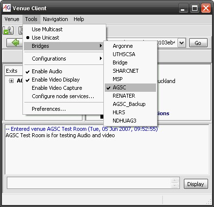

# Advice on using unicast multicast bridges

## This page documents experiences with using various unicast/multicast bridges with AcessGRID v3.0.2

- Best Bridge: If available use the UK UKERNA AccessGRID Support Center Bridge "AGSC" for session with UK participants.

- The German bridge HLRS, also appears to be a good option to UK

- Taiwan's HDUAG3 also appears to be a good option to UK and Asia

- the Bridge labelled "Bridge" appears to be located at the University of Western Australia. Do not use for session connecting to North America and Europe

- Note the the "AGSC_Backup" bridge appears to be sub-standard bridge and reults in more dropped packets.

- The UTHSCSA, SHARCNET bridges dont appear to work for sessions to UK (and possibly other locations)

- MSP bridges route inward traffic but not outward to the UK - avoid.

- RENATER Appears to be quite slow establishing connections.
