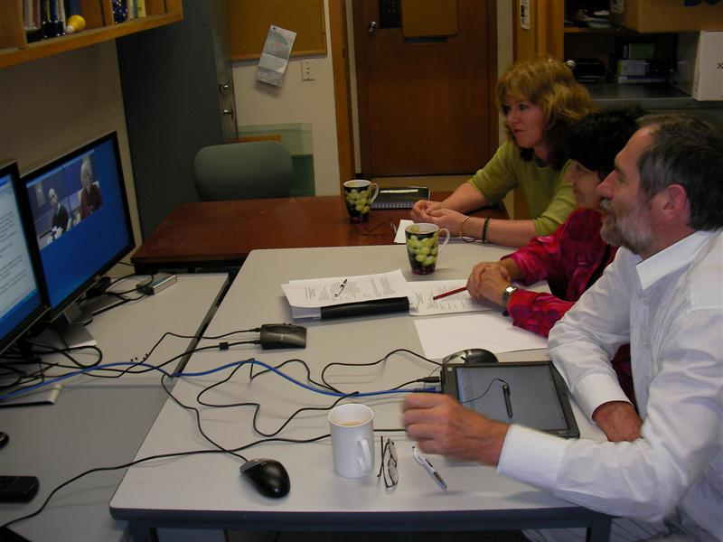
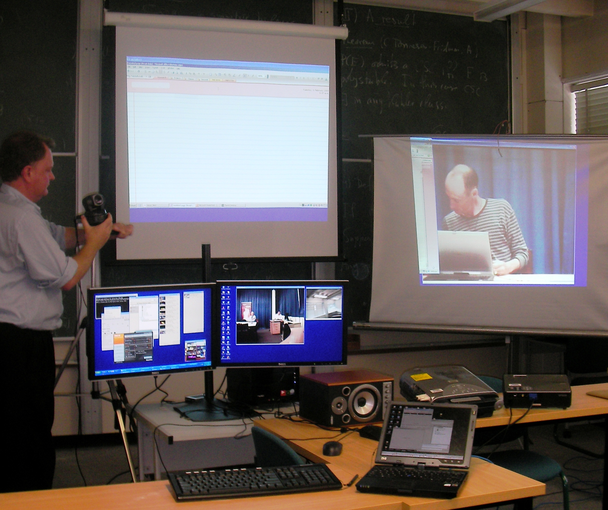
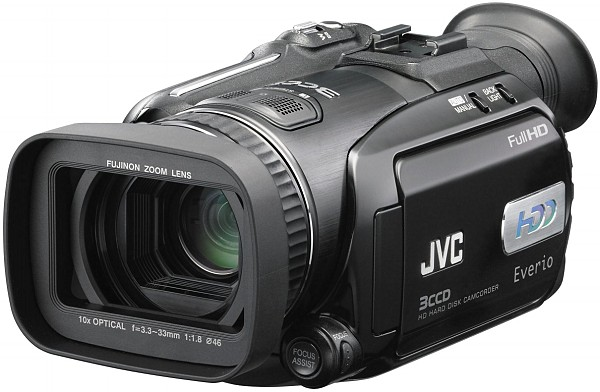

# BeSTGRID Portable Access Grid Node

## Portable AccessGRID node suitable for small groups (3 or more people) through to Seminars and Lecture Broadcasts. The only requirements are 1, preferably 2 network connections to KAREN

## Designed by Nathan Gardiner, Graeme Glen and Paul Bonnington

## Total Cost ~$21,000 all up

### [Photos of some individual components used in portable node](/wiki/spaces/BeSTGRID/pages/3816950772)

### Video capture

*1 * Viewcast Osprey 440 $1565.00

*3 * EVID100P PTZ PAL Colour Video Camera @ $1724.44

*3 * Tripod @ ~$120

*1 * SVGA Splitter @$100

*1 * SVGA to Composite device @$300

### Display

*2 * 24" Dell Monitors  @ $1150

*1 * Dell 5100MP Projector @ $3200

### Audio Input/Output

*1 * Clearone Chat 50 or Clearone Chat 150 @$450 (Be Sure to use the Enclosed Power Supply and not rely on USB power)

*1 * AKG WMS40 Pro HT Handheld UHF Wireless Mic @ $425

*1 * AKG WMS40 Pro HT Clipon UHF Wireless Mic @ $425

*1 * AKG CK55L Cardiod Lapel Mic for Wireless @126.65

*1 * Tapco Mix60 Mixer @$170

*1 * Powered Speakers (M-Audio StudioPro3 Professional Desktop Audio Monitors @$229

*1 * M-audio Podcast Factory USB Audio @$289 (Driver: Do NOT install included driver software. Let WindowsXP detect and use default Windows drivers for "Fasttrack". This is more compatible with the old RAT)

### Computer

*1 * PB Tech Core 2 Duo 2.67

ASUS P5N32-SLI MB/2 * 1GB DDR2-800/160GB 7.2k RPM HDD/IEEE 1394/18x+-DL DVD-RW/XP Home/3yr RTB warranty @ $2341.37

*1 * MSI NX7950GT @ $425.00

*1 * HP Tablet TC 4400 @$2750 (Optional)

## Software

- EVO, a video conferencing tool
- AccessGRID 2.4
- AccessGRID 3.0

## Network

- x2 network ports(x1 for workstation preferably Gigabit, x1 for tablet)
- network cables for each tablet
- open TCP port 5900 inbound for VNC traffic
- open TCP port 9010 inbound (sometimes used for VNC as well Shared

Desktop)
- open UDP port 9999-59999 inbound for multicast traffic
- open full TCP/UDP port outbound
- turn off workstation's Windows firewall for easier manipulation

## Optional Components

- JVC GZ-HD7 HD Everio Hard Disk Camcorder for Streaming HDV (High Definition Video)

_*NOTOC*_
