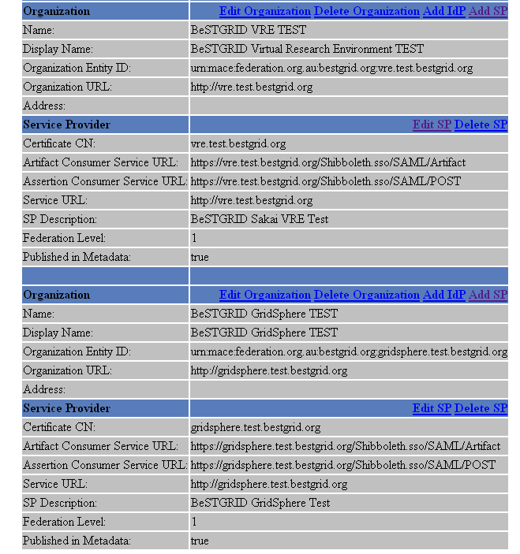

# BeSTGRID Shibbolized Sakai Installation

# Introduction

This article describes my (Eric's) steps to install Shibboleth Authentication supported Sakai.

Work Plan: [BeSTGRID Shibboleth Authentication for Sakai Work Plan](https://reannz.atlassian.net/wiki/pages/createpage.action?spaceKey=BeSTGRID&title=BeSTGRID_Shibboleth_Authentication_for_Sakai_Work_Plan&linkCreation=true&fromPageId=3816950687)

# Prerequisites

The followings are my installation environment, you could adjust this settings for your own requirements.

- Created a VM. (NDS: vre.test.bestgrid.org)
- CentOS 4.5 installed
- An Identity Provider (IdP) for testing purpose

# Create and install SSL certificate

- Create a SSL certificate
- Copy [createCertReq.sh](/wiki/spaces/BeSTGRID/pages/3816950732) and save it into a sub directory, e.g. scripts/createCertReq.sh

- Given execution right to this script

``` 

chmod +x scripts/createCertReq.sh

```

- Create a certificate request for vre.test.bestgrid.org

``` 

./scripts/createCertReq.sh vre.test.bestgrid.org

```

**Confirm there is a directory called *vre.test.bestgrid.org** has been created


- Install the new created SSL certificate

- Install mod_ssl for Apache HTTPD

``` 

yum install mod_ssl --enablerepo=centosplus

```

- Copy the received SSL certificate and its corresponding key to /etc/httpd/conf/ssl.crt and /etc/httpd/conf/ssl.key respectively.

**Edit */etc/httpd/conf.d/ssl.conf** and update **SSLCertificateFile** and **SSLCertificateKeyFile** with correct values.

- Restart Apache HTTPD and make sure the update has taken effect

# Setup Shibboleth SP

- Please have a look the [Install Shibboleth SP 1.3](https://reannz.atlassian.net/wiki/pages/createpage.action?spaceKey=BeSTGRID&title=Shibboleth_Service_Provider_Setup_-_RHEL4&linkCreation=true&fromPageId=3816950687) guide for detailed installation and configuration.

- NOTE

Install cURL if they are not installed yet.

``` 

yum install curl --enablerepo=centosplus

```

- The followings are the example configuration for vre.test.bestgrid.org

- [shibboleth.xml](https://reannz.atlassian.net/wiki/pages/createpage.action?spaceKey=BeSTGRID&title=Shibboleth_Sakai_vre.test.bestgrid.org_shibboleth.xml&linkCreation=true&fromPageId=3816950687)

- Edit /etc/httpd/conf.d/shib.conf

``` 

<Location /secure>
  AuthType shibboleth
  ShibRequireSession On
  require valid-user
</Location>

```

>  **Create a*web_root**/secure directory with the following PHP script to test your Shibboleth SP installation.

``` 

<?php

foreach ($_SERVER as $attribute => $value) {
        $value= utf8_decode( $value );
        echo "$attribute = <font color='red'>$value</font><br>";
}
?>

```

# Become an AAF Level 1 member

- Create an account in AAF level 1 [http://www.federation.org.au/FedManager/jsp/registerUser.jsp](http://www.federation.org.au/FedManager/jsp/registerUser.jsp)
- Create an organization after login
- Create a Service Provider under your new created organization. After successful creation, you should have something similar to below: (NOTE: I've create two organizations for Sakai VRE and GridSphere)



- Download [AAF Level 1 metadata](http://www.federation.org.au/level-1/level-1-metadata.xml), and then save into the directory that you configured in shibboleth.xml.

- Browse your header display script, and then you could authenticate yourself by selecting your IdP from AAF level 1 fedration. If you can see the Shibboleth header, e.g. TP_SHIB_INETORGPERSON_MAIL, then congratulation!!! you have successful installed Shibboleth SP and became a level 1 member in AAF.

# Install SAKAI

Following the installation guide below to install Sakai

- [Setup Sakai Environment|http

//confluence.sakaiproject.org/confluence/display/DOC/Install+Guide+-Environment%282.4%29]

- [Build and Deploy Sakai|http

//confluence.sakaiproject.org/confluence/display/DOC/Install+Guide+-Build%282.4%29]

NOTE: apply the following patches before run Maven to build and deploy Sakai
- sessionend-fix.patch :  [BeSTGRID local copy](/wiki/spaces/BeSTGRID/pages/3816950599)  | [Original copy from Stockholm University](http://people.su.se/~kllin/patches/sakai/sessionend-fix.patch)
- su-shibb.patch: [BeSTGRID local copy](/wiki/spaces/BeSTGRID/pages/3816950639) | [Original copy from Stockholm University](http://people.su.se/~kllin/patches/sakai/su-shibb.patch)

``` 

$tar xfz sakai-src_2-4-0.tar.gz
$cp sessionend-fix.patch sakai-src
$cp su-shibb.patch sakai-src
$cd sakai-src
$patch -p0 < sessionend-fix.patch
patching file event/event-impl/impl/src/java/org/sakaiproject/event/impl/UsageSessionServiceAdaptor.java
$patch -p0 < su-shibb.patch 
patching file user/user-impl/impl/project.xml
patching file user/user-impl/impl/src/java/org/sakaiproject/user/impl/PromiscousDbUserService.java
patching file user/user-impl/pack/src/webapp/WEB-INF/components.xml
patching file login/login-tool/tool/project.xml
patching file login/login-tool/tool/src/java/org/sakaiproject/login/tool/ShibContainerLogin.java
patching file login/login-tool/tool/src/webapp/WEB-INF/web.xml
$maven bld dpl

```

- [Sakai Post-Installation Configuration|http

//confluence.sakaiproject.org/confluence/display/DOC/Install+Guide+-Config%282.4%29]

- [Sakai Database Configuration|http

//confluence.sakaiproject.org/confluence/display/DOC/Install+Guide+-DB%282.4%29]

# Shibbolized Sakai Configuration

- Edit $CATALINA_HOME/sakai/sakai.properties LOGIN/LOGOUT Session

``` 

# LOGIN/LOGOUT

# to include the user id and password for login on the gateway site
top.login=false

# to let the container handle login or not (set to true for single-signon type setups, false for just internal login)
container.login = true

#Shibboleth hacking
login.links.count=1
login.links.1=https://vre.test.bestgrid.org/Shibboleth.sso/WAYF/

login.messages.count=1
login.messages.1=Login

# the URL to send folks to after they logout
loggedOutUrl=/portal

```

NOTE: Update your **login.links.1** to match the SP  configuration

**Edit *mod_jk** configuration (usually at /etc/httpd/conf.d/mod_jk.conf)

``` 

LoadModule jk_module modules/mod_jk.so
#
# Mod_jk settings
#
JkWorkersFile "conf.d/workers.properties"
JkLogFile "|/usr/sbin/rotatelogs /var/log/httpd/mod_jk.log.%Y%m%d 86400 720"
JkLogLevel error
SetEnvIf Request_URI "/Shibboleth.sso/" no-jk
JkMount / default
JkMount /* default
# End of mod_jk settings

```

- Edit your SP Shib module configuration by protecting the sakai login container tool url with shibboleth authentication.

``` 

<LocationMatch "/sakai-login-tool/container">
        AuthType shibboleth
        ShibRequireSession On
        require shibboleth
        AllowOverride Options
</LocationMatch>

```

- Restart Apache HTTPD

**Insert *tomcatAuthentication="false"** into $CATALINA_HOME/conf/server.xml `Connector`

``` 

    <!-- Define an AJP 1.3 Connector on port 8009 -->
    <Connector port="8009" tomcatAuthentication="false"
               enableLookups="false" redirectPort="8443" protocol="AJP/1.3" />


```

- Restart TOMCAT

- BeSTGRID Shibbolized Sakai VRE Test Installation URL: [https://vre.test.bestgrid.org/](https://vre.test.bestgrid.org/)

# Shibbolized Sakai attributes requirement

By default, Shibbolized Sakai must required the following Shibboleth attributes to provide full functions:

- urn:mace:dir:attribute-def:eduPersonPrincipalName
- urn:mace:dir:attribute-def:sn
- urn:mace:dir:attribute-def:givenName
- urn:mace:dir:attribute-def:mail

# Acknowledgment

I would like to express my gratitude to Leif Johansson and Klas Lindfors from Stockholm University for the great work they have done on shibbolizing Sakai.
