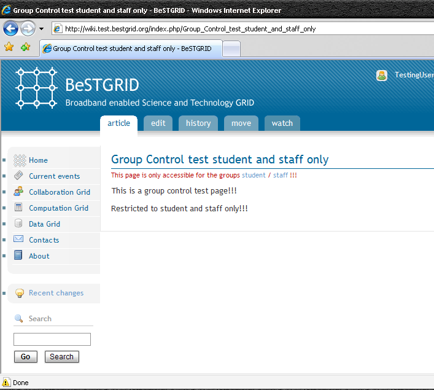

# BeSTGRID Shibbolized Wiki Group Control

# Introduction

This article describes a new developed plug-in for BeSTGRID Shibbolized Mediawiki Group Control. At the moment, it's in testing stage. You can experience this new developed plug-in in [BeSTGRID Test Shibbolized Mediawiki](http://wiki.test.bestgrid.org)

JIRA issue: [http://support.csi.ac.nz:8080/browse/BG-134](http://support.csi.ac.nz:8080/browse/BG-134)

# What does it do?

This plug-in was build to help Shibbolized Mediawiki to enables group access restriction on a page-by-page basis. It will be triggered when a user try to access a restricted page, and it will decide the user access right on this page by user's group information. At the moment, the group information is depend on Shibboleth's primary affiliation attribute (urn:mace:dir:attribute-def:eduPersonPrimaryAffiliation) or Shibboleth's unscoped affiliation attribute (urn:mace:dir:attribute-def:eduPersonAffiliation). However, this is depend on the configuration and could be modify to suit different needs.

This plug-in will auto-create a new user group when it detects the received affiliation (group) attribute does not exist in the wiki yet. Furthermore, it will also auto-insert the user into a user group when it received the affiliation attribute for this user and detects the user hasn't insert into this group yet

# Acknowledgment

This plug-in was developed on top of Version 0.8 of AccessControl Extension for Mediawiki that originally developed by Josh Greenberg and contributed by Martin Mueller ([http://blog.pagansoft.de](http://blog.pagansoft.de)). Thanks so much for these guys' work!!

# Walk Through

**Assumed there is a page called ****[Group Control test student and staff only](http://wiki.test.bestgrid.org/index.php/Group_Control_test_student_and_staff_only)**** in BeSTGRID Test Wiki. It was created by a user called "yjia032@bestgrid.org" who belongs to "staff" user group. The following screenshot shows how to create a restricted page by using *accesscontrol** tag.

- Create a new user in [BeSTGRID Open IdP](https://openidp.test.bestgrid.org/registry/register.php)
- Note: you only need to do this if your institution doesn't belong to [BeSTGRID](http://www.bestgrid.org) or [AAF level 1 federation](http://www.federation.org.au/FedManager/listMembers.do). In order to demonstrate the group control functionality, your institution's IdP should release either urn:mace:dir:attribute-def:eduPersonPrimaryAffiliation or urn:mace:dir:attribute-def:eduPersonAffiliation attribute to BeSTGRID Test Mediawiki.

- Obtain your password and login into BeSTGRID Test Open IdP (In the following steps, we will going to user testingUser1 as the example]

- Update your details

- Go to [BeSTGRID Test Wiki List Users](http://wiki.test.bestgrid.org/index.php/Special:Listusers) page. Your username testingUser1 is not listed in the page, i.e. your account haven't created yet.

- Click on the "Login via BeSTGRID Federation" link button on top right corner.

- Select "BeSTGRID" from "Federation" frame and then select "BeSTGRID OpenIdP Test" from "Institution" frame

- Enter your username testingUser1 and password

- User testingUser1 has been auto-created.

- Go to [Group Control test student and staff only page](http://wiki.test.bestgrid.org/index.php/Group_Control_test_student_and_staff_only).

- Close the browser and then login into BeSTGRID Test wiki as another user who has different role. (e.g. affiliate). Go to the same page, your access will be denied.

