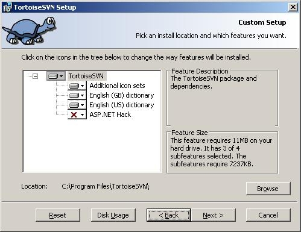

# BeSTGRID TortoiseSVN

um,,uc,,ua,,sc

TortoiseSVN is a free [SubVersion](bestgrid-subversion-repository.md) client available at [http://tortoisesvn.tigris.org/](http://tortoisesvn.tigris.org/). To describe briefly, it enables collaboration among team members on a single project (or even a single file). 

[SubVersion repositories](bestgrid-subversion-repository.md) can be likened to a central file server. Each member maintains a local copy of a repository. 

When a member `commits` a file, any change to the local file is transmitted to the server. 

When a member `updates` a file, any changes to the file on the server is transmitted to the client (member). 

When there is a conflicting change (i.e. a file has been modified concurrently), merging of the two subversions is attempted and reported to members, enabling them to review the conflict.

# Setting up Tortoise SVN

## Web Installation

If there is a newer version available on the official [TortoiseSVN website](http://tortoisesvn.tigris.org), download the windows installer package (.msi) onto your local machine.

## Installation

Simply follow through the installation wizard to install Tortoise.

At the end of the installation, restart the computer to integrate TortoiseSVN properly with the shell.

# More documentation

- [TortoiseSVN help](http://tortoisesvn.sourceforge.net/docs/release/TortoiseSVN_en/help-onepage.html):

Provides a comprehensive introduction to the tool, recommended
- [Repositories](bestgrid-subversion-repository.md)
