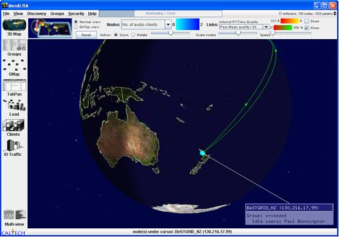

# Collaboration__EVO

While EVO (formerly [VRVS](http://www.vrvs.org)) started in High Energy and Nuclear Physics communities, most of the northern hemisphere NRENs are already making use of the system, with 1200+ worldwide sessions involving 4500 users (21,000 registered) hosted monthly. 

For futher background review this [ presentation on Enabling Virtual Organisations|http://www.terena.nl/events/tnc2006/programme/presentations/show.php?pres_id=233] by [Phillipe Galvez](http://www.vrvs.org/About/people_more.html#galvez)

We've established an EVO Reflector on BeSTGRID and are continuing trials alongside our other activity as we see the extension of reach provided by EVO as contributing greatly to the scale and scope of potential community engagement through BeSTGRID.

- Planned Activity
- BeSTGRID listed as a [NREN|http

//en.wikipedia.org/wiki/National_Research_and_Education_Network] member community.
- Bridge from EVO to BeSTGRIDs Portal Access Grid nodes.
- Carry out trials of bridged sessions to extend the scope of participation in traditional Access Grid sessions, including observation of science by educational communities.

To **access EVO**, use the EVO Client 'Koala'

;Status

- Experiment in the EVO "Universe" community including running of [BeSTGRID Steering Committee](https://reannz.atlassian.net/wiki/pages/createpage.action?spaceKey=BeSTGRID&title=Category__Steering%20Committee&linkCreation=true&fromPageId=3816950827) meetings.
- First [New Zealand EVO Panda reflector node setup](/wiki/spaces/BeSTGRID/pages/3816950667) [at the University of Auckland](https://reannz.atlassian.net/wiki/pages/createpage.action?spaceKey=BeSTGRID&title=University%20of%20Auckland%20EVO%20Panda%20reflector%20node%20configuration&linkCreation=true&fromPageId=3816950827) within BeSTGRID by Phillipe Galvez on 15th December - thanks Phillipe!

