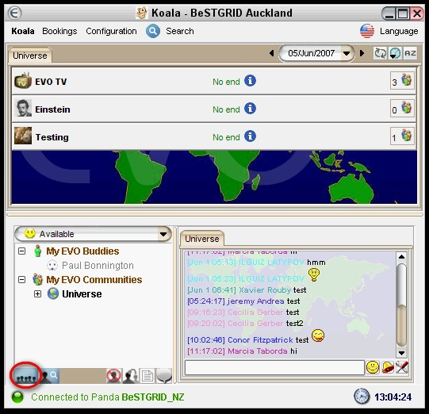
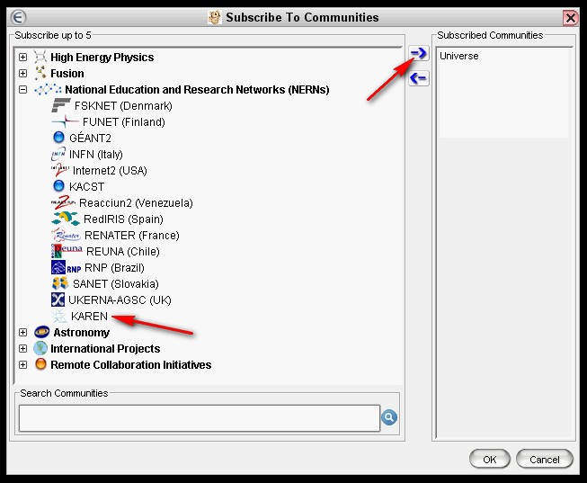
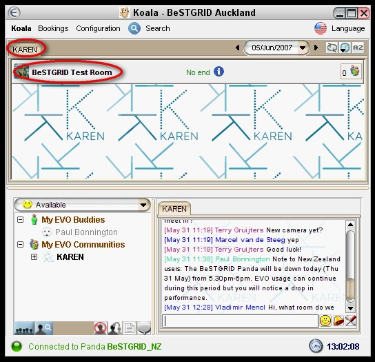

# Configuring EVO for the first time

## Prerequisite: Step by Step Instructions for Running EVO for the first time

1. Read the initial sections of the [User Documentation](http://nextgen-caltech.cern.ch/evoGate/Documentation/)
2. Then, to access EVO, use the [EVO Client 'Koala'](http://nextgen-caltech.cern.ch/evoGate/).

## Connecting yourself to the KAREN community

## Entering the BeSTGRID Test room

## Using and Configuring the Video Tool Vievo

1. Read the short [Vievo guide](http://www.vk.upjs.sk/vievo/vievo-help.html)
