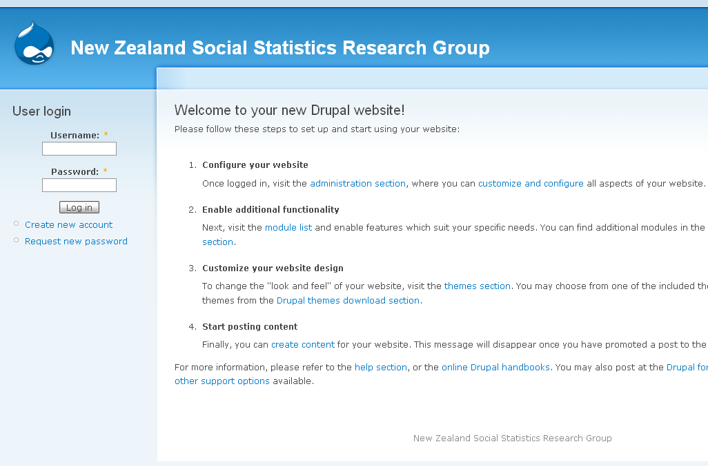

# Drupal multi sites

# Introduction

This article shows how to setup multiple sites on Drupal by go through an example setup for New Zealand Social Science Data Service.

# Background

New Zealand Social Science Data Service (NZSSDS, formerly known as SSDASH) has two domains: www.nzssds.org and www.nzssds.org.nz. Both domains point to same VM. The IP addresses of these two domains are 130.216.189.67 and 130.216.189.68 respectively.

A Drupal site has been setup on this VM, please have a look [Drupal5-Installation](/wiki/spaces/BeSTGRID/pages/3816950589) for more details

# Apache Configuration

- The default configuration of Apache (/etc/httpd/conf/httpd.conf) is configured as "Listen 80", so please change this to "Listen 130.216.189.67:80" and update "ServerName www.nzssds.org:80"

- Create another configuration file (e.g. virtualhost.conf) on /etc/httpd/conf.d/virtualhost.conf with the following content

``` 

NameVirtualHost www.nzssds.org.nz:80
Listen 130.216.189.68:80
#
<VirtualHost 130.216.189.68:80>
    ServerAdmin webmaster@nzssds.org.nz
    DocumentRoot /var/www/html
    ServerName www.nzssds.org.nz
    ErrorLog logs/nzssds.org.nz.error.log
    CustomLog logs/nzssds.org.nz.access_log common
</VirtualHost>

```

# Drupal Configuration

- Create another database instance. Please look at [here](/wiki/spaces/BeSTGRID/pages/3816950589#Drupal5-Installation-Create_Database) for instruction how to create a database instance.

- Create a subdirectory within `drupal_web_root`/sites directory. Each subdirectory must have a 'settings.php' file with related configuration. You should obtain a clean copy of 'setting.php' if you like to use different configuration (e.g. different database instance), otherwise you could obtain a copy from sites/default/setting.php.

The new created subdirectory name is constucted from site's URL. e.g. sites/www.nzssds.org and sites/www.nzssds.org.nz. Please have a look the [online Drupal multi-site setup configuration](http://drupal.org/node/176041) for full details on subdirectory naming format.

# Screenshot

- www.nzssds.org


- www.nzssds.org.nz


