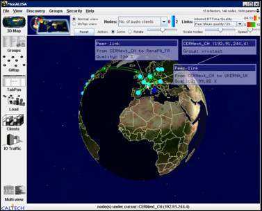
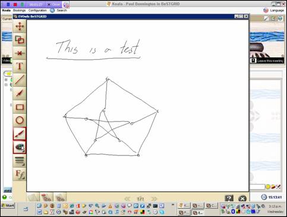

# EVO in NZ

_*NOTOC*_

**EVO (Enabling Virtual Organisations)**

Discussion Document Version 0.3

March 2007

- A/Prof Paul Bonnington
- Director of eResearch, University of Auckland, Director - BeSTGRID

- Sam Searle
- eResearch Coordinator, Victoria University of Wellington

- Nick Jones
- Project Manager, BeSTGRID, www.bestgrid.org

## Abstract:


It consists of a client (named Koala) that runs on the user

``` 
'
```

s machine and a server (Panda) that provides a communication channel, as well as other admin services (scheduler, directory services, etc.).

Previous versions relied on one main server and a series of 

``` 
'
```

reflectors

``` 
'
```

 but EVO

``` 
'
```

s architecture is now distributed, with both servers and clients operating peer-to-peer.


EVO users can communicate using audio, video and instant messaging, exchange files and share desktop applications. It is possible to book meetings or request them spontaneously.

Different technologies and protocols are supported and mixed (e.g. Mbone, H.323, SIP, QuickTime, AccessGrid).


## Development history

EVO grew out of a system called VRVS (Virtual Room Videoconferencing System). VRVS was developed within the High Energy and Nuclear Physics communities and then extended to other research areas.

VRVS was developed by CalTech from 1995 and went into production service in early 1997. It was the first system (2001) to support multiple protocols (Mbone, H.323, MPEG) for collaboration over IP networks. The system has been re-architected twice (2003 and 2005).

EVO was pre-released in April 2006, and beta and production versions are available.

## User base

The team behind VRVS/EVO have worked with NRENs including Internet2 (U.S), GEANT2/DANTE (Europe), UKERNA (UK), RedIRIS (Spain), RNP (Brazil), REUNA (Chile), RENATER (France), SANET (Slovakia), INFN (Italy), FUNET (Finland), Forskningsnettet (Denmark) and REACCIUN2 (Venezuela).

There are more than 23,000 registered users running the VRVS software on more than 37,000 machines in 130 countries. A set of 80

``` 
+
```


``` 
'
```

reflectors

``` 
'
```

 manages the traffic flow and interconnect using unicast tunnels and multicast.

In New Zealand, a small group of EVO users has developed around the BeSTGrid project (University of Auckland, Massey University and University of Canterbury) EVO also has been demo-ed and is being trialled at REANNZ, the Crown-owned company responsible for managing KAREN.

## Requirements

Windows 2000/XP; Linux; Mac OS X (PPC and Intel based)

Based on Java and Java Webstart technology, so requires Java Runtime Environment (JRE).

Webcam and headset, e.g. Logitech: the Quickcam Orbit MP (about NZ$120)  and Premium USB Headsets 350" (about NZ$70).

## EVO Panda Reflector Node system specification

Currently, there is one Panda server in New Zealand (the BeSTGRID Panda). As the number of simultaneously users increases, further Pandas may be necessary:

- CPU	2 x Dual Core Intel (Xeon or PentiumD) (2.33Ghz or higher)
- RAM	2 GB or higher
- Disk	80 GB or higher
- NIC	Gigabit Network  adapter (1000x/100/10)
- OS	Red Hat Enterprise Linux ESv4 or Linux Fedora Core 6 Linux 2.6 kernel or later with support multi-threading

There are currently around 20 panda nodes worldwide with many more coming. 

Their basic configuration is as above. Some have seen a load of 50-60Mbps with 80-85%

CPU idle time, and should support a least few hundred Mbps. Network connectivity is crucial and gigabit close to

KAREN backbone is a very good idea.

The panda node is similar to a router network but instead of switching

all packets, it switches real-time packets (video, audio, IM...) only. 

Therefore, it is important that this panda server is connected with the

best possible connectivity speed using Gigabit Ethernet. It should also be connected as much as possible to the core network and

have very minimal interruption in order to provide high reliability and

efficiency for the users community.

Since EVO has a distributed architecture, as soon as one panda node is full

(bandwidth or CPU), one has just to add a new node.

## Quality

EVO will only work satisfactorily via NRENs like KAREN and its international counterparts. Connecting via commodity internet or ADSL is unlikely to provide good results.

## Security

EVO supports different level of security:

- the ability to secure the deployment and access of the EVO collaboration infrastructure
- the ability to secure the access to a communication session and/or encrypt the data communication channel using standard JAVA encryption libraries (JCE). (NB. This may need more CPU and bandwidth.)

***Costs***

EVO is supplied to the research and education community worldwide at no cost.

Support will be provided via a cost recovery subscription model. Estimated individual costs are from US$100 to $150  per user / year depending of the support level required; however work is underway to negotiate a bulk support deal for New Zealand users.

With the subscription package, the idea will that a community could be somehow independent

and self-managed by managing its own users and virtual rooms meetings. 

It is like having the same privilege as EVO administrators but

restricted to their community. Basically, we can find:

- Management of the users (add/remove/modify)
- Management of the meetings (i.e creation of a permanent Meeting room)
- Privilege to access meeting without password and/or be meeting moderator by default
- Access to statistical information.

## Current Position

Many New Zealand Universities have invested significantly in its Access Grid nodes and room-based videoconferencing. These tools support real-time point-to-point and multi-point group communication and their usage will likely increase in future. Internationally there is also a trend towards the provision of desktop-based videoconferencing, sometimes as part of broader "real time collaboration" toolkits. Some of the drivers for the introduction of these desktop solutions are:

- the high cost of Access Grid and videoconferencing systems and scarcity of space for dedicated rooms
- the requirement for skilled technicians to support room-based solutions
- logistical issues around booking systems and payments
- user preferences for self-operated systems
- the nature of collaboration: often a relatively informal and 

``` 
'
```

just-in-time

``` 
'
```

 interaction with a small number of people is what is required, rather than a formal event.

The goal of many advanced networks is to accelerate the adoption of these kinds of collaboration technologies. In the US Internet 2

``` 
'
```

s Remote Collaboration Services supports five tools: Marratech (SIP-based) , inSORS (M-Bones-based); EVO (Java-based); Radvision (H.323-based) and Conference XP. Other countries with EVO usage include the UK, Spain, France, Italy, Finland, Denmark, Slovakia, Brazil, Chile, and Venezuela.

In New Zealand, work in this area is just beginning. The TEC-funded BeSTGrid project has adopted EVO on a trial basis. They have worked with CalTech to set up a 

``` 
'
```

reflector

``` 
'
```

 at the University of Auckland, and discussions are underway with regards to a business model for support for the NZ community based on an annual subscription.

BeSTGrid are promoting EVO because it is free, user-operated, requires only a webcam and headset, is cross-platform (Windows/Mac/Linux), bridges to Access Grid and to H.263 MCUs, and offers shared whiteboard / desktop facilites, text chat etc as well as   audio/video.

Project team members and participants in the EVO pilot will require a webcam and headset, at a cost of 

``` 
~
```

$200 per participant.

BeSTGrid staff recommend Logitech – the Quickcam Orbit MP (about $120)  and Premium USB Headsets 350" (about $70) – however any recent existing equipment that participants may already have should be satisfactory.

# Further information

- Getting started with EVO in New Zealand: [http://www.bestgrid.org/index.php/Getting_Started_with_EVO_in_New_Zealand](http://www.bestgrid.org/index.php/Getting_Started_with_EVO_in_New_Zealand)
- EVO Frequently Asked Questions: [http://nextgen-caltech.cern.ch/evoGate/FAQ/evo-faq.html](http://nextgen-caltech.cern.ch/evoGate/FAQ/evo-faq.html)
- User Guide for EVO: [http://nextgen-caltech.cern.ch/evoGate/Documentation/](http://nextgen-caltech.cern.ch/evoGate/Documentation/)
