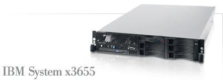

# EVO Panda reflector node setup

## BeSTGRID_NZ (NZ Production EVO Panda)

- Also known as evo.bestgrid.org

- x3655, AMD Opteron DC Processor 2218 2.6GHz/1067MHz,2M L2 Cache, 2x512MB, O/Bay SATA/SAS 3.5in HS,CD-RW/DVD Combo,HTX Riser Card, ServeRAID 8k-l, Rack
- AMD Opteron Dual Core Processor 2218, 2.6GHz 2MB L2 95W
- 1.0 GB (2x 512MB) DDR 2 667Mhz DIMM memory Kit
- 2GB (2x 1GB) DDR 2 667Mhz DIMM memory Kit
- IBM 73GB 15K 3.5' Hot-Swap SAS HDD
- ServeRAID-8k Adapter
- NetXtreme 1000 T+ Dual-Port PCI-X 1GbE (System ships standard with Dual Gig Ethernet)
- xSeries 835W Redundant Power Option

## BACKUP_NZ

- Also known as evo.backup.bestgrid.org
- The BACKUP_NZ panda server is just a small backup Panda server (that runs on a virtual machine hosted by Graeme Glen (g.glen@auckland.ac.nz)).

**It is *not** the preferred production Panda server for New Zealand. The production NZ Panda server is “BeSTGRID_NZ” (aka evo.bestgrid.org).

## Typical System Requirements for Panda Server

- Linux server (2.6 Kernel, ideally dual processor)
- minimum 1GB RAM
- minimum 100BaseT, ideally Gigabit connection to the network
