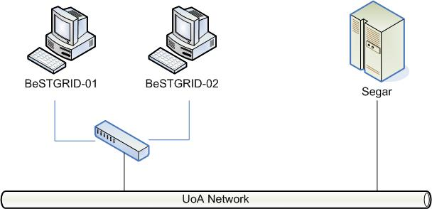

# First BeSTGRID Test Grid

# Design

>  ***BeSTGRID-01** and **BeSTGRID-02** are desktop PCs configured as a headnode and two computation nodes
>  ***Segar** is a supercomputer in Math Department

*Update from 4/04/2008:* This Test Grid doesn't exist now.

# Configuration

| ***BeSTGRID-01**** *Hardware Configuration**** 1x[Intel Pentium 4, 2.8 GHz](http://www.intel.com/design/pentium4/datashts/298643.htm)*** RAM 512Mb** *Software Configuration**** [Debian Sarge 2.6.8-2.686](http://www.debian.org/)*** [Virtual Data Toolkit](http://vdt.cs.wisc.edu/)*** Torque MOM Package 2.1.3** *Fuctions**** Globus Client*** PBS-MOM  | ***BeSTGRID-02**** *Hardware Configuration**** 1xIntel Pentium 4, 2.8 GHz*** RAM 1Gb** *Software Configuration**** Debian Sarge 2.6.8-2.686*** Virtual Data Toolkit*** Torque 2.1.3*** Tomcat Web Server*** GridSphere*** GridPortlets** *Fuctions**** Globus Server v4*** MyProxy Server*** PBS-Server*** PBS-MOM*** GridSphere Portal  | ***Segar - Math's Supercomputer**** *Hardware Configuration**** 8x[AMD Opteron x86 64bits](http://www.amd.com/us-en/Processors/ProductInformation/0,,30_118_8796,00.html)*** RAM 32Gb** *Software Configuration**** Debian Sarge 2.6.8-12-amd64-k8*** Torque MOM Package 2.1.3** *Fuctions**** PBS-MOM  |
| ------------------------------------------------------------------------------------------------------------------------------------------------------------------------------------------------------------------------------------------------------------------------------------------------------------------------------------------------------------ | ---------------------------------------------------------------------------------------------------------------------------------------------------------------------------------------------------------------------------------------------------------------------------------------------------------------------------------------- | ------------------------------------------------------------------------------------------------------------------------------------------------------------------------------------------------------------------------------------------------------------------------------------------------------- |

# Required settings

|  ***BeSTGRID-01*** ***user account***** name: globus, UID: 646464*** group: bestgrid, GID: 646464* ***mount** NFS directory from BeSTGRID-02 to */home/globus/.globus** ***/etc/hosts**: added IPs of BeSTGRID-02 and Segar* ***pbs_mom**:*** installation directory: */opt/torque**** client's binaries: */usr/local/bin/**** pbs_mom binaries: */usr/local/sbin/**** libraries: */usr/local/lib/*** ***/etc/ld.so.conf**: added */usr/local/lib**** run *pbs_mom* under *root* account  |  ***BeSTGRID-02*** ***user account***** name: globus, UID: 646464*** group: bestgrid, GID: 646464* ***export** NFS directory */home/globus/.globus* with worldwide write permissions* ***/etc/hosts**: added IPs of BeSTGRID-01 and Segar* ***pbs**:*** installation directory: */opt/torque**** client's binaries: */usr/local/bin/**** pbs_mom binaries: */usr/local/sbin/**** libraries: */usr/local/lib/*** ***/etc/ld.so.conf**: added */usr/local/lib**** run *pbs_mom* under *root* account  |  ***Segar*** ***user account***** name: globus, UID: 646464*** group: bestgrid, GID: 646464* ***mount** NFS directory from BeSTGRID-02 to */home/globus/.globus** ***/etc/hosts**: added IPs of BeSTGRID-01 and BesTGRID-02* ***iptables**:  added rules to accept *tcp* and *udp* protocols for BeSTGRID-01 and BeSTGRID-02* ***pbs_mom**:*** installation directory: */opt/torque**** client's binaries: */usr/local/bin/**** pbs_mom binaries: */usr/local/sbin/**** libraries: */usr/local/lib/*** ***/etc/ld.so.conf**: added */usr/local/lib**** run *pbs_mom* under *root* account  |
| ----------------------------------------------------------------------------------------------------------------------------------------------------------------------------------------------------------------------------------------------------------------------------------------------------------------------------------------------------------------------------------------------------------------------------------------------------------------------------------------- | --------------------------------------------------------------------------------------------------------------------------------------------------------------------------------------------------------------------------------------------------------------------------------------------------------------------------------------------------------------------------------------------------------------------------------------------------------------------------------------------------- | ------------------------------------------------------------------------------------------------------------------------------------------------------------------------------------------------------------------------------------------------------------------------------------------------------------------------------------------------------------------------------------------------------------------------------------------------------------------------------------------------------------------------------------------------------------------------------------------ |
