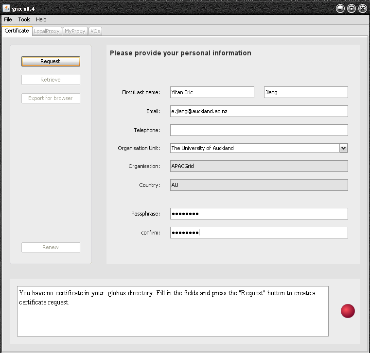
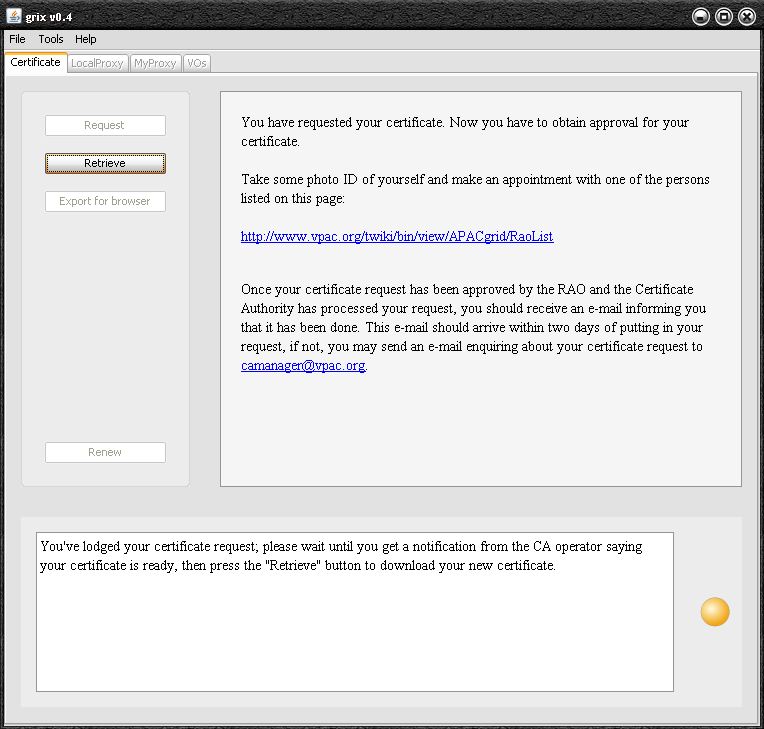
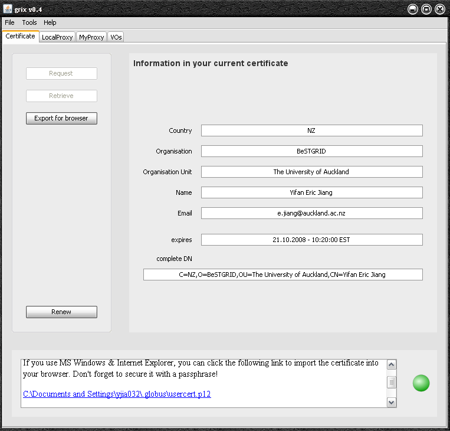

# Getting Started with BeSTGRIDs Computational GRID

## For University of Auckland GRID users

- You'll need a certificate from your RAO (University of Auckland = Andrey Kharuk a.kharuk@auckland.ac.nz). We recommend you use the grix tool to request the certificate.  The tool is available at [Canterbury Portal](https://ngportal.canterbury.ac.nz/grid/grix-jdk5-bestgrid.jnlp).

- We also recommend that your certificate follows what was agreed with APACGrid and has the form

>  /C=NZ/O=BeSTGRID/OU=The University of Auckland/CN=Firstname Surname

e.g.

- In the grix tool, fill in "University of Auckland"  into the OU field; Andrey will then have to edit your certificate via the RAO interface to move the Email, CN, and OU fields up to insert the O=BeSTGRID field.

- Retrieve your certificate

- After successful retrieved your certificate

- Once you have the certificate, start the Grix tool again and on the VO tab, apply for APACGrid membership.  You'll have to check your mailbox for a message with a code to confirm your email.  After you enter this code into Grix, we'll be notified and we'll approve your membership.

## GUIs for running GRID computations

- With command-line tools (globusrun-ws), it might be hard for users to get the feel of what is actually happening and how they could use it.

- APACGrid is developing the Generic Grid Client GUI tool,

>  [https://www.seegrid.csiro.au/twiki/bin/view/Compsrvices/GenericGridGUI](https://www.seegrid.csiro.au/twiki/bin/view/Compsrvices/GenericGridGUI)

- This is a client tool that allows to submit and monitor jobs from the users' desktop.  The tool finds about the existing gateways from the central APACGrid MDS server.  Canterbury is already registered there, and the tool can actually submit jobs to the Canterbury gateway.

- The tool is however still being developed, and I should give the warning that this might be tricky - and that we should test it well in advance.

- In order to run, the tool would need:
	
- a valid globus proxy for the user's X509 certificate (see above)
- the user would need access to our gateway - that is, be in either the BeSTGRID or NGAdmin group on the APAC voms server.
- access to a GridFTP server (ng2.canterbury.ac.nz runs also a GridFTP server).
- a GridFTP client - the VFS manager,

>  [http://www.vpac.org/twiki/bin/view/Sandbox/UsingVFSManager](http://www.vpac.org/twiki/bin/view/Sandbox/UsingVFSManager)

can be used to see how files are uploaded to grid space, and how the

results are fetched back.

- Mount the file system: gsiftp://ng2.canterbury.ac.nz
- Access the directory: gsiftp://ng2.canterbury.ac.nz/home/grid-bestgrid (and create your temporary data directory)

- Andrey has a certificate and is a member of the /NGAdmin group - thus, Andrey would be able to set up a demonstration.
