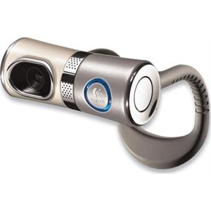
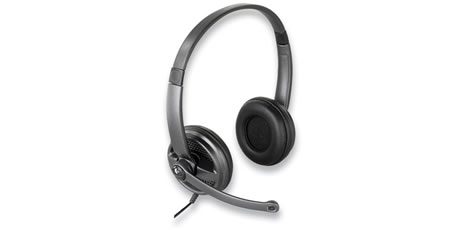
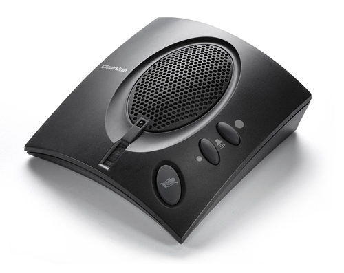

# Getting Started with EVO in New Zealand

# Video Tutorial

For a step by step video guide to running EVO please follow this flash based tutorial [http://it-multimedia.web.cern.ch/it%2Dmultimedia/collaborative/tutorials/](http://it-multimedia.web.cern.ch/it%2Dmultimedia/collaborative/tutorials/)

# Step by Step Instructions for Running EVO for the first time

1. Read the initial sections of the [User Documentation](http://evo.vrvs.org/evoGate/help.jsp?EvO_Manual)
2. Then, to access EVO, use the [EVO Client 'Koala' (Register first, then Click Start)](http://evo.caltech.edu/). *(The first time you login you will notice it downloads a number of plug-ins and it may take a while, this is a once only thing.)*
3. Then read (after logging in) [Configuring EVO for the first time](/wiki/spaces/BeSTGRID/pages/3818228555)
4. Finally read the short [Vievo guide in Appendix A](http://evo.vrvs.org/evoGate/help.jsp?EvO_Manual)
5. You might like to also consult [EVO Frequently Asked Questions](http://evo.caltech.edu/evoGate/FAQ/)

# Notes about System Requirements

## Network Connectivity to use EVO

>  ***EVO only works satisfactorily if you and your colleagues are connected to National Research and Education Networks (NRENs).** (For example, you would need to be connected to the 'KAREN' NREN (in NZ) and, say, your UK collaborator connected to the 'JANET' NREN (in UK).) 

- Don't expect things to work smoothly if one of the parties is connecting via commodity internet or ADSL (i.e from a home connection over 'broadband').

>  **Don't expect things to work smoothly if one of the parties is connecting via*wireless** network on a campus - wireless doesn't have the necessary bandwidth.
>  **Don't expect things to work smoothly if one of the parties is connecting via*wireless** network on a campus - wireless doesn't have the necessary bandwidth.

- If you and your colleagues are using this directly from university or research institute campuses, then there is an excellent chance that you have the required network connectivity.

## Operating Systems to use EVO

EVO is Java-deployed, so should work with most operating systems, and is being used on 32 and 64-bit Windows machines, Mac OS-X and various Linux flavours.

### Mac OS X

For detailed notes on Mac-specific EVO issues, see [EVO Mac Support](http://evo.caltech.edu/evoGate/support/macSupport.jsp).

### Linux

For detailed notes on Linux-specific EVO issues, see [EVO Under Linux](/wiki/spaces/BeSTGRID/pages/3818228771).

## Equipment to use EVO

- University of Auckland staff are encouraged to obtain equipment (referred to below) via [Acquire](http://uoa.acquire.co.nz/acquire/default.asp)
- For Windows machines Logitech webcams are best.
- For an fixed location we recommend Logitech Quickcam Sphere MP available from all over, including [Acquire](http://uoa.acquire.co.nz/acquire/default.asp) and [PBTechnologies, Penrose, Auckland](http://www.pbtech.co.nz).

- For the highest quality 'portable' video webcam for under NZ$150 we recommend Logitech QuickCam Ultra Vision available from all over, including [Acquire](http://uoa.acquire.co.nz/acquire/default.asp) and [PBTechnologies, Penrose, Auckland](http://www.pbtech.co.nz).

- You can also use the Logitech Quickcam Express but the video quality is not as good. Indeed, we believe the entire Logitech Quickcam range can be used but we have not tested them all.

>  ***We do not recommend Microsoft LifeCams**, at this stage. There have been reports that the drivers for these webcams break compatibility.
>  ***We do not recommend Microsoft LifeCams**, at this stage. There have been reports that the drivers for these webcams break compatibility.

- You should get a headset (headphones and mic): we recommend "Logitech Premium USB Headsets 350" (available from all over, including [Acquire](http://uoa.acquire.co.nz/acquire/default.asp) and [PBTechnologies, Penrose, Auckland](http://www.pbtech.co.nz)

- If there is more than one person physically located in the room with you, then a headset is no good, and you will need a 'conferencing' unit like the Clearone Chat 50 or 150 (available from [Acquire](http://uoa.acquire.co.nz/acquire/default.asp) and [AVW in East Tamaki, Auckland](http://www.avw.co.nz/). Note however, that the audio quality from the above headset is superior to the conferencing unit, and therefore should be favoured. For setup in EVO, read: [this section using echo cancellation devices with EVO](known-issues-with-evo.md)

- EVO doesn't work with a number of proxy servers that are used in the University of Auckland. This may be true elsewhere in NZ. It is best if the machine is not behind an "internet proxy" and that the firewall allows normal outbound traffic.
- It would help if the Java Runtime Environment is updated to to a recent version, available from [Java.com](http://java.sun.com/j2se/1.5.0/download.html), for example Java Runtime Environment (JRE) 5.0 Update 11...things run slightly better

# [Known Issues with EVO](/wiki/spaces/BeSTGRID/pages/3818228443)
