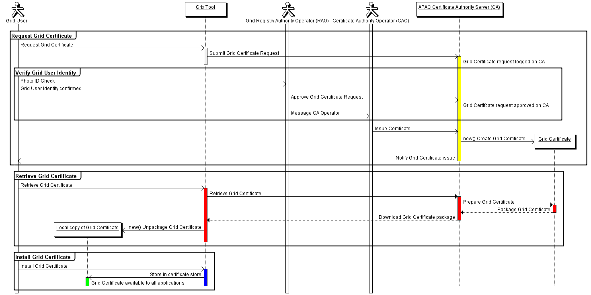
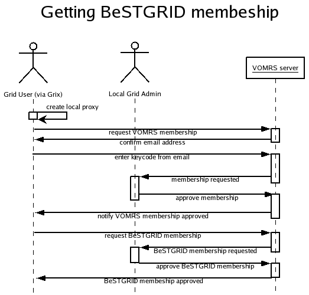
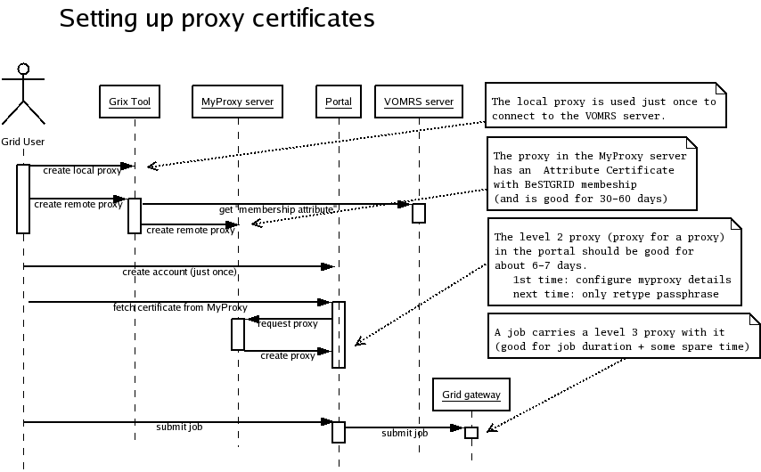

# Getting started with the portal

It's only a few steps to getting started with the [Portal](https://ngportal.canterbury.ac.nz/gridsphere/gridsphere) and with using the Grid.

The steps are:

- Get a grid certificate
- Get membership in BeSTGRID
- Get a proxy certificate into the portal (via the MyProxy repository)

# Get a Grid Certificate

To be able to use the grid resources, one needs to first obtain a grid certificate.  A detailed description is given in the [Guide to requesting a certificate](http://ngportal.canterbury.ac.nz/certuserguide.html), and the steps are summarized in the figure below.

Shortcut: just start Grix by clicking the [Grix Java Web-Start link](http://ngportal.canterbury.ac.nz/grid/grix-jdk5-bestgrid.jnlp).  In case of problems with Java Web-Start, download the two jars ([grix-jdk5-bestgrid.jar](http://ngportal.canterbury.ac.nz/grid/grix-jdk5-bestgrid.jar) and [bcprov-jdk15-136.jar](http://ngportal.canterbury.ac.nz/grid/bcprov-jdk15-136.jar)) and run them with:

>  java -jar grix-jdk5-bestgrid.jar

# Get membership in the BeSTGRID Virtual Organization

The access control settings for BeSTGRID resources permit to use a certificate from any IGTF approved Certification Authority for authentication, but require membership in the BeSTGRID Virtual Organization (VO) to allow access.  The BeSTGRID VO is hosted at the VOMRS server, and the Grix tool provides a convenient way to communicate with the VOMRS server.  This is also covered in the above mentioned [Guide to requesting a certificate](http://ngportal.canterbury.ac.nz/certuserguide.html), and the following figure summarizes the required steps:

# Setting up proxy certificate

The grid certificates stays only on the user's computer, and proxy certificates created for the primary certificate are used to grant to other systems (the portal) the privilege to act on behalf of the user (such as to submit jobs or transfer files).  The privilege can be further delegated by creating proxy certificates for a proxy certificate (level 2, level 3,... proxies).

As a metaphor, proxy certificates can be thought of  as time-restricted notarized copies of one's "birth certificate".  A photocopy with a notary seal and a statement *"this copy is valid from this day for the next ****x**** days"*.  During that time, anyone presenting the copy will be treated as if presenting the original certificate.  And there can be copies of copies .... where the validity time can only decrease (the smallest limit counts).

The MyProxy server is just a repository for certificates - a bank vault where you store your valueable documents or certified copies.

The [Guide to requesting a certificate](http://ngportal.canterbury.ac.nz/certuserguide.html) and the [Portal User's Guide](http://ngportal.canterbury.ac.nz/portaluserguide.html) describe in detail the sequence of steps to create a proxy certificate in the MyProxy certificate repository and retrieve a level 2 proxy into the portal.  The following figure summarizes the sequence of steps

