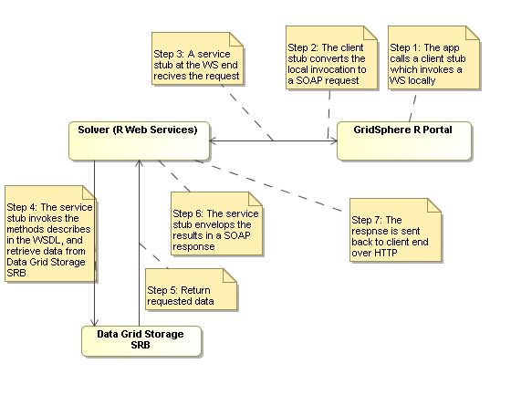

# GridSphere R Portal Initial Work Plan

# Introduction

This article represents the approach of my exploration of GridSphere R Portal project from a developer's perspective. 

# Where to start

- [Grid Portals 101](http://dhruv.uits.indiana.edu/portals/portals-101.pdf) is an excellent overview and introduction article that written by Anurag Shankar of Indiana Unviersity TeraGrid team. This article covers all necessary terminologies that used in the GridSphere. Furthermore, it also provided a good background instruction which will give new user a good understanding.

# A Gridsphere R Portal typical scenario

# Install GridSphere Portal Framework

- There is a brief instruction about how to [install GridSphere Port Framework](https://reannz.atlassian.net/wiki/pages/createpage.action?spaceKey=BeSTGRID&title=Install_GridSphere_Portal_Framework&linkCreation=true&fromPageId=3816950753)

# Install Axis

# Useful information

- [Gridsphere portal framework](http://www.gridsphere.org/gridsphere/gridsphere)
- [GridSphere Documentation](http://www.gridsphere.org/gridsphere/gridsphere/guest/docsTab/r/)
