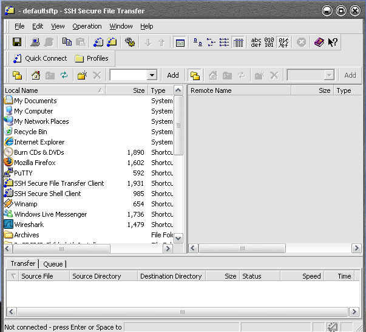
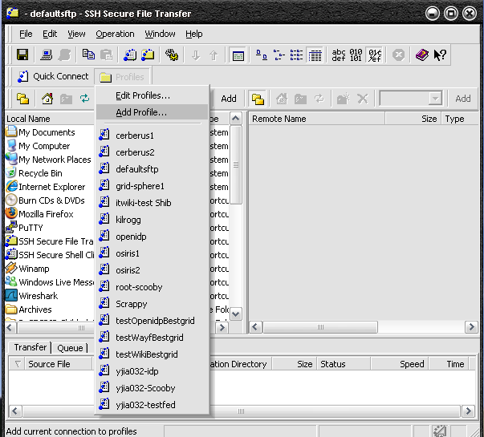
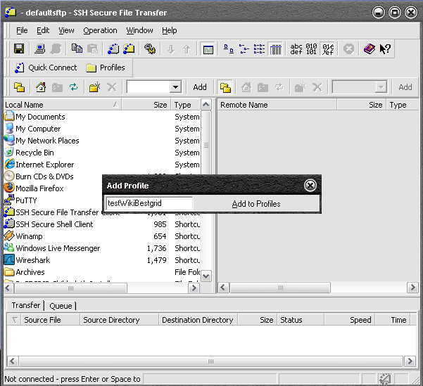
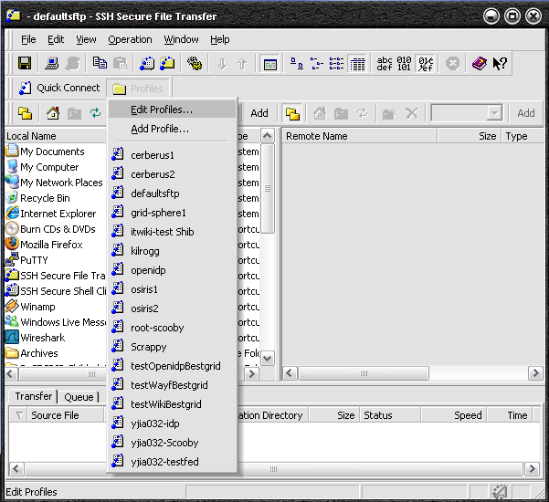
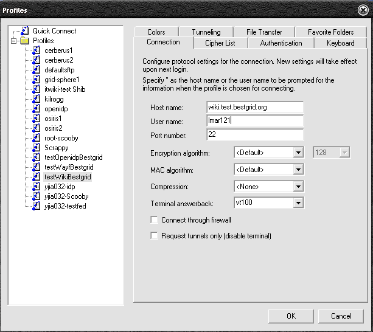
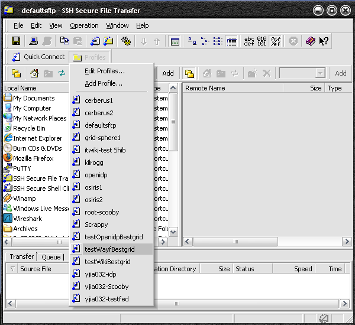
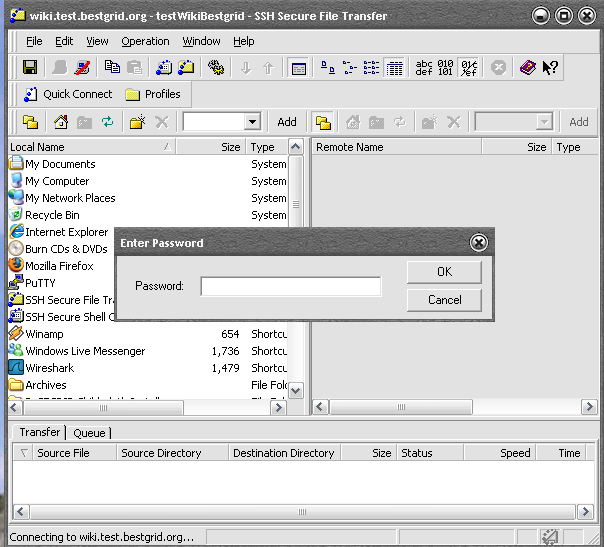
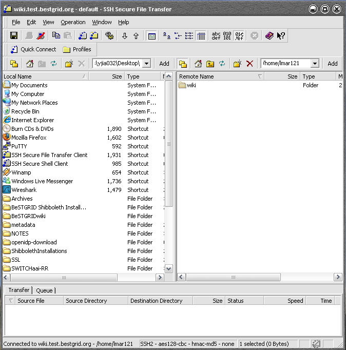

# How to remote access linux server

# Introduction

This article introduce user how to remotely access linux server on a Microsoft Windows machine.

# Download SSH Secure File Transfer

- SSH Secure File Transfer is a program that allows user to remotely access a Linux server with Graphical User Interface (GUI)
- Download the program from [ftp://ftp.wiretapped.net/pub/security/cryptography/apps/ssh/SSH/SSHSecureShellClient-3.2.9.exe](ftp://ftp.wiretapped.net/pub/security/cryptography/apps/ssh/SSH/SSHSecureShellClient-3.2.9.exe)
- Double click to install

# How to use SSH Secure File Transfer

- I will use wiki.test.bestgrid.org as an example.

- It will look like this after the installation:

- Add profile

- Type a name testWikiBestgrid in the text box, and then press the "Add to Profiels" button

- Edit profile

- Insert details as the following and then press "OK" button

Note: Host name is the name of the server, e.g wiki.test.bestgrid.org or wayf.test.bestgrid.org etc...

- Open a connection

- Enter password

- The left window represents YOUR desktop file system while the right window represents the remote linux server file system

- Go into the "wiki" directory at right window, and that is the place that you can upload your file.

- You can use drag and drop to upload your file.
