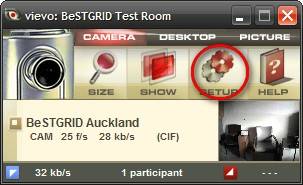
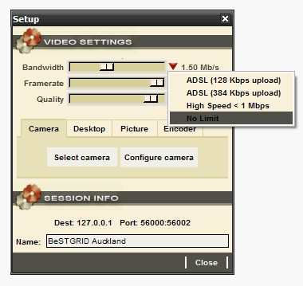

# Improving EVO's Video and Audio Quality

# Four steps to maximising the audio and video quality in EVO

## Use a Logitech USB Headset

If at all possible, all people involved in the meeting should use headsets:

- The microphone is positioned very closely to the mouth resulting in much higher audio quality and other participants wont need to strain to hear what is being said
- Contrary to what some manufacturers claim: echo cancellation devices or inbuilt Webcam mics never sound that good, and other participants will find you difficult to hear (they may even stop listening to you!)
- Logitech USB headsets are highly recommended

- Here are some [Additional Instructions on fine-tuning EVO's Audio](/wiki/spaces/BeSTGRID/pages/3818228528)

## Have your University open a port in the University Firewall for your computer

- Have your University open a port (see box below) in the University Firewall for your computer: your network traffic will not be routed by some institutional proxy/NAT and wont have to go through a network 'bottleneck'
- This ensures that your video and audio communication is transmitted at maximum possible bandwidth
- The local or institute firewall (if any) should permit communication on the following port for your computer:

>  Both IN and OUT, Both UDP and TCP: Port Number 46015
>  Both IN and OUT, Both UDP and TCP: Port Number 46015

## Make sure you are connected to the BeSTGRID_NZ [Panda Server](/wiki/spaces/BeSTGRID/pages/3818228619)

- (For New Zealand based users)
- The New Zealand production EVO [Panda Server is BeSTGRID_NZ](/wiki/spaces/BeSTGRID/pages/3818228619).
- the Panda server you are connected to is listed in the bottom left of the Koala window.
- You are automatically connected to the nearest Panda server – sometime EVO doesn't make the best decision. You should aim to connect to BeSTGRID_NZ.
- To reconnect to the BeSTGRID_NZ panda choose: Koala menu -> Koala Monitoring. Select "evo.bestgrid.org" from the "Best Panda Servers:" drop-down list, and Click "Connect to Selected Panda".

## Increase the Video Quality and Framerate

- Assuming you have the necessary port opened in the University firewall (see above) configure your Vievo settings to use the full bandwidth

