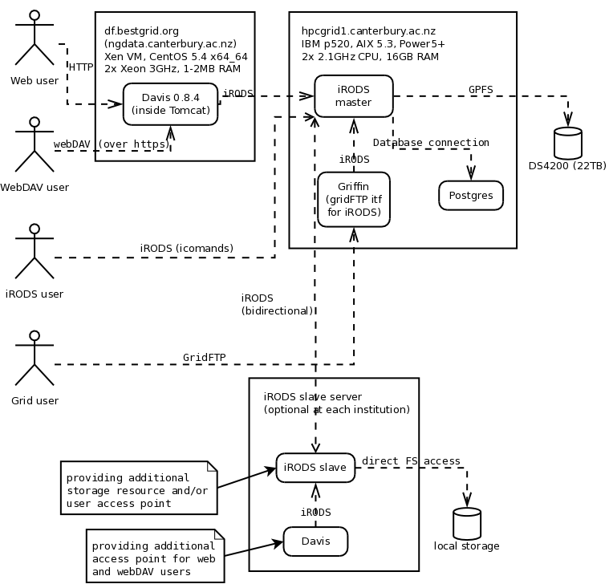

# IRODS deployment plan

**'NOTE: THIS DOCUMENT IS NOW OBSOLETE**' as all useful contents has been merged into the [Installing an iRODS slave server](installing-an-irods-slave-server.md) document.

The ARCS are successfully operating the ARCS DataFabric, based on iRODS as a distributed storage system and Davis as the web and webDAV interface.

This page details the plan for deploying similar infrastructure for BeSTGRID.

First, a picture is worth a thousand words:


# Deployment plan overview

- Deploy iRODS master with postgres on IBM p520
- Deploy Davis on ngdata.canterbury.ac.nz (Xen VM with dedicated ethernet ports)

- Deploy slave iRODS servers as iCAT-less servers, optionally deploy also local Davis

# Detailed deployment: p520

- iRODS version: 2.3

- iRODS unix user: rods
- iRODS directory: /usr/local/pkg/irods
- iRODS vault: /hpc/griddata/irods
- Postgress

- iRODS compile parameters: 64-bit mode, with xlc:
	
- We are linking against `vendorcc64dbg` Globus 5.0.0 - and we need to set 

``` 
export OBJECT_MODE=64 CC=xlc CXX=xlC
```
- To set the compiler to xlc and set library search path to /opt/freeware/lib (openssl), edit `config/irods.config`:

``` 

$CC = 'xlc';
$LDRFLAGS = '-L/opt/freeware/lib';

```

- Additional env


>  PATH=/opt/freeware/bin:$PATH
>  . globus5.sh
>  PATH=/opt/freeware/bin:$PATH
>  . globus5.sh

- The iRODS build does not create correct ODBC.ini file.  Manually create psql/etc/odbc.ini and ~/.odbc.ini and make it READONLY (so that iRODS cannot override it during the build) with (fix with correct PATH and port number):

``` 

[PostgreSQL]
Driver=/usr/local/pkg/irods/Postgres/pgsql/lib/libodbcpsql.a(libodbcpsql.so.2)
Debug=0
CommLog=0
Servername=hpcgrid1-c
ReadOnly=no
Ksqo=0
Port=5432
Database=ICAT

```

- Key answers to irods questions


>     zone: **BeSTGRID**
>     Starting Server Port [20000]? 40000
>     Ending Server Port [20199]? 40199
>     Resource name [demoResc]? **griddata.canterbury.ac.nz**
>     Directory ? **/hpc/griddata/irods**
>     New Postgres directory? /usr/local/pkg/irods/Postgres
>     Include GSI [no]? yes
>     GLOBUS_LOCATION [/usr/local/pkg/globus/5.0.0]?
>     GSI Install Type to use? vendorcc64dbg
>     zone: **BeSTGRID**
>     Starting Server Port [20000]? 40000
>     Ending Server Port [20199]? 40199
>     Resource name [demoResc]? **griddata.canterbury.ac.nz**
>     Directory ? **/hpc/griddata/irods**
>     New Postgres directory? /usr/local/pkg/irods/Postgres
>     Include GSI [no]? yes
>     GLOBUS_LOCATION [/usr/local/pkg/globus/5.0.0]?
>     GSI Install Type to use? vendorcc64dbg

- Post-install instructions:

``` 

For special network interfaces, you may need to
modify server/config/irodsHost; see comments within it.

To use the iRODS command-line tools, update your PATH:
    For csh users:
        set path=(/hpc/projects/packages/local.aix/pkg/irods/iRODS-2.3/clients/icommands/bin $path)
    For sh or bash users:
        PATH=/hpc/projects/packages/local.aix/pkg/irods/iRODS-2.3/clients/icommands/bin:$PATH

If you wish to set the ports to use, set the environment variable
'svrPortRangeStart' or edit the svrPortRangeStart line in irodsctl.pl.
See the 'Specifying Ports' page on the irods web site for more.

To start and stop the servers, use 'irodsctl':
    irodsctl start
    irodsctl stop
    irodsctl restart
Add '--help' for a list of commands.

Please see the iRODS documentation for additional notes on how
to manage the servers and adjust the configuration.

```

# Post-configuration

Useful links: 

- [ARCS DataServices wiki - iRODS pages](http://projects.arcs.org.au/trac/systems/wiki/DataServices/iRODS)
- [ARCS DataServices svn - DataFabricScripts](http://projects.arcs.org.au/svn/systems/trunk/dataFabricScripts/iRODS/)
	
- Essence of backup is: 

``` 
/usr/local/pkg/irods/Postgres/pgsql/bin/pg_dump ICAT
```

## TODO

From [https://projects.arcs.org.au/trac/systems/wiki/DataServices/iRODS_Server](https://projects.arcs.org.au/trac/systems/wiki/DataServices/iRODS_Server)

- iRODS logs pruning/rotation
- Create resources for iphybun
- Rules auto update (not needed until we get some meaningful rules for BeSTGRID)
- Create groups and and assign them to projects (when we get some)
- Setup/update CA certificates on hpcgrid1
- Database backup - see the following links:
	
- [https://projects.arcs.org.au/trac/systems/wiki/DataServices/RestoreDatabase](https://projects.arcs.org.au/trac/systems/wiki/DataServices/RestoreDatabase)
- [http://wiki.arcs.org.au/bin/view/Main/ChangeNote201003-003](http://wiki.arcs.org.au/bin/view/Main/ChangeNote201003-003) (backup scripts are attached here)
- Postgres database backups: [http://www.network-theory.co.uk/docs/postgresql/vol3/MakingaBaseBackup.html](http://www.network-theory.co.uk/docs/postgresql/vol3/MakingaBaseBackup.html)
- The whole backup strategy is to:
		
- Make daily "pg_dump ICAT" backups"
- Do weekly filesystem backups of the Postgres database
- Have postgres push Write-Ahead Logs (WAL) files each time it rolls them over
- Usage statistics - see [https://projects.arcs.org.au/trac/systems/wiki/DataServices/Usage_Statistics](https://projects.arcs.org.au/trac/systems/wiki/DataServices/Usage_Statistics)

- Install resource monitoring: [http://projects.arcs.org.au/trac/systems/browser/trunk/dataFabricScripts/iRODS/utils/rsmond.sh](http://projects.arcs.org.au/trac/systems/browser/trunk/dataFabricScripts/iRODS/utils/rsmond.sh)
	
- Automatically skip off-line resources for read and write operations
- See also `iadmin help modresc`

- Configure rules to select default resource for get operations (once we have more resources)

- Deploy outbox (separate servlet) - [http://projects.arcs.org.au/trac/systems/browser/trunk/data-services/outbox/src/outbox/myproto-outbox](http://projects.arcs.org.au/trac/systems/browser/trunk/data-services/outbox/src/outbox/myproto-outbox)

### Quotas

- See [iRODS quotas overview](https://www.irods.org/index.php/Quotas)

- The quotas are simply based on setting a limit on how much a user can use on a single resource or globally.
- There are no per-collection quotas, and the per-user applies over all collections.  It is simple just a "`sum(r_data_main.data_size)`" over  all files where the user is the primary owner `(r_data_main.data_owner_name)`
- Thus, each file will count towards the quota of the user who uploaded the file (the primary owner does not change even when the "`own`" privilege is shifted to a different user).
- Of course, items in the trash still count towards the quota.
- iRODS keeps the total of files owned by the user - and if a quota is set of the user, compares the total with the quota.
- The total is not updated in real time and has to be explicitly re-synchronized with "`iadmin cu`" (Calculate Usage) (run periodically from a cron job)
	
- An alternative is a periodic iRODS rule invoking the same microservice - see `$IRODS_HOME/clients/icommands/bin/runQuota.ir`
- Quotas can be used in enforcing mode, or can just keep track of how user/group usage.
- The enforcing mode can be turned on with a rule (template in core.irb)
- When in enforcing mode and the user is over quota (or the single  upload would cause the user to go over quota), file uploads fail with `-110000 SYS_RESC_QUOTA_EXCEEDED`
- But, until the total gets updated, it is possible to go over quota by uploading more smaller quotas.
- Besides user quotas, there are also Group quotas - which are just limits on total usage of all members of the group.
- **Is is*NOT** a limit on total files owned by the group as I had hoped - the primary owner of a file is always a user, not a group).
- I'm not sure what would be the proper usage scenario for projects...

- Useful commands:

- Create a quota for a user (in bytes, 100M in this example):

``` 
iadmin suq vladimir.mencl total 100000000
```
- List all quotas (and their overdraft status): 

``` 
iadmin lq
```
- List all quotas (and their overdraft status - for users): 

``` 
iquota -a
```
- Update quota statistics (for the above commands to work):

``` 
iadmin cu
```
- Display quota usage does NOT work even if the above command is run:

``` 
iquota usage
```

- Note: quotas are by default not enforced.  Turn them on with the following rule (by default set to `off` in `core.irb`:

``` 
acRescQuotaPolicy||msiSetRescQuotaPolicy(on)|nop
```

- TODO:
	
- Try quotas in createUser
- Try turning quotas on

### Mounted collections (Symbolic links and tar files)

- Mount an existing collection to a new mountpoint (or an empty collection) with

``` 
imcoll -m l /BeSTGRID/home/vladimir.mencl/existing-coll /BeSTGRID/home/vladimir.mencl/link-coll
```
- Check the mount status with `ils -L`:

``` 
C- /BeSTGRID/home/vladimir.mencl/link-coll  linkPo    /BeSTGRID/home/vladimir.mencl/exiting-coll
```
- Umount the collection with

``` 
imcoll -U /BeSTGRID/home/vladimir.mencl/link-coll
```
- Note: that leaves the "mount-point" collection in place as an empty collection, even if it was automatically created when mounting the collection.

- It is also possible to mount a tar file
	
- See [Mounted iRODS Collection](http://www.irods.org/index.php/Mounted_iRODS_Collection) and [imcoll](http://www.irods.org/index.php/imcoll)
- The syntax for a tar mount is:

``` 
imcoll -m tar [-R tar-file-resource] /BeSTGRID/home/vladimir.mencl/DOEGrids-2006-Nov-8.tar /BeSTGRID/home/vladimir.mencl/tardir
```
- On first access to the mounted directory, the tar file will be expanded:

``` 
ils /BeSTGRID/home/vladimir.mencl/tardir
```
- Un-mount the tar file with:

``` 
imcoll -U /BeSTGRID/home/vladimir.mencl/tardir
```

- NOTE: for this, the iRODS server must be compiled to use GNU tar (AIX tar doesn't implement some options used by iRODS)
- Edit `config/config.mk` and change TAR_EXEC_PATH from /bin/tar to /opt/freeware/bin/tar:

``` 
TAR_EXEC_PATH=/opt/freeware/bin/tar
```
- Recompile iRODS: re-run `irodsssetup` (with all the environment correctly set)

## Post-configuration: DONE

- Setup directory permissions


>  imkdir /BeSTGRID/projects
>  ichmod read public /
>  ichmod read public /BeSTGRID
>  ichmod read public /BeSTGRID/home
>  ichmod read public /BeSTGRID/projects
>  ichmod read public /BeSTGRID/trash   
>  ichmod read public /BeSTGRID/trash/home
>  ichmod read public /BeSTGRID/trash/projects
>  imkdir /BeSTGRID/home/__INBOX  
>  imkdir /BeSTGRID/home/__PUBLIC
>  ichmod read public /BeSTGRID/home/__INBOX  
>  ichmod read public /BeSTGRID/home/__PUBLIC
>  imkdir /BeSTGRID/projects
>  ichmod read public /
>  ichmod read public /BeSTGRID
>  ichmod read public /BeSTGRID/home
>  ichmod read public /BeSTGRID/projects
>  ichmod read public /BeSTGRID/trash   
>  ichmod read public /BeSTGRID/trash/home
>  ichmod read public /BeSTGRID/trash/projects
>  imkdir /BeSTGRID/home/__INBOX  
>  imkdir /BeSTGRID/home/__PUBLIC
>  ichmod read public /BeSTGRID/home/__INBOX  
>  ichmod read public /BeSTGRID/home/__PUBLIC

- Configure alternative hostnames: edit `server/config/irodsHost` and put there the following lines that:
	
- Establish local aliases for this server
- Set preferred hostname for ngdata (going via the back-channel link):

``` 

localhost hpcgrid1.canterbury.ac.nz hpcgrid1 hpcgrid1-c
ngdata-c ngdata.canterbury.ac.nz ngdata

```
- Restart irods:

``` 
/usr/local/pkg/irods/iRODS/irodsctl restart
```

- NOTE: do the same on ngdata: configure this host to `hpcgrid1-c` as the perferred hostname for connecting to hpcgrid1.  Put this into `server/config/irodsHost` on **ngdata**:

``` 

localhost ngdata.canterbury.ac.nz df.bestgrid.org
hpcgrid1-c hpcgrid1.canterbury.ac.nz

```


- Let Davis running at NGData access the server as the rods user (needed for Shibboleth login where Davis needs to reset irods user account password)


>  iadmin aua rods '/C=NZ/O=BeSTGRID/OU=University of Canterbury/CN=ngdata.canterbury.ac.nz'
>  iadmin aua rods '/C=NZ/O=BeSTGRID/OU=University of Canterbury/CN=ngdata.canterbury.ac.nz'

- Setup auto user creation
	
- Deploy createUser script [createUser.pl](https://subversion.ceres.auckland.ac.nz/BeSTGRID/df/scripts/createUser) as `$IRODS_HOME/server/bin/cmd/createUser`
- Deploy configuration file as `$IRODS_HOME/server/config/createUser.config`
- Edit createUser.config and set path to iCommands to `/usr/local/pkg/irods/iRODS/clients/icommands/bin`
- Deploy createInbox.sh as `$IRODS_HOME/server/bin/cmd/createInbox.sh`
- Edit createUser and invoke createInbox.sh as `/usr/local/pkg/irods/iRODS/server/bin/cmd/createInbox.sh`
- Edit createUser and include a domain in the mail from address:

``` 
$smtp->mail($ENV{USER}.'@hpcgrid1.canterbury.ac.nz'); $smtp->to($_[0]);
```

- Tune Postgres: Change the shared_buffer value size to 1G:
	
- Edit `/usr/local/pkg/irods/Postgres/pgsql/data/postgresql.conf` and change the seting for `shared_buffers` to

``` 
shared_buffers = 1024MB
```

- Fix irodsctl: `irodsctl stop` does not stop irods server - but at least `irodsctl status` prints the PIDs correctly.
	
- In irodsctl.pl, status is using getIrodsProcessIds (and getProcessIds(processnaName) while stop is using getOurIrodsServerPids (and tries to read from /usr/tmp/irodsServer.1247)
- FIXED: things break if another user (vme28) owns /usr/tmp/irodsServer.1247 (from previous experiments).  IRODS server starting as rods then fails to overwrite the file with the new PID and silently ignores the failure.  The command `irodsctl stop` then stops working, ... and changes to irods startup environment stop working .... and chaos takes over.

- Deploy some basic iRODS rules used by ARCS (and needed, e.g., to make createUser work or to disable user's seeing each other's home directory)
	
- Create `$IRODS_HOME/server/config/reConfigs/bestgrid.irb` based on [arcs.irb](http://projects.arcs.org.au/svn/systems/trunk/dataFabricScripts/iRODS/Rules/arcs.irb)
- List this ruleset in `$IRODS_HOME/server/config/server.config`: add **bestgrid** to the `reRuleSet` line:

``` 
reRuleSet   bestgrid,core
```

- iRODS and Postgres autostartup
	
- Done: create a /etc/rc.d/init.d/irods script to invoke irodsctl start/stop/status in equivalent commands
- Done: create /etc/rc.d/init.d/irodsLateStart linked into /etc/rc.d/rc2.d/S95irodsLateStart to create an *at job* to invoke `/etc/rc.d/init.d/irods start` at *now + 5 minues* (when GPFS is available)

### Increase Postgres connection limit

- Increase Postgres connection limit: edit `/opt/iRODS/Postgres/pgsql/data/postgresql.conf` (and restart Postgres):

``` 
max_connections = 1500
```
- Postgres connection settings are documented at [http://www.postgresql.org/docs/8.2/static/runtime-config-connection.html](http://www.postgresql.org/docs/8.2/static/runtime-config-connection.html)
- The connection settings must match the SysV IPC limits: [http://www.postgresql.org/docs/8.2/static/kernel-resources.html#SYSVIPC](http://www.postgresql.org/docs/8.2/static/kernel-resources.html#SYSVIPC)
- SEMMNS is the second parameter in output of `cat /proc/sys/kernel/sem` (default value 32000)
- SEMMNI is the last parameter there, default value 128 - this is the limiting factor - SEMMNI must be at least `at least ceil(max_connections / 16)`
- More at [http://www.puschitz.com/TuningLinuxForOracle.shtml#TheSEMMNSParameter](http://www.puschitz.com/TuningLinuxForOracle.shtml#TheSEMMNSParameter)
- Note: any further increase of `max_connections` would require increasing SEMMNI: override `kernel.sem` in `/etc/sysctl.conf`: 

``` 
kernel.sem='250        32000   32      256'
```

### Public and Anonymous access

There are two ways of making data "publicly" available in iRODS - either making them available to all iRODS users (anyone with a valid login), and making them available without requiring a login.

The first is achieved by giving access to group `public` - where each iRODS user is automatically a member.

The latter is achieved by giving access to user `anonymous` (which is **NOT** included in the group `public`), and tuning the Davis and iRODS configuration appropriately.

The following steps make the collections under [https://df.bestgrid.org/BeSTGRID/projects/public](https://df.bestgrid.org/BeSTGRID/projects/public) available without a login:

- iRODS (run the following as the rods user):

- Create the `anonymous` user (reserved name), login will work with any password


>  iadmin mkuser anonymous rodsuser
>  iadmin mkuser anonymous rodsuser

- Create /BeSTGRID/projects/public and /BeSTGRID/projects/open as publicly AND anonymously browsable:
	
- Give the directories read-only permissions to group `public` and user `anonymous`
- **Mark it recursive to give permissions to all*existing** files
- **Mark it STICKY to give permissions to all*future** files

``` 

imkdir /BeSTGRID/projects/public
imkdir /BeSTGRID/projects/open
ichmod read anonymous /BeSTGRID/projects/public
ichmod read public /BeSTGRID/projects/public
ichmod read anonymous /BeSTGRID/projects/open
ichmod read public /BeSTGRID/projects/open
ichmod inherit /BeSTGRID/projects/public
ichmod inherit /BeSTGRID/projects/open

```


# NGData / Davis deployment

- Based on [https://projects.arcs.org.au/trac/davis/wiki/HowTo/Install](https://projects.arcs.org.au/trac/davis/wiki/HowTo/Install)

- Shibboleth: install ngdata.canterbury.ac.nz as a [Shibboleth 2.x SP](installing-a-shibboleth-2x-sp.md), using the name df.bestgrid.org in URLs and entityID.

- Configure Apache:
	
- SSL: use df.bestgrid.org:443 as the ServerName in the SSL virtual host and use the proper certificates

``` 

--- ssl.conf.dist	2009-11-13 12:47:25.000000000 +1300
+++ ssl.conf	2010-03-26 14:53:43.000000000 +1300
@@ -85,2 +85,3 @@
 #ServerName www.example.com:443
+ServerName df.bestgrid.org:443
 
@@ -111,3 +112,3 @@
 # certificate can be generated using the genkey(1) command.
-SSLCertificateFile /etc/pki/tls/certs/localhost.crt
+SSLCertificateFile /etc/pki/tls/certs/df.bestgrid.org.crt
 
@@ -118,3 +119,3 @@
 #   both in parallel (to also allow the use of DSA ciphers, etc.)
-SSLCertificateKeyFile /etc/pki/tls/private/localhost.key
+SSLCertificateKeyFile /etc/pki/tls/private/df.bestgrid.org.key
 
@@ -128,2 +129,3 @@
 #SSLCertificateChainFile /etc/pki/tls/certs/server-chain.crt
+SSLCertificateChainFile /etc/pki/tls/certs/gd_bundle.crt
 

```

- Put other local configuration into `/etc/httpd/conf.d/df.conf`

``` 

ServerName df.bestgrid.org

```

- Create Davis account to match the account on BlueFern


>  groupadd -g 1083 davis
>  useradd -u 95046 -g 1083 -m -d /home/davis -c "Davis webDAV" davis
>  groupadd -g 1083 davis
>  useradd -u 95046 -g 1083 -m -d /home/davis -c "Davis webDAV" davis

- As davis: install davis - follow [https://projects.arcs.org.au/trac/davis/wiki/HowTo/Install](https://projects.arcs.org.au/trac/davis/wiki/HowTo/Install) - installing Davis 0.9.0


>  cd /opt/davis
>  tar xzf /tmp/davis-0.9.0.tar.gz
>  ln -s davis-0.9.0 davis
>  cd /opt/davis
>  tar xzf /tmp/davis-0.9.0.tar.gz
>  ln -s davis-0.9.0 davis

- copy /opt/davis/davis/bin/jetty.sh into /etc/rc.d/init.d/davis


>  ln -s /opt/davis/davis/bin/jetty.sh /etc/rc.d/init.d/davis
>  chmod +x /opt/davis/davis/bin/jetty.sh
>  ln -s /opt/davis/davis/bin/jetty.sh /etc/rc.d/init.d/davis
>  chmod +x /opt/davis/davis/bin/jetty.sh

- Install OpenJDK


>  yum install java-1.6.0-openjdk java-1.6.0-openjdk-devel
>  yum install java-1.6.0-openjdk java-1.6.0-openjdk-devel

- Create /etc/default/jetty (home dir, run as, use OpenJDK java)


>  JETTY_HOME=/opt/davis/davis
>  JETTY_USER=davis
>  JAVA_HOME=/usr/lib/jvm/java
>  JAVA_OPTIONS="-server -Xms512m -Xmx768m"
>  JETTY_HOME=/opt/davis/davis
>  JETTY_USER=davis
>  JAVA_HOME=/usr/lib/jvm/java
>  JAVA_OPTIONS="-server -Xms512m -Xmx768m"

- Make the config file executable


>  chmod +x /etc/default/jetty
>  chmod +x /etc/default/jetty

- Configure jetty: make sure SSL is disabled and AJP enabled in `/opt/davis/davis-0.9.0/etc/jetty.xml`
- [Configure jetty to only listen on the localhost interface](http://docs.codehaus.org/display/JETTY/Configuring+Connectors) (127.0.0.1) to protect it from remote connections.  Edit `/opt/davis/davis/etc/jetty.xml` and set the `host` option for the AJP connector:

``` 

--- jetty.xml.dist	2010-03-25 15:39:39.000000000 +1300
+++ jetty.xml	2010-03-30 12:22:47.000000000 +1300
@@ -65,4 +65,5 @@
        <New class="org.mortbay.jetty.ajp.Ajp13SocketConnector">
          <Set name="port">8009</Set>
+         <Set name="host">127.0.0.1</Set>
          <Set name="ThreadPool">
            <New class="org.mortbay.thread.BoundedThreadPool">

```

- Configure Apache with mod_ssl (already done above)

- enable proxy pass: add the following to `/etc/httpd/conf.d/df.conf` (also require Shibboleth for /BeSTGRID on http frontend)

``` 

ProxyRequests Off
ProxyPreserveHost On

ProxyPass /BeSTGRID ajp://localhost:8009/BeSTGRID flushpackets=on

<VirtualHost *:80>
  ServerName arcs-df.eresearchsa.edu.au
  DocumentRoot "/var/www/html"

  <Location /BeSTGRID>
  AuthType shibboleth
  ShibRequireSession On
  ShibUseHeaders On
  require shibboleth
  </Location>
</VirtualHost>

```

- Note: ProxyPass only the zone, must make dojoroot and images visible by Apache


>  ln -s /opt/davis/davis/webapps/dojoroot /var/www/html
>  ln -s /opt/davis/davis/webapps/images /var/www/html
>  ln -s /opt/davis/davis/webapps/dojoroot /var/www/html
>  ln -s /opt/davis/davis/webapps/images /var/www/html

- Davis wants to log into $HOME/logs


>  mkdir ~davis/logs
>  mkdir ~davis/logs

- Enable auto startup (start later after configuring):


>  chkconfig --add davis
>  chkconfig --add davis

## Customize Davis

- Create `/opt/davis/davis/webapps/root/WEB-INF/davis-host.properties`

``` 

#webdavis.Log.threshold=WARNING
webdavis.Log.threshold=DEBUG
#jargon.debug=4

shared-token-header-name=shared-token
cn-header-name=cn
admin-cert-file=/etc/grid-security/daviscert.pem
admin-key-file=/etc/grid-security/daviskey.pem

organisation-name=BeSTGRID
authentication-realm=BeSTGRID Data Fabric
organisation-logo=/images/bestgrid-logo-32x32.gif
organisation-logo-geometry=32x32
favicon=http://ngdata.canterbury.ac.nz/favicon.ico
organisation-support=BeSTGRID technical staff at bestgrid-operators@list.auckland.ac.nz

anonymousCredentials=irods\\anonymous:anything
anonymousCollections=/ARCS/projects/public,/ARCS/projects/open,/BeSTGRID/projects/public,/BeSTGRID/projects/open,/BeSTGRID-DEV/projects/public,/BeSTGRID-DEV/projects/open

myproxy-server=myproxy.arcs.org.au
server-type=irods
server-port=1247
#default-idp=arcs idp
default-idp=myproxy
zone-name=BeSTGRID

server-name=hpcgrid1.canterbury.ac.nz
default-resource=griddata.canterbury.ac.nz
insecureConnection=shib

#to allow MacOS computers connect using finder
webdavUserAgents=WebDAVFS

# not loading: PID objects

```
- Disable ARCS default configuration:


>  cd /opt/davis/davis/webapps/root/WEB-INF
>  mv davis-organisation.properties davis-organisation.properties.disabled
>  cd /opt/davis/davis/webapps/root/WEB-INF
>  mv davis-organisation.properties davis-organisation.properties.disabled

- Copy favourite icon into /var/www/html/favicon.ico and
	
- Put bestgrid-logo-16x16.gif into `/var/www/html` and 

``` 
ln -s bestgrid-logo-16x16.gif favicon.ico
```
- Put bestgrid-logo-32x32.gif and bestgrid-logo.gif into /opt/davis/davis/webapps/images

## NGData GSI configuration

CAs, CRLs needed for jargon GSI

- Install IGTF CA certificates from VDT-RPM


>  wget -P /etc/yum.repos.d/ [http://vdt.cs.wisc.edu/vdt_rpms/vdt-ca-certs/vdt-ca-certs.repo](http://vdt.cs.wisc.edu/vdt_rpms/vdt-ca-certs/vdt-ca-certs.repo)
>  yum install vdt-ca-certs
>  wget -P /etc/yum.repos.d/ [http://vdt.cs.wisc.edu/vdt_rpms/vdt-ca-certs/vdt-ca-certs.repo](http://vdt.cs.wisc.edu/vdt_rpms/vdt-ca-certs/vdt-ca-certs.repo)
>  yum install vdt-ca-certs

- Install Fetch-CRL (2.8.2) from RPM
	
- Get the most recent RPM from [http://dist.eugridpma.info/distribution/util/fetch-crl/](http://dist.eugridpma.info/distribution/util/fetch-crl/)

- Run the following command regularly from a cron job:

``` 
/usr/sbin/fetch-crl --loc /etc/grid-security/certificates --out /etc/grid-security/certificates --quiet
```
- Put the following line into root's crontab (run `crontab -e`):

``` 
3 1,7,13,19 * * * /usr/sbin/fetch-crl --loc /etc/grid-security/certificates --out /etc/grid-security/certificates --quiet >/dev/null 2>&1
```


- Make the host certificate available to the davis user as daviscert.pem + daviskey.pem


>  cd /etc/grid-security
>  cp hostcert.pem daviscert.pem
>  cp hostkey.pem daviskey.pem
>  chown davis.davis daviscert.pem daviskey.pem
>  cd /etc/grid-security
>  cp hostcert.pem daviscert.pem
>  cp hostkey.pem daviskey.pem
>  chown davis.davis daviscert.pem daviskey.pem

## Update Jargon

The version of the Jargon library distributed with Davis 0.9.0 does not fully support the new style of associating certificate *Distinguished Names* (DNs) with iRODS user accounts (`iadmin aua`) introduced in iRODS 2.2.  Hence, update the Jargon library to version 2.3 (compatible with iRODS 2.3):

- Checkout Jargon 2.3.0 out of SVN:


>  svn co svn://irodssvn.ucsd.edu/tags/Jargon_2_3_0 jargon-230-svn
>  svn co svn://irodssvn.ucsd.edu/tags/Jargon_2_3_0 jargon-230-svn

- Build Jargon with ant


>  cd jargon-230-svn
>  ant
>  cd jargon-230-svn
>  ant

- Disable Jargon library shipped with Davis:


>  ( cd /opt/davis/davis/webapps/root/WEB-INF/lib ; mv jargon.jar jargon.jar.disabled )
>  ( cd /opt/davis/davis/webapps/root/WEB-INF/lib ; mv jargon.jar jargon.jar.disabled )

- Copy new jargon library and dependencies into Davis lib directory:


>  cp target/dist/Jargon.jar lib/slf4j-api-1.5.10.jar lib/slf4j-log4j12-1.5.10.jar /opt/davis/davis/webapps/root/WEB-INF/lib/
>  cp target/dist/Jargon.jar lib/slf4j-api-1.5.10.jar lib/slf4j-log4j12-1.5.10.jar /opt/davis/davis/webapps/root/WEB-INF/lib/

## Installing iRODS on ngdata

I have installed iRODS 2.3 with slave iCAT-less server on ngdata.canterbury.ac.nz:

- To have the iCommands installed
- To have a local iRODS server if we need it for GridFTP
- To have a way to test slave server interaction.

Davis will still talk directly to iRODS at hpcgrid1, but these are the steps I did to install iRODS 2.3 at ngdata:

- Create rods group and user - with same IDs as on hpcgrid1


>  groupadd -g 1082 rods
>  useradd -u 95045 -g 1082 -m -d /home/rods -c "iRODS" rods
>  groupadd -g 1082 rods
>  useradd -u 95045 -g 1082 -m -d /home/rods -c "iRODS" rods

 **Note**: it is necessary to have full Globus env setup while running irodssetup (else finishSetup breaks with Cannot scramble password)

- Run `irodssetup`:


>      Build an iRODS server [yes]?
>      Make this Server ICAT-Enabled [yes]? no
>      Build an iRODS server [yes]?
>      Make this Server ICAT-Enabled [yes]? no

- Configure certificate (irodscert, environment)
- Configure irods environment `/etc/profile.d/irods.sh`

``` 

export GLOBUS_LOCATION=/opt/globus ; .
$GLOBUS_LOCATION/etc/globus-user-env.sh
IRODS_HOME=/opt/iRODS/iRODS
PATH=$IRODS_HOME/clients/icommands/bin:$PATH
export LD_LIBRARY_PATH IRODS_HOME PATH
MYPROXY_SERVER=myproxy.arcs.org.au
export MYPROXY_SERVER

```

- Remove resouce "demoResc2" created when the iRODS server was installed:


>  iadmin rmresc demoResc2
>  iadmin rmresc demoResc2

- Install [iupdate](https://subversion.ceres.auckland.ac.nz/BeSTGRID/df/scripts/iupdate) into $IRODS_HOME/


>  cd $IRODS_HOME/clients/icommands/bin/
>  wget [https://subversion.ceres.auckland.ac.nz/BeSTGRID/df/scripts/iupdate](https://subversion.ceres.auckland.ac.nz/BeSTGRID/df/scripts/iupdate)
>  cd $IRODS_HOME/clients/icommands/bin/
>  wget [https://subversion.ceres.auckland.ac.nz/BeSTGRID/df/scripts/iupdate](https://subversion.ceres.auckland.ac.nz/BeSTGRID/df/scripts/iupdate)

# Upgrading Davis

This section has moved to [Administering the DataFabric#Upgrading Davis](administering-the-datafabric.md#AdministeringtheDataFabric-UpgradingDavis)

# Deploying Griffin

[Griffin](http://projects.arcs.org.au/trac/griffin) is the GridFTP to iRODS interface developed by ARCS's Shunde Zhang.

Follow [http://projects.arcs.org.au/trac/griffin](http://projects.arcs.org.au/trac/griffin)

Plan: run as user davis, install griffin in /opt/griffin

- As root:


>  mkdir /opt/griffin
>  chown davis.davis /opt/griffin
>  mkdir /opt/griffin
>  chown davis.davis /opt/griffin

- As davis:


>  wget [http://projects.arcs.org.au/trac/griffin/attachment/wiki/releasenotes/0.7.0/griffin-0.7.1-jargon.tar.gz](http://projects.arcs.org.au/trac/griffin/attachment/wiki/releasenotes/0.7.0/griffin-0.7.1-jargon.tar.gz)
>  tar xzf griffin-0.7.1-jargon.tar.gz
>  cd griffin-0.7.1-jargon
>  ./install.sh /opt/griffin
>  wget [http://projects.arcs.org.au/trac/griffin/attachment/wiki/releasenotes/0.7.0/griffin-0.7.1-jargon.tar.gz](http://projects.arcs.org.au/trac/griffin/attachment/wiki/releasenotes/0.7.0/griffin-0.7.1-jargon.tar.gz)
>  tar xzf griffin-0.7.1-jargon.tar.gz
>  cd griffin-0.7.1-jargon
>  ./install.sh /opt/griffin

- On top of the Griffin manual:
- Create `/etc/default/griffin`


>  APP_HOME=/opt/griffin
>  JAVA_OPTIONS="-Dlog4j.configuration=file:/opt/griffin/log4j.properties -server -Xms128m -Xmx384m"
>  APP_USER=davis
>  APP_HOME=/opt/griffin
>  JAVA_OPTIONS="-Dlog4j.configuration=file:/opt/griffin/log4j.properties -server -Xms128m -Xmx384m"
>  APP_USER=davis

- Copy griffin-0.7.1-jargon/griffin into /etc/rc.d/init.d - as `root`:


>  cp griffin-0.7.1-jargon/griffin /etc/rc.d/init.d/
>  cp griffin-0.7.1-jargon/griffin /etc/rc.d/init.d/

- Edit `/opt/griffin/griffin-ctx.xml`
	
- Point to service.cert and service.key readable by the user (davis) => daviskey.pem and daviscert.pem
- set serverName to hpcgrid1-c (local iRODS server)
- set defaultResource to "griddata.canterbury.ac.nz" (local iRODS resource)
- comment out mapfile (not needed if the slave server is properly patched)
- *set mapFile and updates*


- Register & start griffin service


>  chkconfig --add griffin
>  service griffin start
>  chkconfig --add griffin
>  service griffin start

- Note: when testing Griffin with UberFTP, disable data channel authentication with "`dcau n`".  Else all directory listing and file transfer commands fail with


>  536 Specified protection level not supported. 
>  536 Specified protection level not supported. 

- Note: in order for Griffin to work without a mpafile, BOTH client and server with the gsi-auth patch:
- Note: in order for account creation to work on a slave (with setting a password), createUser must issue the `iadmin moduser password` command to the Master server:


>  irodsHost=hpcgrid1.canterbury.ac.nz iadmin moduser vladimir.mencl password test
>  irodsHost=hpcgrid1.canterbury.ac.nz iadmin moduser vladimir.mencl password test

- Note: in order for CD with absolute paths to work, the root of the filesystem must be readable to all.


>  ichmod read public /
>  ichmod read public /

# Misc iRODS notes

- If using multiple irodsEnv configuration files, one can select a different file with:

``` 
export irodsEnvFile=~/.irods/.irodsEnv-df-arcs-gsi
```

# User info

- iRODS connection parameters
	
- host: hpcgrid1.canterbury.ac.nz
- port: 1247 (default)
- zone: BeSTGRID

- iRODSEnv: GSI access

TODO

DataFabric web/webDAV URL

- [https://df.bestgrid.org/BeSTGRID/home](https://df.bestgrid.org/BeSTGRID/home)

- Using iRODS (locally)


>  . globus5.sh
>  PATH=/usr/local/pkg/irods/iRODS/clients/icommands/bin:$PATH
>  mkdir .irods
>  . globus5.sh
>  PATH=/usr/local/pkg/irods/iRODS/clients/icommands/bin:$PATH
>  mkdir .irods

- And create `$HOME/.irods/.irodsEnv` with:

``` 

irodsHost 'hpcgrid1.canterbury.ac.nz'
irodsPort 1247
irodsDefResource 'griddata.canterbury.ac.nz'
irodsZone 'BeSTGRID'
irodsAuthScheme 'GSI'
irodsServerDn '/C=NZ/O=BeSTGRID/OU=University of Canterbury/CN=hpcgrid1.canterbury.ac.nz'
irodsUserName 'vladimir.mencl'

```
