# JMeter

[Shibboleth](/wiki/spaces/BeSTGRID/pages/3818228969)

# **JMeter** 

There are two types of servers available for Shibboleth Identity Provider (IdP) hosting. It can be hosted either on a single powerful server with multiple virtual machines (VM) or on multiple parallel servers. Therefore it is necessary to carry out a test plan to measure the performances of above options. As the result JMeter has been chosen as the tool of performance measurement.

The latest binary of JMeter can be download from here [http://jakarta.apache.org/site/downloads/downloads_jmeter.cgi](http://jakarta.apache.org/site/downloads/downloads_jmeter.cgi).

Extract it into a directory and double click the jmeter.bat in /bin directory.

Please following the steps below to complete the set-up of this performance measurement.

# General setup for the test plan

1) Add a Thread Group under the root (Test Plan)

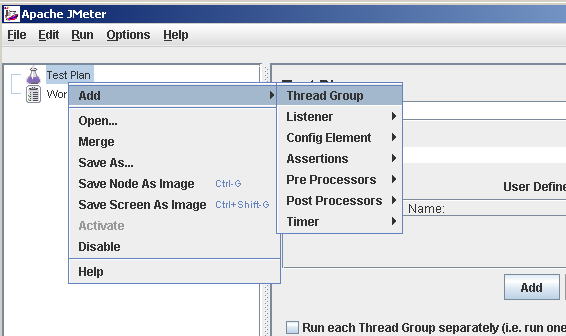
2) Specifies the variables at the root (Test Plan). 

Note: I specifies the hostname of the IdP as 'yifan-jiang.enarc.auckland.ac.nz'

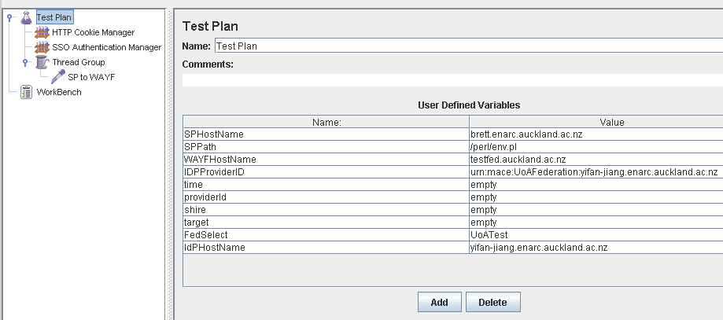
3) Specifies the load of the test plan by configures the Thread properties

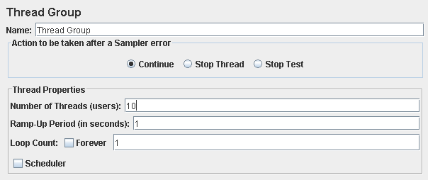
4) Add a Cookie Manager

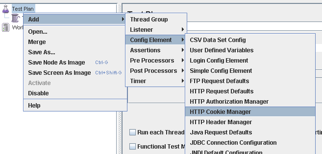
5) Add a Http Authorization Manager if there is a password protection.

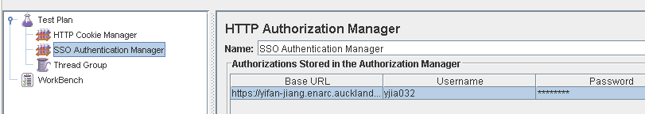
# SP to WAYF sub test plan set up

6) Add a HTTP Request Sampler under the Thread Group

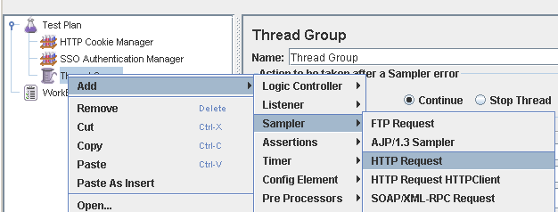
7) Specifies the HTTP Request Sampler

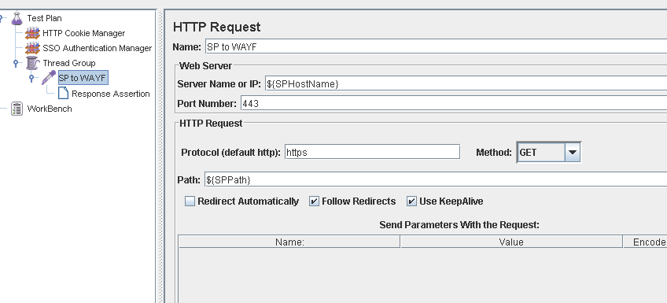
8) Add a Assertion Results Listener after the HTTP Request Sampler

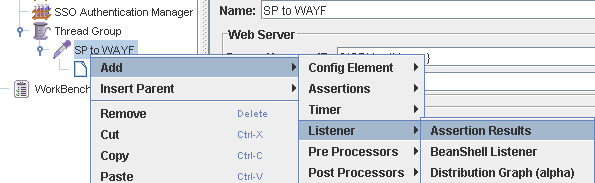
9) Add a 'Save Responses to a file' after the Assertion Results Listener. You can choose either store all the responses or just the failed response only.

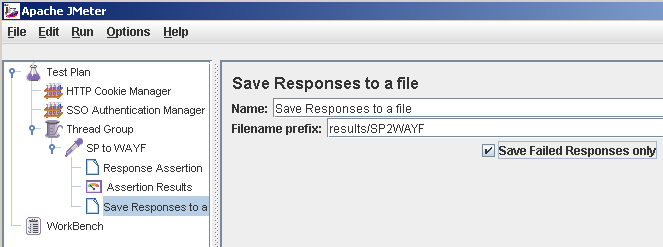
10) It is necessary to extract the responded values from the responded page and then assign these values to their corresponding variables. XPath Extractor would be used for this purpose.

10.1) Extracting 'shire' from the responded page

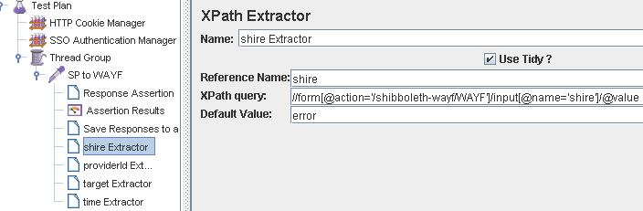
10.2) Extracting 'providerId' from the responded page

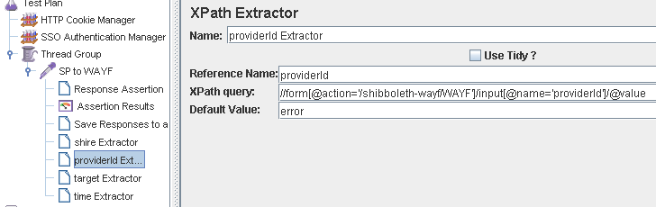
10.3) Extracting 'target' from the responded page

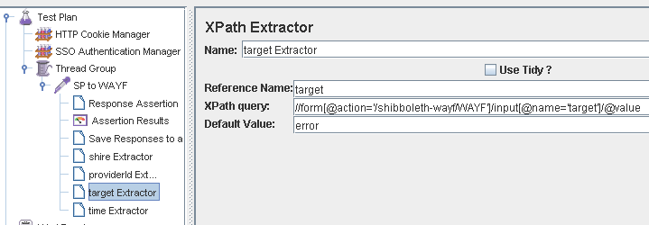
10.4) Extracting 'time' from the responded page

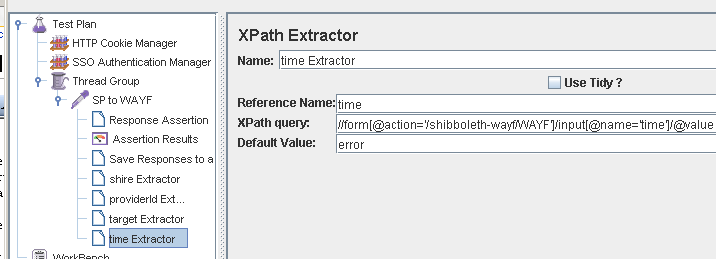
# WAYF to IdP sub test plan set up

11) Add another HTTP Request Sampler for the steps from WAYF to IdP and specifies them as the following

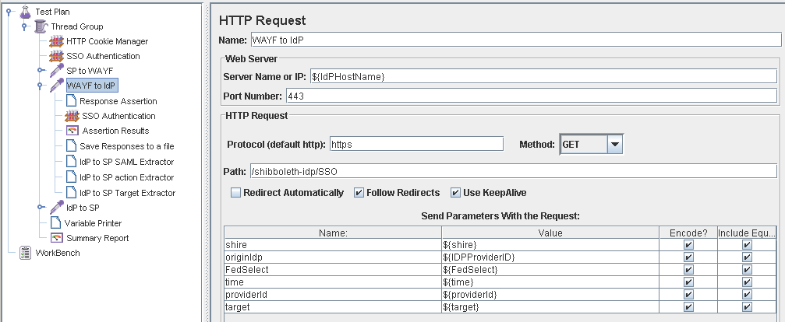
12) Add a Respond Assertion to match the responded page

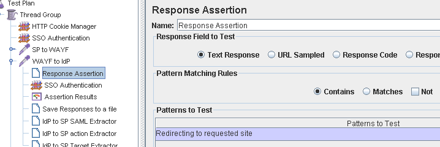
13) Similar to last sub test plan set up, add an 'Assertion Results Listeners' and a 'Save Responses to a file' into this sub test plan as well.

14) Extracting 'SAML' from the responded page

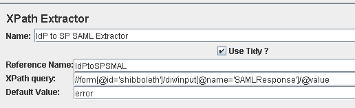
15) Extracting 'action' from the responded page

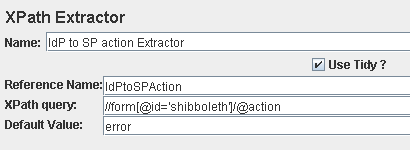
16) Extracting 'target' from the responded page

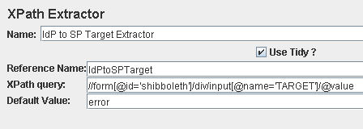
# IdP to SP sub test plan set up

17) Add another HTTP Request Sampler for the steps from IdP to SP and specifies them as the following

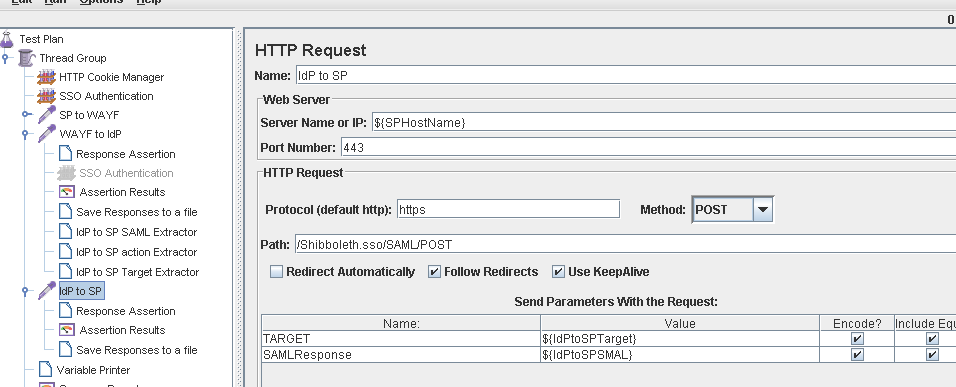
18) Add a Respond Assertion to match the responded page

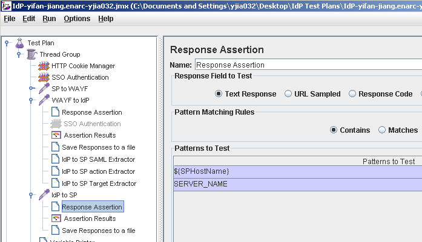
19) Add an 'Assertion Results Listeners' and a 'Save Responses to a file' into this sub test plan, similar to previous sub test plan.

# Debugging and Test Results Summary

20) It is helpful to print out the values of the variables during the debugging process. So click here [http://www.beanshell.org/download.html](http://www.beanshell.org/download.html) and download the 'bsh-commands' (e.g. bsh-commands-2.0b4.jar) into JMETER_HOME\lib. Save and restart JMeter, and then add a 'BeanShell PostProcessor' into the test plan. The script show below is an example to print out the values of all variables.

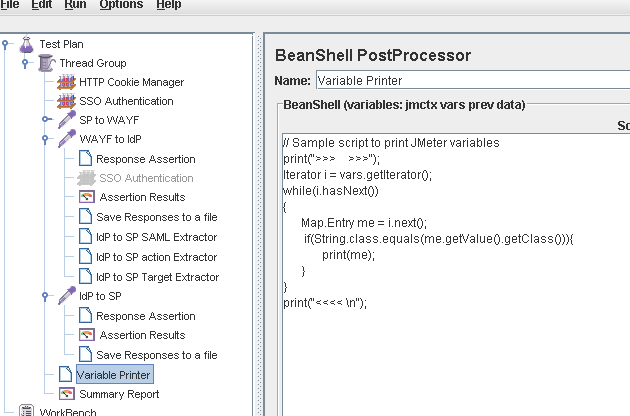
21) Add a summary page to summarizes the test results

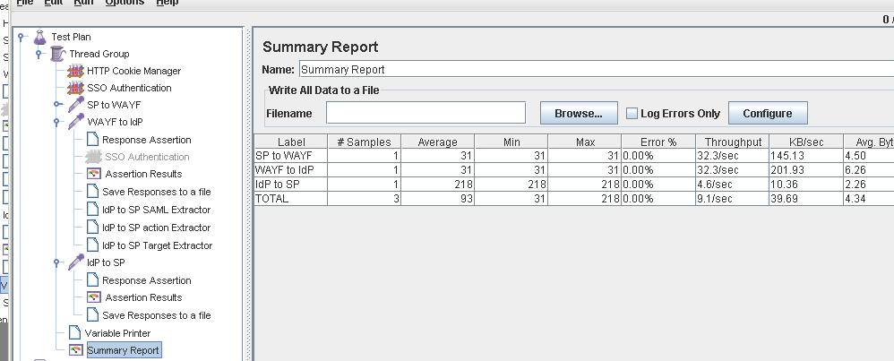