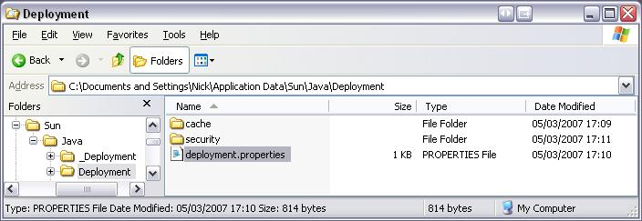

# Known Issues with EVO

## Microsoft LifeCams

We do **not** recommend Microsoft LifeCams, at this stage. There have been many reports that LifeCams dont not always "turn on" when starting EVO. There have been reports that the drivers for these webcams break JAVA compatibility.

## Using Echo Cancellation Devices (such as the Chat50)

When using an echo cancellation device such as the clear one chat 50, you should explicitly select this device in the EVO AVcontrol tab as both the audio transmit device and receive device.  Failing to do this will result in poor audio quality with a lot of echo.

## Forcing EVO to connect to the New Zealand EVO Reflector

An EVO Reflector has been established at the University of Auckland supported by the BeSTGRID project. If you are connected to the KAREN network in New Zealand you should be routing through this node.

Sometimes the BeSTGRID node isn't the one showing up as connected. In some cases you can choose it from the Koala | Koala Monitoring menu, while in others it doest show up in that list. If this is the case you can hard code the EVO Koala client to look for the BeSTGRID EVO Reflector.

1. Find a directory ".Koala" in your home directory (is in your My Documents folder on Windows)
2. Edit the file called koala.properties
	
- Change the "LastPandaList" entry to read "LastPandaList=vrvstest/vrvsref.math.auckland.ac.nz"

- Note

When you exit the Koala client, it will save this file with the panda node you are connected so next time you connect to the same. Before to edit the koala.properties file, you should exit Koala otherwise the change will be overwritten.

## Issue with upgrade to SUN Java JSRE 6.0 upgrade

There is an issue with upgrading to the SUN Java JSRE 6.0, whereby the deployment mechanism for EVO breaks. The steps to follow to resolve this issue are:

1. Ensure the previous Java SE Runtime Environment 5 is uninstalled
2. Remove the previous Sun\Java\Deployment folder from your profile so that it downloads and reinstalls cleanly

The above image shows the location of the Deployment folder on Windows XP.

## [NOD32](http://www.nod32.co.nz/) Anti-virus software conflicts with EVO

AUT found problems with the Koala client closing unexpectedly.  The EVO developers suggested the NOD32 Anti-virus package was the cause.  Uninstalling it solved these problems, however the following should allow Koala to run while retaining anti-virus functionality:

- NOD32 module AMON - Exclude the folder containing your JRE from on demand scanning, on recent Sun installations it is c:\Program Files\Java

- NOD32 module IMON - Exclude javaw.exe.  As per the example above, on a recent installation I found it under C:\Program Files\Java\jre1.6.0\bin\javaw.exe.  This prevents NOD32 from intercepting the network traffic from the Koala client.

The above solved the problem on an office PC using USB webcams.

In our Access Grid room we use an Osprey Viewcast 440 Video Capture card.  This required another change:

- NOD32 module AMON: Exclude the .koala folder within the the current user's profile, eg C:\Documents and Settings\user\.Koala.

## Unable to Start Koala

- ALERT

Bug of Java 1.6 on MS Windows

If you encounter a problem when starting EVO:

- In Start->Run...->Open: type the following command

>  javaws -viewer
>  javaws -viewer

- Click OK from the Run window
- Go to Application Cache and remove all versions of the Koala in the cache.
- Restart EVO.

## Linux specific EVO issues

For detailed notes on Linux-specific EVO issues, see [EVO Under Linux](evo-under-linux.md).

## EVO and Osprey

EVO doesn't recognize cameras if **Osprey** drivers version **4.x** are installed. Use version **3.1.2** instead. (Drivers will be uploaded soon).
