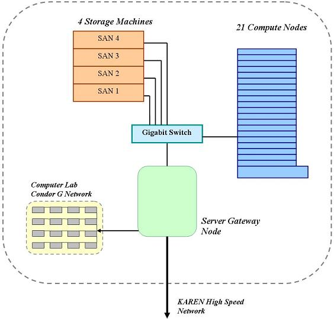
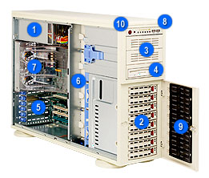
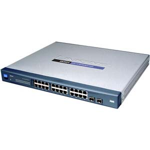
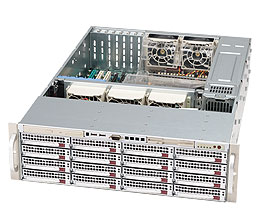
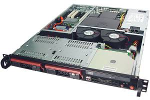

# Massey Cluster

# Summary

The architecture and specifications of the cluster at Massey Albany for participation in the *BeSTGRID* Project are detailed here.

The cluster at Massey is connected to the Grid via the KAREN high speed national network.

The Massey cluster hosts a large number of machines facilitating mass storage and mass computation, which are centrally coordinated by a Server Gateway Node (see diagram below), which is directly connected to KAREN.

The diagram is not out of date - there are 13 physical dual nodes (26 nodes in total), one of which will be used as a Rocks server, and PBS Head Node over Infiniband.

# Server Gateway Node

The Server is a [Supermicro 743](http://www.example.com) (pictured).

The Server has 2 dual-core 64 bit processors, 16 GB of RAM, and contains 6 RAIDed Serial ATA 150GB disks.

We have used [Fedora Core 6 x86_64](http://fedoraproject.org/wiki/) as the base Operating System for the Server machine. No other Operating System would fully support the hardware.

The Server uses a [Xen](http://www.cl.cam.ac.uk/research/srg/netos/xen/) Linux Kernel to host virtual machines.

Each new virtual machine is allocated a chunk of the available RAM and Hard Disk space, and an arbitrary Operating System is installed.

The use of Virtualisation allows multiple, fully-independent systems to operate, abstracted away from hardware. The main advantage of virtualised High Performance Computing is that several different servers, of different Operating Systems, and with different roles can be simultaneously hosted on one physical machine, and arbitrarily brought up or down depending on current needs. Experimental servers can also be built, with no risk to the underlying machine.

In theory, at least, virtualised systems are state-portable to other machines, and easy to backup and restore.

The [Virtual Machines](/wiki/spaces/BeSTGRID/pages/3818228782) page contains full details of the various Virtual Machines on the server, including their various tasks, resource allocation plans, and detailed set-up guides.

# Link to KAREN High Speed Network

# Internal Network

We now have internal Infiniband networking, and several Infiniband switches, so the Gigabit Ethernet information on this page is now redundant, and is only used for maintenance jobs.

## Gigabit Switch

To connect the 4 storage machines to the Server we are *currently* using a 10/100/1000 Gigabit 24-port switch.

The switch is a Linksys SRW2024 (pictured).

The Linksys switches require a Windows machine with Internet Explorer in order to access the administrative interface.

We have discovered that the [Opera](http://www.opera.com/) browser also works, allowing us to use any machine to communicate with the switch.

## Gigabit and 10-Gigabit Ethernet

Presently each storage machine is connected to the switch with 4 separate Gigabit Ethernet cables. We therefore are using 16 ports just to connect to the SAN machines.

The Server machine is also connected to the switch with 4 individual Gigabit Ethernet connections; each one dedicated to a different subnet, so that it is possible to utilise all four simultaneously when communicating with a storage machine. We have found that this approach maximises the bandwidth over our network. Bonding and other approaches were unreliable and slow.

In future the 4*Gigabit Ethernet cables will likely be replaced with a single 10-Gigabit Ethernet connection each, depending on the feasibility of this architecture.

The compute nodes will all use a single 10-Gigabit connection. This may require the use of a larger switch, or a blade device.

# Storage Machines

We are using a stack of 4 SAN (Storage Area Network) machines for primary data storage ,providing a total of 32 Terabytes of storage, and weighing 120kg.

The SAN machines in the Massey cluster are [Supermicro 836](http://www.supermicro.com/products/chassis/3U/836/SC836E2-R800V.cfm) (pictured) with dual core Intel Xeon 64 bit CPU and 16 * 500GB HDs.

For redundancy we have used a *software* RAID block at RAID level 6 on each machine.

# Compute Nodes

## Regular Compute Nodes

The stack of Compute Nodes contains 13 machines with 26 nodes, designed to share the load of several high-CPU-demand jobs that may be running on the cluster simultaneously.

These 20 machines have 8 core X5355 CPUs, 16GB of RAM and 2 SATA disks with about 1TB of storage each.

This provides the cluster with an additional 20TB of storage over the dedicated 32TB in the Storage stack. The cluster will therefore have over 50TB of storage available.

## Super Compute Node

We have one node in the Compute Node stack that is an 8-Core X5355 machine with 8GB RAM and 4 SATA disks with more than 1TB of storage (similar to that pictured below).

This machine may also serve as a secondary server (or storage) machine, depending on the load on the other cluster resources.

# Lab Machines and Condor G

The cluster may be linked to the General Computing Labs at Massey University in Albany.

This would give the cluster access to the spare CPU cycles of approximately 200 modern lab machines.

This grid operation would be administrated by the Server Node, and work in conjunction with [Condor G](http://www.cs.wisc.edu/condor/) software, which will be imaged an all the lab machines, in order to lock/unlock the cycles on each machine depending on user presence.
