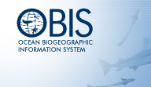

# Ocean Biogeographic Information System (OBIS)

## [Ocean Biogeographic Information System (OBIS)](http://www.iobis.org)

- Project Lead

[A/Prof Mark J. Costello](mailto:m.costello@auckland.ac.nz), Leigh Marine Research Centre, Associate Professor, tel: 83608
- Usage

OBIS virtual machine on Pleyads, 20GB of disk space.

; Project Description:
- OBIS publishes data on behalf of scientists from government agencies, museums, universities, commercial companies, and non-governmental organisations. OBIS is always seeking new contributors.
- OBIS is a marine biogeographic information system, meaning that we concentrate on datasets that record particular species (or higher taxonomic group) from particular marine locations, at particular times. At present, we can only publish data where the locations are recorded as latitude and longitude, not as place names. Our focus is on high taxonomic quality, so datasets where organisms have been identified by professional or trained biologists are our priority. In the near future, we will be expanding to take in environmental datasets (i.e. coverage of physical, chemical, and geological parameters) that are relevant to understanding the distribution of species. So we are interested in hearing from potential contributors of these datasets, and welcome your contact, but are still in the process building this facility.
- www
[http://www.iobis.org](http://www.iobis.org)
