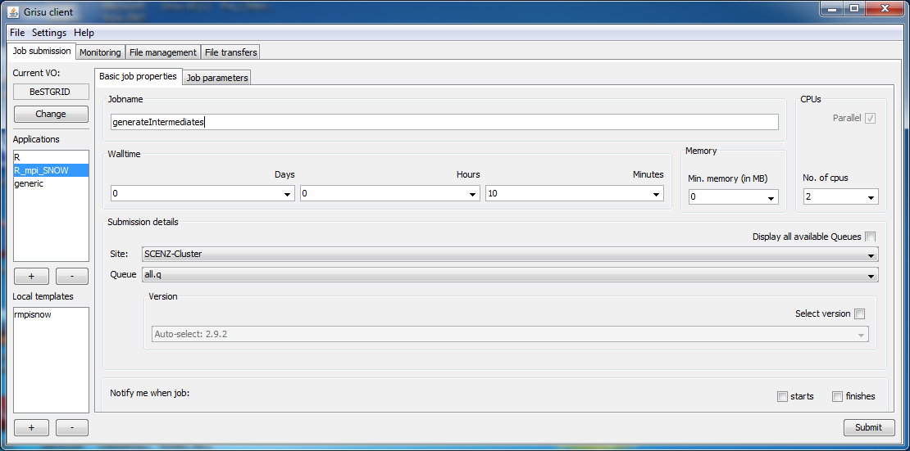

# R Tutorial

# Introduction

This tutorial will demonstrate the submission of scripts developed in the R language to the BeSTGRID computation environment.  The BeSTGRID computation environment provides access to a variety of compute resources, these resources are typically compute clusters and provide a more powerful resource than provided by your typical desktop computer.  A feature of the BeSTGRID computation environment is that it operates in a non-interactive batch mode.  This means that scripts and programs run in the environment need to do so in a self contained way without direct user input.

The tutorial will briefly cover using R in a non-interactive way through the use of R scripts, how you would submit an R job to the BeSTGRID environment.  The tutorial will also cover making full use of BeSTGRID resources by using a parallel approach to R scripts.

# Pre-requisites

In order to make full use of this tutorial you will require the following:

- A [BeSTGRID Federation Identity](https://www.bestgrid.org/getstarted) or a [Grid Certificate](https://reannz.atlassian.net/wiki/pages/createpage.action?spaceKey=BeSTGRID&title=Grid_Certificate&linkCreation=true&fromPageId=3816950630).
- Membership of the [BeSTGRID Virtual Organisation (VO)](https://reannz.atlassian.net/wiki/pages/createpage.action?spaceKey=BeSTGRID&title=Apply_for_VO_Membership&linkCreation=true&fromPageId=3816950630).
- The [Grisu tool to submit jobs](http://grisu.arcs.org.au/downloads/webstart/grisu.jnlp).

# R Scripts

[R](https://reannz.atlassian.net/wiki/pages/createpage.action?spaceKey=BeSTGRID&title=R&linkCreation=true&fromPageId=3816950630) is widely used in by the research community, it traditionally runs in an interactive environment on a users desktop in a single-threaded manner.  We will add some packages namely RMPI and SNOW to an example R script, and run it in a non-interactive manner to allow it to run in a grid computing environment.

If you already have an R script that you run on a cluster or similar then it is likely to be easily translated into the grid computing environment.

## The Example Problem

Throughout this tutorial we will use an example problem to illustrate each stage.  The example is a script that generates a large number of random numbers and returns the sum of those numbers.

The R code for this problem is shown below

``` 


## we are taking in a command line argument
args <- commandArgs(TRUE)

## the argument is the number of random numbers we want to generate
numberofnumbers <- args[1]

## create and initalise a result variable
result <- 0

## generate array of random numbers
arrayofnumbers<- sample(1:10000,numberofnumbers,replace=T)

## loop through the array adding each value to the final result
for(i in 1:length(arrayofnumbers)){

## keep a running total
result = result + arrayofnumbers[i]

}

## display on screen the total value of all numbers added up
print(result)

```

We will refer to this code, as 'addingnumbers.r' in the examples that follow, you can cut and paste the code to create an R file of your own to try the examples out with.

On your local machine you can run this code with either of the command lines shown below.

``` 
RScript addingnumbers.r 20000
```

``` 
R addingnumbers.r --quiet --args 20000
```

# Submitting a Non-Parallel R Script

In this first example, we will look at submitting a standard R script to the BeSTGRID environment.  To do this will be make use of the *addingnumbers.r*script and the Grisu job submission tool.


Select on the left of the window, the R template, if you do not have this available, click the + to add it, see the Grisu documentation for more help.

Give the job a unique name here we have called it **R_Tutorial_AddingNumbers**.

All other options on this screen can be left as is, Grisu has automatically selected a site with R installed to run the job at.

Click the **Job Parameters** tab at the top of the screen, it should look like the image below.


On this tab, use the Browse button to find the **AddingNumbers.r** file that you created earlier.

In the Optional arguments box enter 20000

Click the submit button, this will upload your R script to the BeSTGRID servers and schedule the job to be run.

The image below shows the monitoring information, when this says **Completed** your job has finished running and you can access the results.


Once the job is Completed you can double click the entry to get the output from the job, the output from AddingNumbers is shown below.


Double-clicking the **stdout.txt** will show the results of running the script using R on the BeSTGRID resources.

These files can be copied to your desktop or another grid location if required.

# Submitting a Parallel R Script

The real power of the grid comes when scripts can be run that make use of multiple processors or large amounts of memory.  In this section will will look at working with the addingnumbers script to show someways in which it can be altered to run in a parallel environment.

Our original program generated a large number of random numbers and added them up, printing out the final result.  This code will run reasonably well on a desktop computer, being able to add several million numbers.  However consider adding even larger numbers, for this we will need to split up our addition.

In order to test our code we will split our previous code into two files, the first will generate and add up numbers, the result of this will be saved to an intermediate file.  The second code will take the results stored in intermediate files and add them to produce a final total.  Splitting the work into two files, means we can test our code and make sure that we iron out any bugs.  This method of dividing a problem up, is similar to the approach you may want to take for many science problems also.

``` 

# Using the command line take in two arguments.
# The number of files to create (number of chunks)
# The number of numbers per file to add up.
args <- commandArgs(TRUE)
numberOfFiles <-args[1]
numberOfNumbers <-args[2]
for (i in 1:numberOfFiles)
{
x<- sample(1:10000,numberOfNumbers,replace=T)
#initialise the result variable each time round the loop. 
result <-0
for(m in 1:length(x)){
result = result + x[m]
}
# create a file name based on the loop number.
resultfile<-paste("intermed",i,".txt",sep="")
# actually write out the information to file.
write(result,resultfile)
}
 
```

``` 

# Take from the command line, the number of intermediate files
args <- commandArgs(TRUE)
numberofFiles <-args[1]
# initialise the result variable, outside the loop as we want a final total
result <-0
for (i in 1:numberOfFiles)
{
# generate the input file name
inputfile<-paste("intermed",i,".txt",sep="")
# read the values from the input file, ours will only have one value, but this code will work for files with multiple values
x <- scan(inputfile)
# add up the values of the file.
for(j in 1:length(x)){
result = result + x[j]
}
}
# write to file the final result calculated
write(result,"finalresult.txt")


```

In dividing up our code into two files, we haven't yet made it parallel, but the problem has been broken up so that we can now convert to a parallel implementation.

We will focus on the code that generates the intermediate files.  This file contains two loops, the outer loop controls how many intermediate files we create.  The inner loop does the work to add the numbers, each iteration of the outer loop is independent of all the other iterations, so we will deconstruct this loop to be able to do things in parallel.  Instead of having the contents of the loop run one iteration after the other, we can run all iterations in parallel.  To do this the content of the outer loop will be removed and placed in a function.  The SNOW package provides some functions that allow functions to be called in parallel, we will use one of these to achieve our aims and remove the outer loop.  The code below is the parallel version of the code that generates the intermediate files, we will call this code **generateIntermediate.r**.

``` 

# Take input from the commandline
args <- commandArgs(TRUE)
numberOfChunks <-args[1]
numberOfNumbers <-args[2]
library(snow)
# mpiexec will define size of cluster so don't give this function call a size parameter
# BeSTGRID resources have MPI installed and use the RMPI library also which is why we specify explicitly the MPI cluster to avoid doubt.
cl <- makeMPIcluster()
# cl <- makeCluster() also works here, and would be suitable for use of other systems.
# chunkadd is the contents of the outer loop in the earlier example.
# it is a function that takes two parameters, the file number and the number of numbers to add up.
chunkadd <- function(fileNumber,numbers)
{
x<- sample(1:10000,numbers,replace=T)
result <-0
for(m in 1:length(x)){
result = result + x[m]
}
resultfile<-paste("intermed",fileNumber,".txt",sep="")
write(result,resultfile)
}
#this is the main body of code.
# clusterApplyLB replaces the outer loop in the earlier example, it calls the function chunkadd once for each file (numberOfChunks)
# and distributes them across the available resources in the cluster.
# the LB part of the function name, means that the function will load balance,
# nodes will be fed work depending on how fast they complete previous work.
clusterApplyLB(cl, 1:numberOfChunks, chunkadd, numberOfNumbers)
# as we are using a cluster, we need to stop the cluster before the end of our script.
stopCluster(cl)
# we use the normal quit operation to exit R
q()

```

This script will produce a number of intermediate files that can then be added up.  To submit this job, we need to the the R_MPI_SNOW template in Grisu, the steps below highlight how to do this.


These settings similar to those used for the Non-Parallel submission, except that you need to select the number of CPUs.  Selection of CPUs is important, generally we more processors you can use, the better, however a job won't scale beyond a certain limit, for example, selecting 8 CPUs for to run this job when a parameter of 4 for the number of files is unlikely to have any benefit.  

**At this time is is also recommended that you pick a site other than Auckland to run your jobs at.**


The settings on the parameters tab are again similar to the Non-Parallel version, ensure you specify the parameters that will be passed to your code in the arguments box.

Click on submit once you have completed both screens.

When the job completes you should have a number of files available.  These files can be used as input to the intermediate file adding script which can be run as another job.

To reduce the number of job submissions however we can incorporate back into our R script the code to consolidate the intermediate files so that it runs after we have finished producing the intermediate files.

The code below shows the final version of our script.

``` 

# Take input from the commandline
args <- commandArgs(TRUE)
numberOfChunks <-args[1]
numberOfNumbers <-args[2]
library(snow)
# mpiexec will define size of cluster so don't give this function call a size parameter
# BeSTGRID resources have MPI installed and use the RMPI library also which is why we specify explicitly the MPI cluster to avoid doubt.
cl <- makeMPIcluster()
# cl <- makeCluster() also works here, and would be suitable for use of other systems.
# chunkadd is the contents of the outer loop in the earlier example.
# it is a function that takes two parameters, the file number and the number of numbers to add up.
chunkadd <- function(fileNumber,numbers)
{
x<- sample(1:10000,numbers,replace=T)
result <-0
for(m in 1:length(x)){
result = result + x[m]
}
resultfile<-paste("intermed",fileNumber,".txt",sep="")
write(result,resultfile)
}
#this is the main body of code.
# clusterApplyLB replaces the outer loop in the earlier example, it calls the function chunkadd once for each file (numberOfChunks)
# and distributes them across the available resources in the cluster.
# the LB part of the function name, means that the function will load balance,
# nodes will be fed work depending on how fast they complete previous work.
clusterApplyLB(cl, 1:numberOfChunks, chunkadd, numberOfNumbers)
# as we are using a cluster, we need to stop the cluster before the end of our script.
stopCluster(cl)
# The code to add the intermediate files goes after we have stopped the cluster as it is a serial job, we are no longer running in parallel.
# Initialize the final result variable 
finalresult <-0
for (i in 1:numberOfChunks)
{
# generate the input file name
inputfile<-paste("intermed",i,".txt",sep="")
# read the values from the input file, ours will only have one value, but this code will work for files with multiple values
x <- scan(inputfile)
# add up the values of the file.
for(j in 1:length(x)){
finalresult = finalresult + x[j]
}
}
# write to file the final result calculated
write(finalresult,"finalresult.txt")
# we use the normal quit operation to exit R
q()

```

This job can be submitted in the same way, as before using the R_MPI_SNOW template.

This has provided a brief example of how an R script can be made parallel by replacing a loop with a parallel apply function and how that can be submitted to execute on BeSTGRID.  Below is a brief discussion of some other considerations when looking to develop parallel R scripts.

# Considerations for Parallel R Scripts

When producing parallel R scripts, there are some important considerations, these are discussed briefly below, more information can be found online by searching for information on writing parallel programs.

**Debugging**, Debugging can be more difficult with scripts that operate in parallel.  It is best to develop in small increments and to test as you go.  If you are creating a function, ensure that it works how you expect first before including it in your script.

**Loops**, Loops are usually the best candidates for getting speedups in your code.  However you need to ensure that they don't rely on the results of a previous loop iteration.  Each loop body needs to be independent.  In our example the loop body was independent because it was generating and adding a list of random numbers.  Foreach loops are often independent.  If your loop is not independent consider ways that you could make it independent.

**Concentrate on the slow parts**, The aim with a parallel programming approach is to dramatically speed up the computation being done.  Identify the parts of your code that are computationally intensive and concentrate your efforts on them, this will help you see the best speed up.

**Serial Code**, In your program you may have chunks of serial code, this is fine, think about how you place them in relation to parallel code.  If your code is mainly serial with a small amount of parallel work, you might want to convert it into two jobs so that you don't hold up a large number of processors for a long time.

**Task Parallelism**, If you have a number of serial jobs that are performed on the same data, are they independent (don't update the data or rely on another task to return an answer), if so consider task parallelism. Task Parallelism is where a number of different jobs are all going on at the same time. Read more on [Task Parallelism at Wikipedia](http://en.wikipedia.org/wiki/Task_parallelism)

# Package Installation

BeSTGRID sites will have a number of common packages installed, however you may need to install your own specialized packages.  This article on [R packages](https://reannz.atlassian.net/wiki/pages/createpage.action?spaceKey=BeSTGRID&title=Installing_R_packages_in_Grisu_jobs&linkCreation=true&fromPageId=3816950630) will help.

# Other Submission Mechanisms

The command line version of Grisu, Gricli can be used to submit jobs. More information on submitting jobs with Gricli will appear here shortly.
