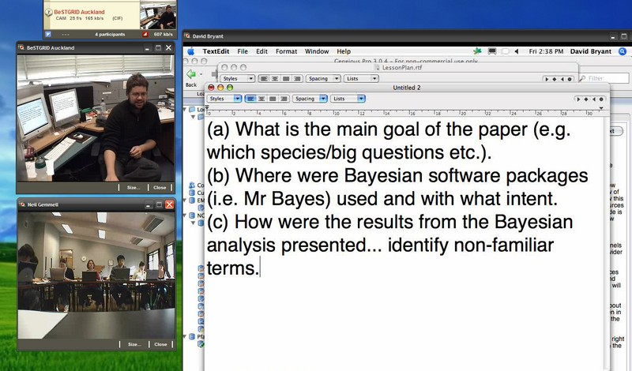
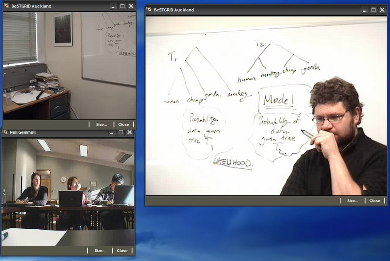
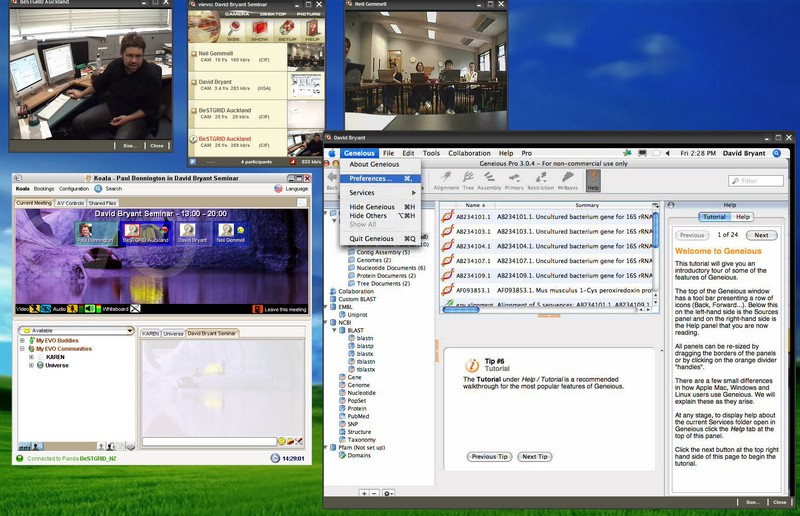

# Remote Teaching using EVO

# Dr David Bryant teaching the Graduate course Bio 430

# at the University of Canterbury....from his office in Auckland

>  [Dr David Bryant](http://www.math.auckland.ac.nz/~bryant/)
>  Department of Mathematics, University of Auckland

- Demonstration conducted

>  Friday May 18, 2007
>  2:00 - 4:00 pm
>  Friday May 18, 2007
>  2:00 - 4:00 pm

First example in NZ of **cross-institutional live teaching using DVD quality video** and shared desktops between regular (seminar) rooms and personal offices, enabled by the KAREN network |

## Location & Facilities were easy to access

- Taught from the comfort of David Bryant's University of Auckland office using [BeSTGRID portable equipment](/wiki/spaces/BeSTGRID/pages/3818228487)

>  *A*regular teaching room* was used at Canterbury, again using the [BeSTGRID/HitLab portable equipment](/wiki/spaces/BeSTGRID/pages/3818228487)
>  *A*regular teaching room* was used at Canterbury, again using the [BeSTGRID/HitLab portable equipment](/wiki/spaces/BeSTGRID/pages/3818228487)

## An engaging experience for all

>  ***Students at Canterbury responded frequently** with questions during the lecture

- David Bryant was able to share his office desktop computer screen with class in Canterbury, and provide live demonstrations of software, and powerpoint presentations
- Lecture was also watched live by two other BeSTGRID members (Paul Bonnington and Nick Jones) from their office desktops. Furthermore, Paul Bonnington also fully participated in the discussions from his office
- Organised by A/Prof Neil Gemmell

>  BeSTGRID's Project Lead: University of Canterbury
>  BeSTGRID's Project Lead: University of Canterbury

## Technology supported collaboration

- DVD-quality (XGA resolution) video used for David Bryant and regular office whiteboard.
- There were multiple video feeds from the Auckland office: DVD-video for Whiteboard, full resolution desktop computer display (as video), and two CIF-resolution camera feeds from other points in the office
- [EVO (Enabling Virtual Organisations)](evo-vignette.md) software was used for all aspects of the remote teaching
- Multiple platforms used: Windows, Macintosh. Multicast network was not required. Session was operated by lecturers Neil Gemmell and David Bryant.

# Photos from the Lecture (Selected Screen Shots)

All photos have been reduced in resolution. Full resolution photos available upon request.

