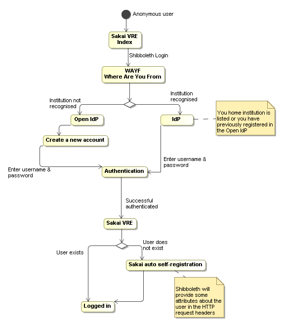

# Sakai and Shibboleth Integration

# Introduction

This article presents a high level overview of the use of Shibboleth federated authentication with Sakai used as a Virtual Research Environment (VRE). Is a picture worth a thousand word? Yes, I think the diagram [below](#SakaiandShibbolethIntegration-SakaiandShibbolethIntegrationDiagram) can give you a big picture overview of an anonymous user authenticated himself through a Shibboleth federation network.

However, it is useful to understand some background overviews of Shibboleth and Sakai which maybe helpful for you to understand the diagram below. Several useful links are listed at the [References](#SakaiandShibbolethIntegration-References) section. 

# Terminology

It is important to understand some terminologies before you go further. If you already know some basic knowledges of Shibboleth and Sakai, you can skip this section and go [below](#SakaiandShibbolethIntegration-SakaiandShibbolethIntegrationDiagram). The definitions below are directly quoted from the [Shibboleth](http://shibboleth.internet2.edu/about.html) and [Sakai](http://sakaiproject.org/index.php?option=com_content&task=view&id=103&Itemid=208) official website.

## Shibboleth

>  ***Identity Provider (IdP)** is responsible for supplying information about users at a domain to relying parties protected by service providers.

 ***Service Provider (SP)** communicates with Identity Providers (IdP) to discover information about users trying to access resources it protect.

>  ***Where Are You From (WAYF)** or **Discovery Service** is responsible for allowing a user to associate themself with an institution of their specification, then redirecting the user to the known address for the handle service of that institution.

 ***Open IdP** a Identity Provider with a web interface which allows users to register their details.

## Sakai

>  ***Sakai** is an online Collaboration and Learning Environment. Many users of Sakai deploy it to support teaching and learning, ad hoc group collaboration, support for portfolios and research collaboration.

# Sakai and Shibboleth Integration Diagram

# References

- Toolkits

[Sakai Guanxi Shibb Kit](http://www.guanxi.uhi.ac.uk/drguanxi/index.php/Sakai_Guanxi_Shibb_Kit)

[Stockholm University Opensource SAKAI Shibboleth Patches](http://devel.it.su.se/pub/jsp/polopoly.jsp?d=2376&a=21472)
- [Trials and Minor Tribulations - Configuring Sakai for Shibboleth](http://confluence.sakaiproject.org/confluence/display/CONF07/Trials+and+Minor+Tribulation+-+Configuring+Sakai+for+Shibboleth;jsessionid=240CBFAA68D282832E7465CF34768F06)
- Internet2 resources

[Shibboleth Technical Overview](http://shibboleth.internet2.edu/shib-tech-intro.html)

[Shibboleth high-level technical introduction](http://shibboleth.internet2.edu/tech-intro.html)
- Sakai resources

[About Sakai](http://sakaiproject.org/index.php?option=com_content&task=view&id=103&Itemid=208)

[Charles Severance muses on Shibboleth for Sakai VRE / Research Sites](http://bugs.sakaiproject.org/confluence/display/ENC/Shibboleth+for+Research+Sites)
- General
- [A similar project undertaken at OSS Watch UK|http

//wiki.oss-watch.ac.uk/SakaiVre/ShibbolethIntegration?highlight=%28%5ESakaiVre/.%2A%29]
- [Shibboleth installations and configurations](shibboleth.md)
