# Shibboleth-idp

# **Install Shibboleth IdP 1.3** 

This section describes my steps of installation and configuration of Shibboleth IdP in Microsoft Windows XP. It also includes the problems that I've had to face and how to deal with them.

# Step 1: Beginning with some research online

I've been googling around the internet for a while, and I found number of articles that may help you during your installation.

1. MAMS's manual installation guide [http://www.federation.org.au/twiki/bin/view/Federation/ManualInstallSP](http://www.federation.org.au/twiki/bin/view/Federation/ManualInstallSP).
2. Katholieke Universiteit Leuven's IdP installation guide [http://shib.kuleuven.be/docs/idp/install-idp-1.3.shtml](http://shib.kuleuven.be/docs/idp/install-idp-1.3.shtml).

# Step 2: Install JAVA 5.0 SDK

It is one of the prerequisites of IdP installation. Remember to set the environment variable JAVA_HOME to "c:/jdk5.0/" (That is where I installed my JAVA SDK) and attach "%JAVA_HOME%/bin" to the end of the env variable "Path". To set the environment variable, you could go Start->Settings->Control Panel->System->Advanced->Environment Variables

# Step 3: Install Apache Ant Build Tool

You need the Apache Ant Built Tool in order to install a Shibboleth IdP. You can download its binary file from here [http://ant.apache.org/bindownload.cgi](http://ant.apache.org/bindownload.cgi).

Extract the binary to somewhere convenient on your computer once the download has completed.  You might find it is more convenient if you can set an environment variable ANT_HOME and edit the "Path" for Ant.

# Step 4: Install OpenSSL

This step is the pre-step of getting a certificate, so you can skip it if you can plan to get a certificate from somewhere else. Download the binary file (e.g., Openssl-0.9.8d-Win32.zip) for Win32, else you could get it from hunter [http://hunter.campbus.com/](http://hunter.campbus.com/).

Download and extract the binary file to a directory, and copy the libeay32.dll and ssleay32.dll to Windows\System32. 

I had some troubles pasting those files into the System32 folder, since they were being using by some other programs. So, I renamed the original files and then pasted the new ones.

Don't forget to set the environment variable for it (OpenSSL?). It would make the life simpler in the later stage. 🙂

# Step 5: Obtain the SSL certificate and CA certificate

First of all, creates a directory etc/certs, Then enter the following command at the command prompt

openssl req -newkey rsa:1024 -nodes -keyout server.key -out server.csr 

open the server.csr, then you should see something like this

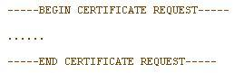
Copy all of them included those two lines, and then paste them at [http://www.federation.org.au/CA/CA-sign.html](http://www.federation.org.au/CA/CA-sign.html) in order to get a resultant certificate.

Copy and paste the resultant certificate into a file called server.crt. 

Download a level 1 CA certificate from [http://www.federation.org.au/level-1-ca.crt](http://www.federation.org.au/level-1-ca.crt) [http://www.federation.org.au/level-1-ca.crt](http://www.federation.org.au/level-1-ca.crt)

Note: I did not use the certificates created by myself, I obtained it from Brett Lomas [b.lomas@auckland.ac.nz](mailto:b.lomas@auckland.ac.nz). So I have no idea how were those self-generated certificates.

# Step 6: Install Apache2 with SSL

Go to hunter [again to download the binary file for Apache2 with SSL. In my case, I've downloaded this: Apache_2.0.59-Openssl_0.9.8d-Win32.zip 

Extract it into a folder, e.g C:/Apache/Apache2 and set up the environment variable 'Path' for it as well.

open and edit the conf/httpd.conf file

Change the 'ServerName' to your real one... in my case is: yifan-jiang.enarc.auckland.ac.nz

If you don't know what is your DN, you can do it in the following way...

Open a command prompt, type: ipconfig     

Remember your IP and enter it as the following way: nslookup 130.1..... (your IP)

And then you should record down the 'Name' for your ServerName. After that, you should go back to httpd.conf file and replace the attributes "DocumentRoot" and "Directory .." with your real web root path.

Finally, you open a command prompt and type "apache -k install" to install Apache2.

# Step 7 Configure Apache2 with SSL

Back to conf\httpd.conf again, looking for this line "LoadModule ssl_module modules/mod_ssl.so" and uncomment it by removing the # character. 

Find this:

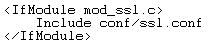
and comment the 

``` 
<IfModule ...>
```

 and its closing line 

``` 
</IfModule>
```

. just leave the 'Include' line.

Save and close httpd.conf and then open conf\ssl.conf for editing.

Make sure it has the following:

Listen 443

Listen 8443

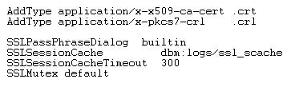
Create two virtual ports, remember replace my ServerName (yifan-jiang.enarc.auckland.ac.nz)with yours.

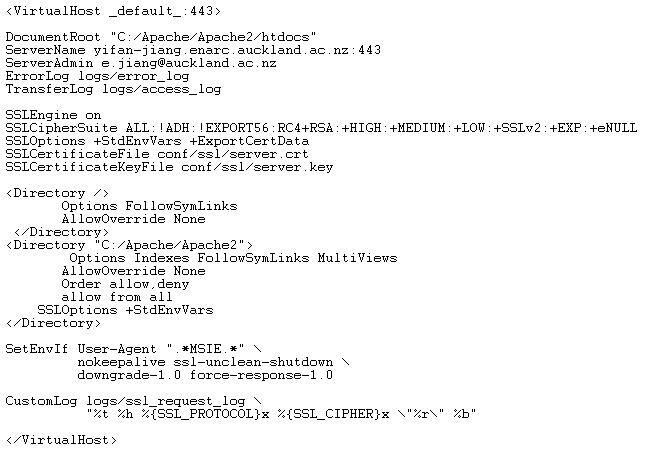
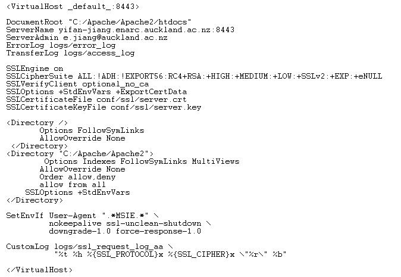
**Note:** I've created a conf/ssl folder to stores my key (server.key) and my certificate (server.crt). Notice that you should replace my paths of my key and my certificate with yours when you are configuring the attributes: SSLCertificateFile and SSLCertificateKeyFile for both of your virtual hosts.

**Remember!!!!!** Starting your Apache2 service by enter the command line below into the command prompt

**apache -k start -D SSL**

Don't forget the -D SSL, otherwise the https will not work!!!!

# Step 8: Install and configure Tomcat mod_jk Connector

**Download and install Apache-Tomcat Connector**

Download mod_jk.so from [http://tomcat.apache.org](http://tomcat.apache.org). Click on Tomcat Connectors (under "Download" on the left-hand side), and then click JK 1.2 Binary Releases. Under Win32, select jk-1.2.xx and find mod_jk-apache-2.0.x.so. 

Extract to **apache_install_dir**/modules and rename it to mod_jk.so

**Configuring Apache**

Add the following line to the end of the **apache_install_dir**/conf/httpd.conf file:

Include "**tomcat_install_dir**/conf/jk/mod_jk.conf"

**Configuring Tomcat**

1) Create a jk directory in the **tomcat_Install_dir**\conf\ directory.

2) Create the mod_jk.conf and workers.properties text files in the jk directory.

3) Create the jk.log file in the **tomcat_Install_dir**\logs\ directory.

4) Copy the following text into the mod_jk.conf file:

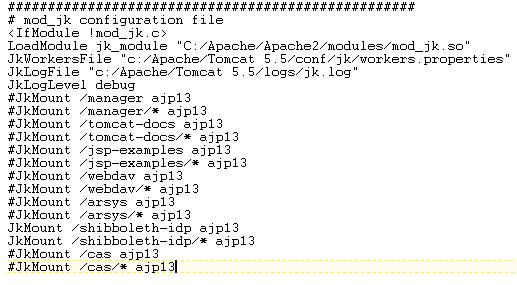
NOTE: I've commented out some directories and added the shibboleth directory in there.

5) Copy the following text into the workers.properties file:

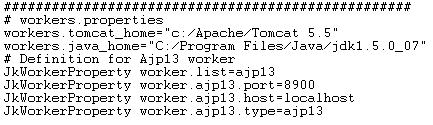
6) Restart Apache and Tomcat. (Remember restart Apache by: **apache -k stop**     and   **apache -k start -D SSL**

# Step 9: Download and Install Shibboleth IdP

1) Download the latest version of Shibboleth IdP from internet2[http://shibboleth.internet2.edu/latest.html](http://hunter.campbus.com/)]

2) Extract it into a temporary working directory. We will refer to this directory as the environment **shib_install**.

3) Copy all **shib_install**/endorsed/**.jar to *tomcat_install**/common/endorsed

4) Open a command prompt and go to **shib_install** directory. 

5) Run the installation script by enter **ant.bat**, and this will take you through a series of question.

I've installed my IdP at c:/shibboleth-idp/

# Step 10: Configure Shibboleth IdP

Edit your shibboleth configuration file: c:/shibboleth-idp/etc/idp.xml as the following.  

You should change the variables that circled in red with your own configuration and be careful the variables that circled in green, they all have their own corresponding definitions.

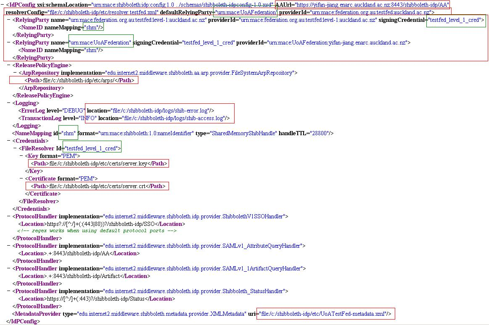
Edit your own resolver file, I've add the following into my resolver file (etc/resolver.testfed.xml)

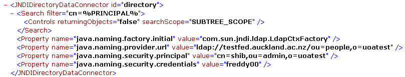
Edit your metadata file that specified in your idp.xml file. In my case, it is etc/UoATestFed-metadata.xml

You need to add a CA into your metadata file, for example:

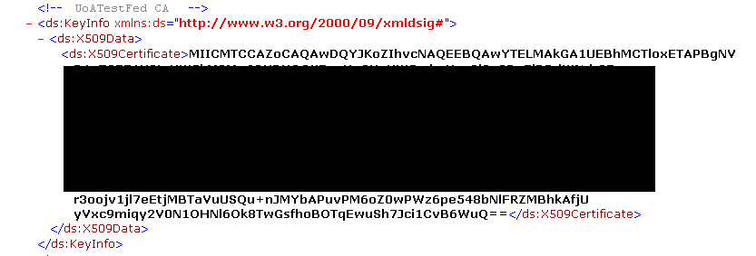
and add one or more entities in it as well, for example:

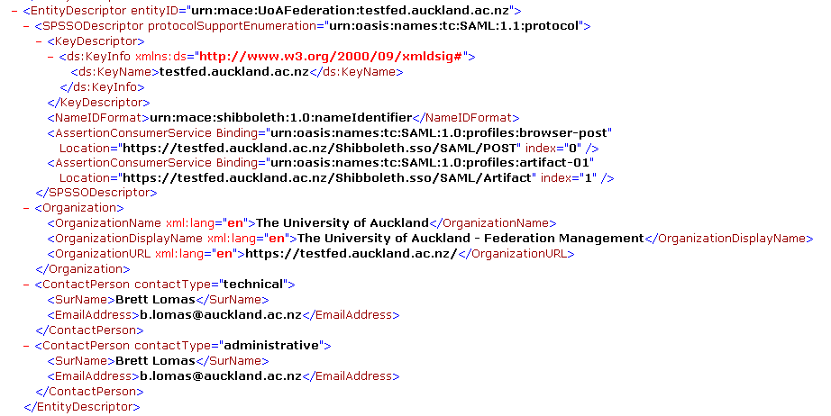
# Step 11: Protecting SSO

If you already have a authentication system, then you can skip this step. This step just provides you an instruction on how to set up a simple authentication system for IdP.

1) Open a command prompt and go to your **apache_home**/bin directory, e.g. C:\Apache\Apache2\bin

2) enter the following commands

**htpasswd.exe -c ..\users *your_username_in_ldap***   (and then follow the instruction)

**htpasswd.exe ..\users *another_username_in_ldap** (e.g. yjia032)* (add another users)

3) Add the following lines into your httpd.conf at **apache2_install_dir**\conf, e.g. (C:\Apache\Apache2\conf)

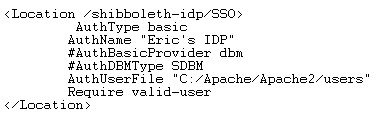
# Common Errors

It is recommended to review the log files in both Identity Provider (IdP) and Service Provider (SP) in order to diagnose the errors.

## Session Creation Failure

It may occur due to the following errors:

1) **Clock Skew**

The shibd.log file in SP presented a message similar to below: 

**ERROR shibd.Listener ****[41]**** sessionNew: caught exception while creating session: unable to accept assertion because of clock skew**

It is caused by the different system time settings between SP and IdP. 

2)  **Metadata conflict**

If the following messages presented in the shibd.log of SP, then it should be the conflict between the metadata in either IdP or SP, or both. Make sure those metadata is up-to-date, and they should contain the identities and the details of all parties (e.g. IdP specified the identity and the details of the SP that it need to communicate with). 

ERROR OpenSSL [52] sessionNew: path validation failure: unable to get local issuer certificate

ERROR Shibboleth.ShibBrowserProfile [52] sessionNew: unable to verify signed profile response

ERROR shibd.Listener [52] sessionNew: caught exception while creating session: unable to verify signed profile response

## Attribute Release Policy (ARP)

Make sure the tomcat authentication has turned off, otherwise it may cause some problems when requesting the attributes from IdP.

It can be turn off by the following specification in the server.xml of **tomcat_install**/conf directory. e.g C:\Apache\Tomcat 5.5\conf


