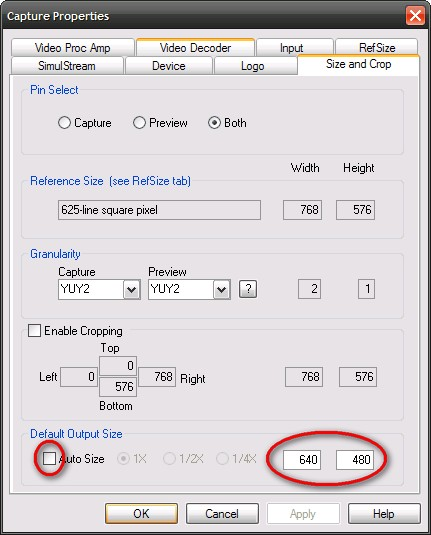

# Software Configuration for Portable Node

Be sure to also read **[Access GRID sessions to UK sites](/wiki/spaces/BeSTGRID/pages/3816950471)**

# Software Configuration for Access Grid 2.4 (Preferred version for use in NZ)

- The following were sourced from [Access GRID site](http://www.accessgrid.org)
	
- [Python 2.3.5](http://www.python.org/ftp/python/2.3.5/Python-2.3.5.exe) (install all components. Default install)
- [Python win32 Extensions](http://prdownloads.sourceforge.net/pywin32/pywin32-207.win32-py2.3.exe?download)
- [wxPython 2.6](http://prdownloads.sourceforge.net/wxpython/wxPython2.6-win32-unicode-2.6.2.1-py23.exe) (ansi-py23, full installation, with compile options on)
- [Access Grid Toolkit 2.4](http://www-new.mcs.anl.gov/fl/research/accessgrid/software/releases/2.4/windows.html)

- Make sure you have done a full Microsoft Windows Update from [Windows Update home](http://update.microsoft.com).
- Turn off WindowsXP Firewall (using the Security Centre control panel)
- Configure institutional firewall as below
- Run AccessGRID Venue Client (Debug Mode)
- Fill out Profile
- Set Home Venue to

>  [https://agvenue.karen.canterbury.ac.nz:9000/Venues/default](https://agvenue.karen.canterbury.ac.nz:9000/Venues/default)
>  [https://agvenue.karen.canterbury.ac.nz:9000/Venues/default](https://agvenue.karen.canterbury.ac.nz:9000/Venues/default)

- Set Profile Type to 'node'
- Preferences: Certificate Manager.... -> Load your certificate (apply for one if you dont already have one)

# Software Configuration for Access Grid 3.x (For Testing Purposes in NZ)

- The following were sourced from [Access GRID site](http://www.accessgrid.org) and can exist with Version 2.4
- [Access Grid 3.0.2](http://www.accessgrid.org/software) (Windows XP)
	
- [Python 2.3.5](http://www.python.org/ftp/python/2.3.5/Python-2.3.5.exe) (install all components. Default install)
- [Python win32 Extensions](http://prdownloads.sourceforge.net/pywin32/pywin32-207.win32-py2.3.exe?download)
- [wxPython 2.6](http://prdownloads.sourceforge.net/wxpython/wxPython2.6-win32-unicode-2.6.2.1-py23.exe) (ansi-py23, full installation, with compile options on)
- [Bonjour](http://a1408.g.akamai.net/7/1408/9955/20050505/akamai.info.apple.com/Bonjour/061-1768.20050505.BJWdw/BonjourSetup.exe)
- [Access Grid Toolkit 3.0.2](http://www-new.mcs.anl.gov/fl/research/accessgrid/software/releases/3.0.2/windows/AGTk-3.0.2-Final-Py-2.3.exe)

*Run AccessGRID software and fill in Profile Dialog. Set Home Venue to:*

*[https://agvenue.sges.auckland.ac.nz:8000/Venues/default](https://agvenue.sges.auckland.ac.nz:8000/Venues/default)**. Profile type is Node.*

- [RealVNC 4.1.2](http://www.realvnc.com) (VNC Free Edition for Windows) (install will server configured, provide password, Must have vncviewer.exe in path or in 'c:\program files\realvnc\vnc4')

*Run AccessGRID software as above before attempting to install Shared Desktop.*

- [Access Grid Shared Desktop v0.2](http://www.westgrid.ca/collabvis/research-agshareddesktop.php) (version for AG3.x, [installation instructions](http://www.westgrid.ca/collabvis/research-agshareddesktop.php), agpm3.py is located in C:\Program Files\AGTk-3\bin, shared desktop package should be moved there and agpm3.py command run from that directory)
	
- While in a venue, right click Shared Applications and choose 'Add Shared Desktop'
- Right click the newly created Shared Desktop shared application and choose Open. A gui should appear offering to share your own desktop and listing other available desktops to connect to.
- You will need to open a port on your firewall to allow connection. The default listening port for the vncserver is 9010.

# Firewall: University of Auckland specific info for inbound ports

If you are using JANET and the Manchester bridge the only thing you will need is inbound UDP on the Rincewind entries.

Have the following added to the FW access list:     udp-r_9999_11000-in

This is a inbound UDP range between 9999 and 11000 which the Manchester AG2|3 bridge uses.

All you require for outbound FW is having Rincewind Access class set as external.

>  [http://www.agsc.ja.net/support/ports.php](http://www.agsc.ja.net/support/ports.php)

If you are using the University of Canterbury Venue Server you will need is inbound UDP on the Rincewind entries to include up to port 59999.

Have the following added to the FW access list:     udp-r_9999_59999-in

# University of Canterbury Venue Server and Unicast Bridge for AG 3.0

**Note:** Currently the Canterbury DNS server is playing-up. You will need to add 202.36.178.240 to your DNS servers list.

If connecting to the University of Canterbury Venue Server with Unicast you will need to change a configuration

file located on your computer:

>  C:\Documents and Settings*username*\Application Data\AccessGrid3\Config

There is a file called preferences. Open this up in text editor and

change the line where is says bridgeRegistry to:

>  bridgeRegistry = [http://agwww.karen.canterbury.ac.nz/registry/peers.txt](http://agwww.karen.canterbury.ac.nz/registry/peers.txt)

# Polycom PVX (Optional)

If you are also installing Polycom PVX on the portable AccessGRID node, and are using Osprey Video Capture Cards, then you will need to set (in the Osprey VidControl, under Capture Properties) the Default Output Size to 640x480 (with Auto Size off). Otherwise, when you start Polycom PVX, it will report that it does detect your video input.

