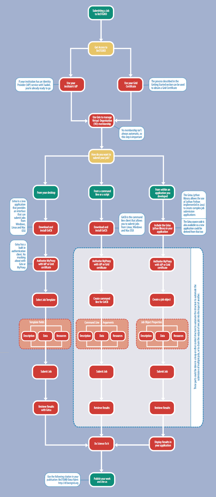

# Submitting jobs with Grisu

`Getting Started Roadmap`

# What are Compute Jobs?

Compute Jobs are packages of work submitted to a computer, which could be the workstation at your desk or a supercomputer on the [BeSTGRID Computation Grid](https://reannz.atlassian.net/wiki/pages/createpage.action?spaceKey=BeSTGRID&title=Category__Computational_Grid&linkCreation=true&fromPageId=3818228931).	A Compute Job consists of: a **description** of the work to be done, some **data** to be worked on, and a list of **resources** required to do the work, though some of these could be trivial or empty. BeSTGRID provides services for non-trivial compute jobs that are beyond the resources of an individual researcher’s workstation or even the computing facilities of an individual research institute.

Compute jobs take many shapes:

>  ***Highly Parallel** or **Tightly Coupled** jobs for fluid dynamics, molecular motion
>  ***Long Running Simulations** of probability, such as random walks and Monte Carlo runs
>  ***Complex Analyses**' of large data sets
>  ***Large Memory** jobs requiring large amounts (>2GB) of data to be held in memory at any time
>  ***Embarrassingly Parallel** jobs consisting of [many independent calculations](http://www.stat.auckland.ac.nz/grad/faq/running-simulations#job-scripts) with slightly different parameters or data sets

BeSTGRID makes compute resources available for all these job types.

# What computing resources does BeSTGRID provide?

None. BeSTGRID itself does not provide any computing resources, but the BeSTGRID members share substantial computing resources with each other. These range from modest dedicated computing clusters such as SCENZ-Cluster from Landcare Research NZ Ltd, through the distributed cycle-scavenging clusters provided by the University of Auckland, to the BlueFern supercomputer from the University of Canterbury.

Due to the variety of resources available, there’s likely to be a resource already available that suits the Compute Job you want to run.

# How do I submit a Compute Job?

To submit a compute job, download and install one of the [Grisu](https://reannz.atlassian.net/wiki/pages/createpage.action?spaceKey=BeSTGRID&title=Grisu&linkCreation=true&fromPageId=3818228931) clients. These clients are used to create compute jobs by; attaching a **description**, in the form of a script or command to be executed, including some **data**, and requesting appropriate **resources**. Once the compute job is set up, the client submits it via the KAREN network, or a standard internet connection, to one of the compute resources on the BeSTGRID Computational Grid.

# What is Grisu?

The Grisu suite allows BeSTGRID members to submit compute jobs in a standard form to the various BeSTGRID Computational Grid resources. The Grisu suite includes:

- The Grisu desktop application, which uses templates that make job submission as easy as filling in a form
- The [GriCli](http://projects.arcs.org.au/trac/grisu/wiki/Gricli) command line client, which allows job submission from a command line or a shell script
- The [Grisu Jython Library](http://projects.arcs.org.au/trac/grisu/wiki/GrisuJython), which allows job submission from within a software application

Grisu is developed by [Australian Research Collaboration Services](http://www.arcs.org.au/) (ARCS), and has significant contribution from BeSTGRID. There is an active developer community and the source code is [freely available](http://projects.arcs.org.au/trac/grisu/).

# Submitting a job from your desktop

We expect you have followed the steps listed at the bottom of this page to gain access.

1. Start the [Grisu template client](http://www.bestgrid.org/grisu) (Java Webstart Link)
2. Login
3. Create a job
	
- Choose job type
- Enter job details
- Select files for upload
4. ***Submit your job.** This places it into a queue where it will be run as soon as possible. Depending on current load and your demands, this could be quite some time.

On the completion of your job you can pick up the files from within the Grisu template client by double-clicking on your jobs name in the status page.

FIXME: I'm surprised there isn't already a page to cover this. Cut+pasted in the content from Aaron Hicks & Stephen D. Cope's poster at the eResearch Symposium (2010), although it doesn't cover the Grisu template client.
