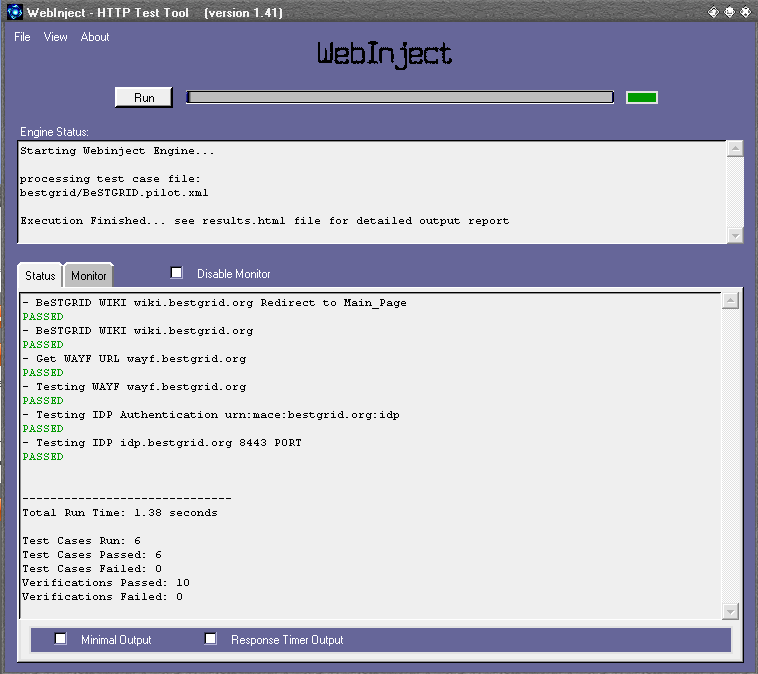
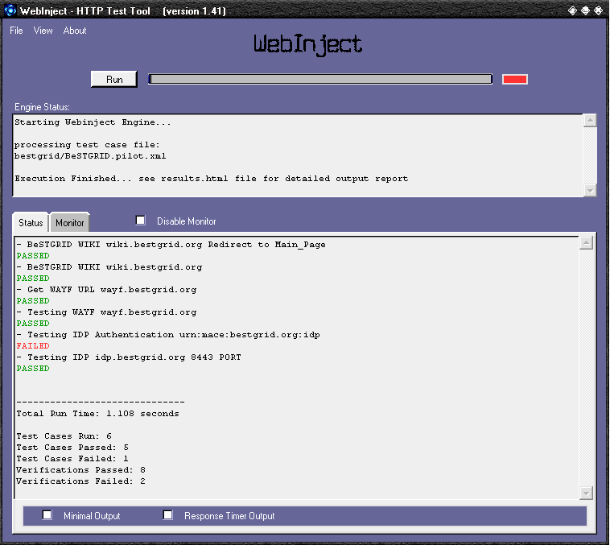

# System Monitoring

# Introduction

This article covers my exploration on system monitoring. 

# [WebInject](http://www.webinject.org)


WebInject is a free tool for automated testing of web applications and web services. It can be used to test individual system components that have HTTP interfaces (JSP, ASP, CGI, PHP, Servlets, HTML Forms, XML/SOAP Web Services, etc), and can be used as a test harness to create a suite of [HTTP level](https://reannz.atlassian.net/wiki/pages/createpage.action?spaceKey=BeSTGRID&title=HTTP%20level&linkCreation=true&fromPageId=3816950817) automated functional, acceptance, and regression tests. A test harness, also referred to as a test driver or a test framework, allows you to run many test cases and collect/report your results. WebInject offers real-time results display and may also be used for monitoring system response times.

WebInject uses an XML API (interface) for defining and loading test cases. You can use WebInject without ever seeing its internal implementation.

# Download

- [ Download WebInject for MS Windows|http://downloads.sourceforge.net/webinject/webinject-1.41.win32.zip]
- [Download WebInject source code](http://downloads.sourceforge.net/webinject/webinject-1.41.src.tar.gz)

# Configuration

## config.xml

>  **Update*testcasefile** for correct test-case file

``` 


<testcasefile>bestgrid/BeSTGRID.pilot.xml</testcasefile>
<globalhttplog>onfail</globalhttplog>
<httpauth>openidp.test.bestgrid.org:443:BeSTGRID_Open_IdP_Authentication:monitoring:password</httpauth>
<httpauth>idp.bestgrid.org:443:BeSTGRID_OpenIdP_Authentication:monitoring:password</httpauth>


```

- Please append the following configuration into config.xml, if you'd like to enable output formatting that is compatible for use with Nagios

``` 
<reporttype>nagios</reporttype>
```

- MRTG

``` 
<reporttype>mrtg</reporttype>
```

## BeSTGRID.pilot.xml

- Test cases for BeSTGRID pilot production system

``` 

<testcases repeat="1">
<testvar varname="wiki">wiki.bestgrid.org</testvar>
<testvar varname="wayf">wayf.bestgrid.org</testvar>
<testvar varname="idpID">urn:mace:bestgrid.org:idp</testvar>
<testvar varname="idp">idp.bestgrid.org</testvar>


<case
    id="1"
    description1="BeSTGRID WIKI ${wiki} Redirect to Main_Page"
    description2="verify redirect"
    method="get"
    url="http://${wiki}"
    verifyrespondcode="301"
/>

<case
    id="2"
    description1="BeSTGRID WIKI ${wiki}"
    description2="verify string 'Broadband enabled Science and Technology GRID' exists in response"
    method="get"
    url="https://${wiki}/index.php/Main_Page"
    verifypositive="Broadband enabled Science and Technology"
    
/>


<case
	id="3"
	description1="Get WAYF URL ${wayf}"
	method="get"
	url="https://${wiki}/Shibboleth.sso/WAYF/${wayf}?target=https://${wiki}/index.php/Main_Page"
	verifyrespondcode="302"
	verifypositive="Location: https://${wayf}"
	parseresponse="Location: |\n" 
/>

<case
	id="4"
	description1="Testing WAYF ${wayf}"
	description2="vertify string 'Select an identity provider' exists in response"
	method="get"
	url="{PARSEDRESULT}"
	verifypositive="Select an identity provider"
	parseresponse ='shire" value="|"'
	parseresponse1='target" value="|"'
	parseresponse2='providerId" value="|"'
	parseresponse3='time" value="|"'
/>

<case
	id="5"
	description1="Testing IDP Authentication ${idpID}"
	method="get"
	url="https://${idp}/shibboleth-idp/SSO?target={PARSEDRESULT1}&shire={PARSEDRESULT}&providerId={PARSEDRESULT2}&time={PARSEDRESULT3}"
	verifypositive="You are automatically being redirected to the requested site."
/>

<case
	id="6"
	description1="Testing IDP ${idp} 8443 PORT"
	method="get"
	url="https://${idp}:8443"
	verifyrespondcode="302"
/>

</testcases>

```

## BeSTGRID.test.xml

- Test cases for BeSTGRID test system

``` 

<testcases repeat="1">
<testvar varname="wiki">wiki.test.bestgrid.org</testvar>
<testvar varname="wayf">wayf.test.bestgrid.org</testvar>
<testvar varname="idpID">urn:mace:bestgrid:openidp.test.bestgrid.org</testvar>
<testvar varname="idp">openidp.test.bestgrid.org</testvar>


<case
    id="1"
    description1="BeSTGRID WIKI ${wiki} Redirect to Main_Page"
    description2="verify redirect"
    method="get"
    url="http://${wiki}"
    verifyrespondcode="301"
/>

<case
    id="2"
    description1="BeSTGRID WIKI ${wiki}"
    description2="verify string 'Broadband enabled Science and Technology GRID' exists in response"
    method="get"
    url="https://${wiki}/index.php/Main_Page"
    verifypositive="Broadband enabled Science and Technology"
    
/>


<case
	id="3"
	description1="Get WAYF URL ${wayf}"
	method="get"
	url="https://${wiki}/Shibboleth.sso/WAYF/${wayf}?target=https://${wiki}/index.php/Main_Page"
	verifyrespondcode="302"
	verifypositive="Location: https://${wayf}"
	parseresponse="Location: |\n" 
/>

<case
	id="4"
	description1="Testing WAYF ${wayf}"
	description2="vertify string 'Select an identity provider' exists in response"
	method="get"
	url="{PARSEDRESULT}"
	verifypositive="Select an identity provider"
	parseresponse ='shire" value="|"'
	parseresponse1='target" value="|"'
	parseresponse2='providerId" value="|"'
	parseresponse3='time" value="|"'
/>

<case
	id="5"
	description1="Testing IDP Authentication ${idpID}"
	method="get"
	url="https://${idp}/shibboleth-idp/SSO?target={PARSEDRESULT1}&shire={PARSEDRESULT}&providerId={PARSEDRESULT2}&time={PARSEDRESULT3}"
	verifypositive="You are automatically being redirected to the requested site."
/>

<case
	id="6"
	description1="Testing IDP ${idp}  8443 PORT"
	method="get"
	url="https://${idp}:8443"
	verifyrespondcode="302"
/>

</testcases>

```

# Screenshots

## All testcases passed


## IDP testcase failed

- Tomcat has been turn off in OpenIdP


# Common Errors

- *webinjectGUI.exe crashed when running test-cases with HTTPS

*It is very likely that has conflicts with OpenSSL ssleay32.dll library

## Install Missing Modules

This section relates to the installations of missing Perl modules that required by webinject. In this case, we are going to user CPAN (i.e. -MCPAN) for our installation. Must install them as **root** user.

- Can't locate LWP.pm in @INC

*$ perl -MCPAN -e 'install Bundle::LWP' 

- Can't locate XML/Simple.pm in @INC

*$ perl -MCPAN -e 'install XML::Simple'

- Can't locate Crypt/SSLeay.pm in @INC

*$ perl -MCPAN -e 'install Crypt::SSLeay'
- or $ yum install perl-Crypt-SSLeay --enablerepo=centosplus

- Can't locate Error.pm in @INC

*$ perl -MCPAN -e 'install Error'
