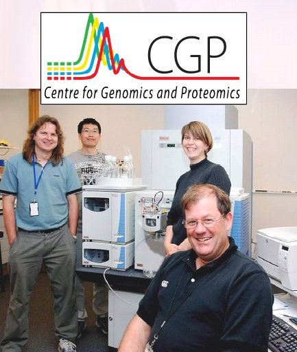

# The Proteomics Symposium 2007

- [Programme Details](http://www.sbs.auckland.ac.nz/services/proteomics/pdfs/Symposium_2007.pdf) 

`:AccessGRID Invitation`

;New Zealand Universities (with active AccessGRID nodes).:

`:AccessGRID nodes in New Zealand`

## Technical Information

`:AccessGRID Invitation`

Any available Access node can participate in the seminar.

Connect to the venue server:

>  [https://agvenue.karen.canterbury.ac.nz:9000/Venues/default](https://agvenue.karen.canterbury.ac.nz:9000/Venues/default)  

using **version 2.4** of AccessGRID

Choose the **NZ Institutions** lobby

and then the **BeSTGRID** Room

### Shared Whiteboard and Presentation Screen

In order to view the seminar whiteboard, you will be required to install

the "Shared Desktop" package in AccessGRID, together with RealVNC:

>  [http://www.westgrid.ca/collabvis/research-agshareddesktop.php](http://www.westgrid.ca/collabvis/research-agshareddesktop.php)

For further technical information, please contact: Paul Bonnington p.bonnington@auckland.ac.nz (BeSTGRID)
