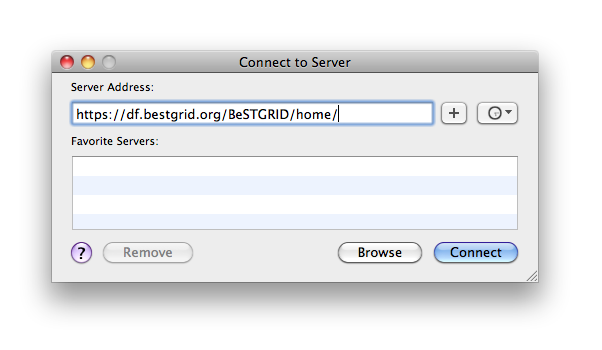
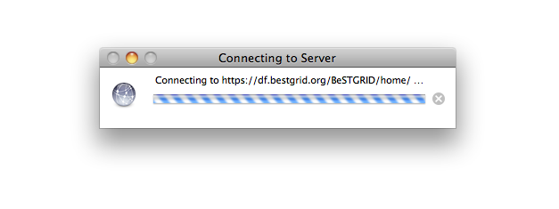
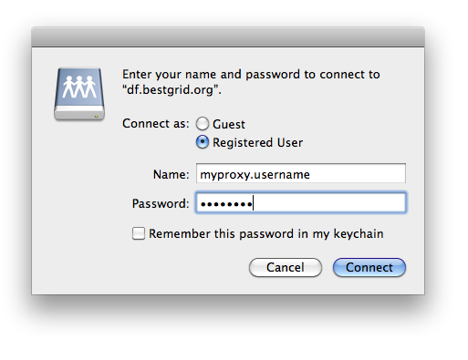
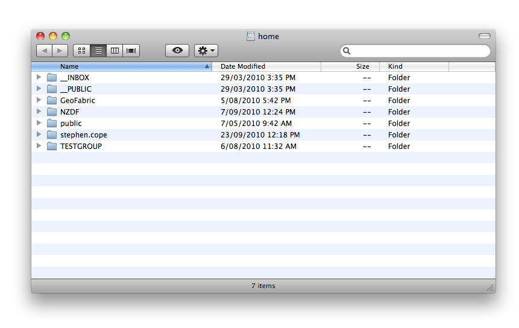
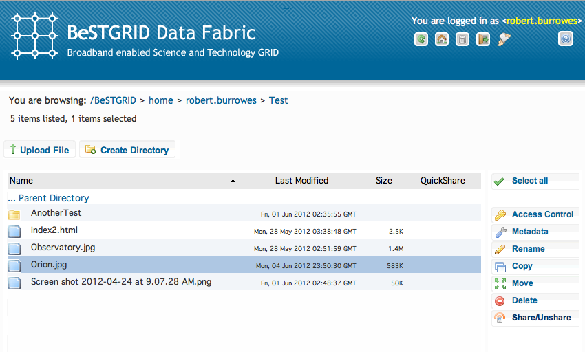
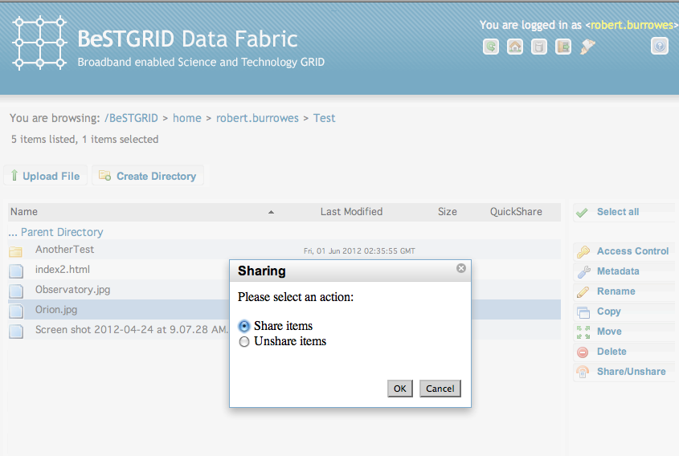
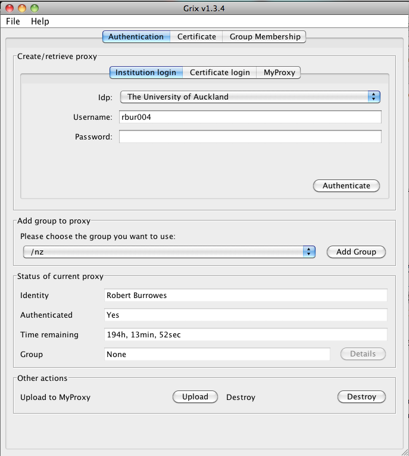
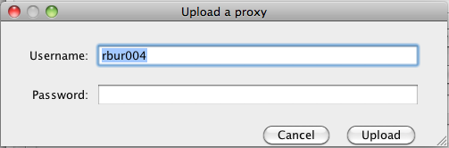

# Using the DataFabric

The BeSTGRID DataFabric can be accessed in several different ways - each may be suitable for a different type of users or for a different scenario.  This page provides a guide to the most common ways for accessing the DataFabric.

The primary means of accessing the DataFabric are:

- Browsing the DataFabric via a web browser

Suitable for casual users and for browsing existing collections
- Mounting the DataFabric as a filesystem via webDAV

Suitable for more involved users, for uploading larger collections of files, and for accessing the files on the DataFabric directly from applications.
- Accessing the DataFabric directly via the iRODS protocol with the iDrop GUI client

Suitable for users requiring a convenient GUI interface, requiring high performance transfers but not needing the convenience of connecting the DataFabric as a remote drive
- Accessing the DataFabric directly via the iRODS protocol with iCommands

For the most involved users, who need the most transfer performance they can get - or who need direct access to the iRODS advanced features (access control, metadata, ...)

For each of these scenarios, the exact use may still differ depending on the authentication mechanism used.  The sections below describe how to start using the DataFabric for each of these scenarios.

# File Permissions in the Data Fabric

The Data Fabric uses a system based on Access Control Lists (ACLs) to control what each user (or group of users) can do with each file or directory. These ACLs are a property of the storage system that is used to store the files in the Data Fabric (irods), and therefore they are independent of the method that is used to access the files ([web interface](#UsingtheDataFabric-WebBrowserandShibbolethLogin), [WebDAV](#UsingtheDataFabric-MountingDataFabricasadiskdrive), [iDrop](#UsingtheDataFabric-AccessingtheDataFabricwithiDrop), [icommands](#UsingtheDataFabric-AccessingDataFabricfromiRODS)). Modification of ACLs is possible with some of these access methods, but is unavailable with others. If the method you are using to access your files in the Data Fabric does not support ACL modification, use web access if you need to change permissions.

When you store a file or create a directory in the data fabric, you are the owner and have full control - you can read, write or delete it and, by default, no one else can. You can give access to other users or groups, either just read access, or read and write, or full ownership. You can only give (or remove) access to others if you own the file yourself. But if you give 'own' to someone else, they can also give (and remove) access to others.

If you are changing the access rights to a directory, then the access rights to the files in this directory will be changed. For example, you can give write access to a user or group so they can store files into one of your directories. As normally configured, all users can read all directories (i.e. see the names of files within these directories).

Directories also have an 'inherit permissions' attribute that can be unset or set. When directories have this attribute set, new files and subdirectories added to the directory inherit the access permissions (ACLs) of the parent directory. 

If you accidentally remove your own access from a file or directory you will not be able to read it, but you can restore access by changing the permissions to give yourself access again, because for the data fabric you are still the owner.

# Web Browser and Shibboleth Login

For users who do have a login at an institution that is part of Tuakiri, the New Zealand Access Federation, their Tuakiri login is the easiest way to access the DataFabric with a browser.

All New Zealand Universities and CRIs are members of Tuakiri.  Please see the [Tuakiri Subscriber List](https://tuakiri.ac.nz/confluence/display/Tuakiri/Subscriber+List) to see whether your instituion has completed the work of linking into Tuakiri.  Users not affiliated with a Tuakiri member institutions but collaborating on projects where the PI is affiliated with Tuakiri member institution can request an account at the Tuakiri VirtualHome IdP.  Please contact the Tuakiri support at `support at tuakiri.ac.nz` to request an account for your collaborators.

- To access the DataFabric, go to [http://df.bestgrid.org/BeSTGRID/home/](http://df.bestgrid.org/BeSTGRID/home/)
	
- When prompted, select your institution (you may make this setting permanent)
- When prompted, login with your institutional username and password
- Start accessing the DataFabric

# Web Browser and Grid Certificate

For users who do have a grid certificate, it may be the easiest to use their grid certificate as their identity on the DataFabric.  They would delegate their credential into the MyProxy server, protecting the copy of the certificate with a username and password, and then login to the DataFabric with the MyProxy username and password.

To delegate a certificate into MyProxy:

- Start [Grix](grid-tools.md#GridTools-Grix): [Grix Java WebStart](http://ngportal.canterbury.ac.nz/grid/grix-jdk5-bestgrid.jnlp)


>  **Select*Authentication** tab
>  **Select*Local X509 certificate**
>  **Select*Authentication** tab
>  **Select*Local X509 certificate**

- Enter your certificate passphrase


>  **Select a*Lifetime** for the delegated certificate - it's reasonable to choose 30 or 60 days, the certificate will have to be delegated again after this period of time.
>  **Click the*Authenticate** button, this will create a local proxy certificate.
>  **Click the*Upload** button and pick a username and password.  This will upload the certificate to MyProxy.
>  **Select a*Lifetime** for the delegated certificate - it's reasonable to choose 30 or 60 days, the certificate will have to be delegated again after this period of time.
>  **Click the*Authenticate** button, this will create a local proxy certificate.
>  **Click the*Upload** button and pick a username and password.  This will upload the certificate to MyProxy.

To access the DataFabric:

- Open [https://df.bestgrid.org/BeSTGRID/home/](https://df.bestgrid.org/BeSTGRID/home/) and authenticate with your MyProxy username and password

# Linking Shibboleth and Grid identities together

The DataFabric will automatically create an account for each user on the first access.  The account will be linked either with the **Distinguished Name** from the certificate or with the **SharedToken** received in the Shibboleth login.   

For users who have both a Grid certificate and a Shibboleth login, it may be useful to link their two identities together - instead of having two separate DataFabric (iRODS) accounts.  Please send a request to help@bestgrid.org to link your DataFabric account with a DN or a SharedToken from your other identity.

In the request, please include the following information:

1. The full DN included in your certificate - it is displayed on first page in Grix, and it can be also obtained with 

``` 
openssl x509 -subject -noout -in $HOME/.globus/usercert.pem
```
2. Your CN and SharedToken as provided by your IdP - ideally, include in the request the information you get at the [http://df.bestgrid.org/shared-token/](http://df.bestgrid.org/shared-token/)
3. Your iRODS username

# Accessing the DataFabric in anonymous mode

For parts of the DataFabric that have been made available to the `anonymous` user, it is possible to access them without a user account.

- Via Shibboleth: the DataFabric won't be requesting a Shibboleth login when directly accessing an anonymously accessible collection.  Go directly to the project URL - like 

``` 
http://df.bestgrid.org/BeSTGRID/home/<anonymous-project>
```
- Via https: the DataFabric will not be prompting you for a username + password, go directly to the project URL like 

``` 
https://df.bestgrid.org/BeSTGRID/home/<anonymous-project>
```

# Mounting DataFabric as a disk drive

The DataFabric comes with a webDAV interface, available at the same URL as the DataFabric web interface.  The webDAV interface can be mounted into most current operating systems and desktop environments (Windows, Mac, Linux, POSIX).  In most cases, the desktop environment already comes with built-in support for mounting a webDAV URL, but it may pay off to install additional tools - which can provide a more efficient and more reliable way of accessing the DataFabric.

In all of the scenarios (except for anonymous access, see below), one has to have a username and password to mount the DataFabric from the HTTPS URL, [https://df.bestgrid.org/BeSTGRID/home/](https://df.bestgrid.org/BeSTGRID/home/)

For users with a Tuakiri login, the easiest way is to set a password on their DataFabric account and then use the name of their DataFabric account and this password as the webDAV login.

- The DataFabric account name is shown in the top right corner of the web interface.
- The password can be set by clicking the "key" icon in the web interface, or directly at [https://df.bestgrid.org/dfpassword/](https://df.bestgrid.org/dfpassword/)

Users without a Tuakiri login who have been using the DataFabric with a grid certificate can request a password to be set on their account - please contact `help at bestgrid.org`.

Once the password is established, the users can also change the password at [https://df.bestgrid.org/dfchangepw/](https://df.bestgrid.org/dfchangepw/)

Note that in the past, users were asked to create a MyProxy login for use with webDAV.  This has been replaced by using the DataFabric account directly.  For more (historic) information on the MyProxy usernames, please see the [Creating a MyProxy login](#UsingtheDataFabric-CreatingaMyProxylogin) section below.

The actual instructions to mount the DataFabric vary across operating systems and desktop environments.  The most common cases are below.

## Anonymous access

When accessing a project that has been made **anonymously** accessible, and the intention is to only access the project with the permissions of the anonymous user (typically read-only), it is **not necessary** to get a username and password.  In that case, use the URL to the project home directory (example: [https://df.bestgrid.org/BeSTGRID/home/GeoFabric](https://df.bestgrid.org/BeSTGRID/home/GeoFabric)) and when prompted for a username and password, either leave it blank, or enter "irods\anonymous" as the username and anything as the password.  Otherwise proceed as documented below.

## Windows XP with default webDAV client

>  **From*My Network Places**, choose **Add a Network Place**

- Select "Choose another network location", click Next.
- Enter the following URL as the network address: [https://df.bestgrid.org/BeSTGRID/home/](https://df.bestgrid.org/BeSTGRID/home/)
- When prompted, enter your username and password


>  **Choose a name for the connection - e.g.,*BeSTGRID DataFabric**
>  **Choose a name for the connection - e.g.,*BeSTGRID DataFabric**

- Click Finish

>  **Please note that while this is the easiest solution to get going, the Windows XP*built-in webDAV client has severe limitations**, in particular with files larger than 2GB (it cannot read a directory if it contains a file larger than 2GB).  We strongly recommend using one of the [alternative solutions](#UsingtheDataFabric-Windows-alternativesolutions), in particular [BitKinex](http://www.bitkinex.com/)

## Windows - alternative solutions

On Windows Vista, it is necessary to use external tools for mounting a webDAV URL - and Windows XP users may also get additional performance.

The tools available are [NetDrive](http://www.netdrive.net/), [WebDrive](http://www.webdrive.com/products/webdrive/), and [BitKinex](http://www.bitkinex.com/). Read a brief comparison and review of these clients [here](/wiki/spaces/BeSTGRID/pages/3818228988), note that only BitKinex has shown to reliably transfer files greater than 2GB in size.

### Using BitKinex

BitKinex is the recommended alternative client, a complete procedure for getting started with the Data Fabric using the BitKinex client is described in the [Accessing the Data Fabric with Grix and BitKinex](accessing-the-data-fabric-with-grix-and-bitkinex.md) and [WebDAV using BitKinex](/wiki/spaces/BeSTGRID/pages/3818228414) pages.

**NOTE:** Some of the alternative clients do not work with files or directories with special characters. Use only letters, numbers, spaces, dashes, underscores, and periods in file and directory names.

**NOTE:** For Windows 7, there is Microsoft patch available to make WebDAV native support working: [http://help.wildapricot.com/display/DOC/Setting+Up+WebDAV+in+Windows+7](http://help.wildapricot.com/display/DOC/Setting+Up+WebDAV+in+Windows+7)

## Mac - using Finder

Finder is a WebDAV client that is bundled with the operating system.  To connect:





- In the Finder menu, find "Go", then select "Connect to Server" (or press Cmd-K).
- In Server Address, type in:

``` 
https://df.bestgrid.org/BeSTGRID/home/
```
- Click on "+" to save this URL as a connection favorite.
- Click on connect and enter the username and password when prompted.

- Note

Mac Finder would by default create a `.DS_Store` file in each directory it visits.  To avoid polluting the DataFabric, it is **important** that you **disable** the **.DS_Store creation**

The following will disable this function for all network connections: SMB/CIFS, AFP, NFS, and WebDAV.

- Open Terminal and run there the following command: 

``` 
defaults write com.apple.desktopservices DSDontWriteNetworkStores true
```

- Note

Inspector application that displays file information when requested from the Finder has a bug that prevents it displaying correct on-disk size for WebDAV directories. Even though the total directory size is reported correctly, Size on Disk returns very high values, unrelated to the actual folder size. This bug is known to the Apple developers. If more exact information is required, a du command can be used from the command line:
- Open Temrinal
- type the command: 

``` 
du -k /Volumes/home/
```

The result would be the list of directories in the BeSTGRID home directory with their sizes and the total amount taken by the directories.

## Linux and POSIX systems with KDE - Konqueror

In KDE, you can use the webDAV client built into Konqueror: 

- Open up a Konqueror window, and type in:

``` 
webdavs://df.bestgrid.org/BeSTGRID/home/
```
- When prompted, enter the username and password

## Linux and POSIX systems with Gnome - Nautilus

In Gnome, you can use the webDAV client built into Gnome/Nautilus:

>  **Select*Connect to Server** (either from the File menu in any Nautilus window, or from the Places menu in the top status bar)

- In the Connect to Server dialog box, fill in the following details:


>  Service type: Secure WebDAV (HTTPS)
>  Host: df.bestgrid.org
>  Port: (leave empty)
>  Folder: BeSTGRID
>  Service type: Secure WebDAV (HTTPS)
>  Host: df.bestgrid.org
>  Port: (leave empty)
>  Folder: BeSTGRID

- Leave the username blank - enter it later when prompted
- Select to Add a bookmark and choose a bookmark name.
- Click Connect
- When prompted, enter your username and password.

## Linux and POSIX systems - DavFS

Alternatively, one can install [DavFS](http://www.sfu.ca/itservices/linux/webdav-linux.html), a standalone client library for webDAV.

- Install Davfs


>  yum install davfs2
>  yum install davfs2

- Configure davfs NOT to use file locking (not implemented by the DataFabric)
	
- Add these lines to `/etc/davfs2/davfs2.conf`

``` 

# ARCS Specific Options
# ---------------------
use_locks         0
drop_weak_etags   1

```

- Mount the DataFabric with (run this as `root`):


>  mount -t davfs [https://df.bestgrid.org/BeSTGRID/](https://df.bestgrid.org/BeSTGRID/) /mnt
>  mount -t davfs [https://df.bestgrid.org/BeSTGRID/](https://df.bestgrid.org/BeSTGRID/) /mnt

- To mount the filesystem as accessible by your local account, modify the command to:


>  mount -t davfs -o uid=*username*,gid=*groupname* [https://df.bestgrid.org/BeSTGRID](https://df.bestgrid.org/BeSTGRID) /mnt
>  mount -t davfs -o uid=*username*,gid=*groupname* [https://df.bestgrid.org/BeSTGRID](https://df.bestgrid.org/BeSTGRID) /mnt

# Accessing the DataFabric with iDrop

iDrop is a GUI tool for accessing the DataFabric directly via the iRods interface.  iDrop provides better performance then the webDAV interface and is suitable for users who need to get better performance on transfering large files but can forgo the convience of connecting the DataFabric as a remote drive.

iDrop is a Java application that launches via a JavaWebStart link.  You need to have Java 1.6 or higher installed - after that, you can just click on the webstart link to start iDrop for the first time.  This should install an icon on your desktop - next time, you can use either this icon or the original link to start iDrop (and still get any updates released to the web application).

To start iDrop, click this link: [http://iren-web.renci.org/idrop-release/idrop.jnlp](http://iren-web.renci.org/idrop-release/idrop.jnlp)

## Notice: Java security setttings

Due to how Sun/Oracle Java is imposing tight security restrictions, iDrop might fail to start with the error message saying: 

``` 
Application Blocked by Security Settings
```

This can be solved by explicitly adding an exception in the Java Control panel allowing iDrop to run even though it is a self-signed application.

The exact sequence of steps would depend on the exact platform (Operating System and Java vendors and versions), but this sequence of steps should work as the rough guideline:

1. Open the Java Control Panel
	
- On Windows, this would be under the Windows Control Panel
- On Mac and Linux, the Java Control Panel can be either found in a similar location, or can be launched by running this command in the terminal: 

``` 
javaws -viewer
```
2. Select Security tab
3. Click Edit Site List
4. Click Add
5. Enter the URL for iDrop JNLP: [http://iren-web.renci.org/idrop-release/idrop.jnlp](http://iren-web.renci.org/idrop-release/idrop.jnlp)
	
- Acknowledge the warning - click Continue (unfortunately, this website is not running HTTPS)
6. Click OK to close the Edit Site List window.
7. Click OK to close the Control Panel entry.

After adding this exception, Java should be happy willing to run iDrop (still giving a warning about possibly security implications). |

To connect to the DataFabric:

- [Setup a password](#UsingtheDataFabric-UsingtheDataFabricwithaniRODSusernameandpassword) for your DataFabric account at [https://df.bestgrid.org/dfpassword/](https://df.bestgrid.org/dfpassword/)
- In iDrop, enter the following information (select the `Advanced Login Settings` to get all entries displayed):


|  Value for Otago DF site  |                                |                              |                      |
| ------------------------- | ------------------------------ | ---------------------------- | -------------------- |
|  Host                     |  df.bestgrid.org               |  irods.ceres.auckland.ac.nz  |  df.uoo.nesi.org.nz  |
|  Port                     |  1247 (default)                |  1247 (default)              |  1247 (default)      |
|  Zone                     |  BeSTGRID                      |  BeSTGRID                    |  BeSTGRID            |
|  Resource                 |  df.bluefern.canterbury.ac.nz  |  irods.ceres.auckland.ac.nz  |  df.uoo.nesi.org.nz  |
|  Username                 |  `your DF username`            |  `your DF username`          |  `your DF username`  |
|  Password                 |  `your DF password`            |  `your DF password`          |  `your DF password`  |

- For more information, please see the iDrop website at [https://code.renci.org/gf/project/irodsidrop/](https://code.renci.org/gf/project/irodsidrop/)

# Sharing files with external collaborators

Individual files can be shared with external collaborators using private URL's, using the web interface with specially generated web links. 

e.g. 

[https://df.bestgrid.org/quickshare/8a1f788d49cb394/Orion.jpg](https://df.bestgrid.org/quickshare/8a1f788d49cb394/Orion.jpg)  

is a link to a file in my data fabric home directories Test folder, created through the web interface using the "Share/Unshare" option.

- **Select the file to share, and click on "Share/Unshare" on the right hand menu.**


- **Click "Ok" in the dialog box.**


- **Note the quick link URL is now on the end of the selected row. Copy this link, and send it to the person you want to share the file with.**


# Creating a MyProxy login

Because webDAV cannot handle a Shibboleth login, users who use a Shibboleth login on the web interface need to get a MyProxy username and password to access the webDAV interface.

To create a MyProxy login from a Shibboleth login, one needs to get a SLCS certificate based on the Shibboleth login, upload the certificate into MyProxy (choosing a username and password) and then login with the MyProxy username and password.

Unfortunately, this has to be repeated at least every 10 days - the lifetime of the SLCS certificates.

To get a SLCS certificate and delegate it into MyProxy:

- Start [Grix](grid-tools.md#GridTools-Grix): [Grix Java WebStart](http://www.bestgrid.org/grix)


>  **Select*Authentication** tab
>  **Select*Institution login**
>  **Select your institution in the*IdP** list
>  **Select*Authentication** tab
>  **Select*Institution login**
>  **Select your institution in the*IdP** list

- Enter your institutional username and password


>  **Click the*Authenticate** button, this will create a local proxy certificate.
>  **Click the*Authenticate** button, this will create a local proxy certificate.


- This will fill in the Identity, Authenticated, Time remaining and Group fields in the bottom half of the window.

>  **Click the*Upload** button and you will get this window.


- Enter a username and a password in this window, and click Upload (these can be any username and a made up password just for using with Webdav).

- You can now use Webdav to login to the DF with the username and password you entered in the last window.

[Using_the_DataFabric#Windows_XP_with_default_webDAV_client](using-the-datafabric.md)

A Better Windows client, which works with files bigger than 2G [WebDAV_using_BitKinex](webdav-using-bitkinex.md)

[Using_the_DataFabric#Mac_-_using_Finder](using-the-datafabric.md)

This process will not work through a HTTP proxy.

- Using the web interface with the MyProxy credentials, go to (Note the https , or you will go to the Shibboleth login):
	
- [https://df.bestgrid.org/BeSTGRID/home](https://df.bestgrid.org/BeSTGRID/home)
- Enter your user name as "myproxy\" followed by the name you have selected when uploading the MyProxy certificate
- And enter the password you've selected.

# Accessing DataFabric from iRODS

This is an option suitable for users who need the highest performance and data throughput available, and is only available on Linux and POSIX systems.

This option may give users access to find-grained iRODS features not available via the web interface (detailed access control, metadata access,...)

- Install iCommands (the client part of iRODS) on your system.
	
- This is the same as installing iRODS, without compiling the server.
- Install the same version as the one installed on the BeSTGRID DataFabric (iRODS 2.3 at the time of writing)
- You will need to compile iRODS with GSI support, and you will need Globus (and it's development libraries / SDK) for that.
		
- Either install Globus from VDT as recommended in the ARCS manual
- Or install Globus from source code TODO: link ngdata iRODS


For more information:

- See the [iRODS iCommands documentation](https://www.irods.org/index.php/icommands)
- Walk through the [iRODS tutorial](https://www.irods.org/index.php/Tutorial)

# Accessing DataFabric with iRODS FUSE

An alternative to mounting the DataFabric is to use iRODS FUSE (file system in user space) module.  See the [iRODS FUSE](https://www.irods.org/index.php/iRODS_FUSE) page for more information.

# Using the DataFabric with an iRODS username and password

It is possible to set a password directly associated with a DataFabric (iRODS) account.  Doing so is necessary for using clients like iDrop that talk directly to the iRODS server.  And having an iRODS password is also an alternative to setting up a MyProxy login to use the DataFabric with a username and password (which has been necessary to access it via webDAV).

- For users who can access the DataFabric with a Shibboleth login: go to [https://df.bestgrid.org/dfpassword/](https://df.bestgrid.org/dfpassword/)
- For others: request a password to be set for you by contacting help@bestgrid.org.  You will then be asked to change your password at [https://df.bestgrid.org/dfchangepw/](https://df.bestgrid.org/dfchangepw/)

After you have your password set, you can:

- Authenticate with your username and password directly in clients that talk directly to iRODS (e.g., iDrop)


>  **Authenticate to Davis via web (HTTPS) and webDAV by entering your "irods*your.account.name**" as your username and providing your iRODS password you've just set.
>  **Authenticate to Davis via web (HTTPS) and webDAV by entering your "irods*your.account.name**" as your username and providing your iRODS password you've just set.

# Using the DataFabric with Globus and Tuakiri Single Sign On

The Data Fabric can be accessed from the [Globus](https://www.globus.org/) (formerly Globus Online) online file transfer service. Globus offers Single Sign On to the Data Fabric for holders of an account in the Tuakiri Access Federation. 

Documentation on how to use the Globus service can be found on the [Globus support website](https://support.globus.org/entries/23583857-Sign-Up-and-Transfer-Files-with-Globus-Online).

To make use of the Tuakiri Single Sign On, click 'Log In' on the Globus page, then 'alternate login', choose 'Tuakiri', then log in with your home institution. After a successful login, go to the 'Transfer Data' page. There, enter the name of the Data Fabric node you wish to connect to into one of the 'Endpoint' boxes. The available nodes are:

|  Location                    |  Endpoint Name           |
| ---------------------------- | ------------------------ |
|  The University of Auckland  |  `nesi#df_auckland`      |
|  University of Canterbury    |  `nesi#df_christchurch`  |
|  University of Otago         |  `nesi#df_otago`         |
