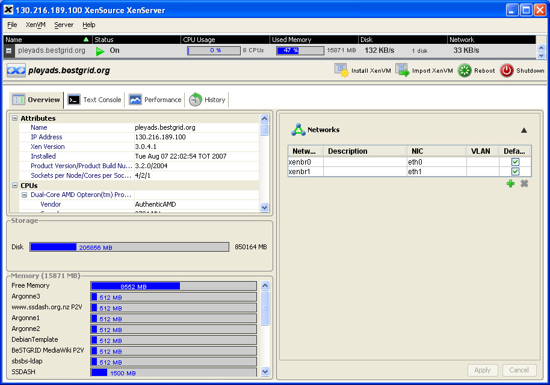

# Virtualisation with XenServer Enterprise

# The virtualization imperative 

**Virtualization** is the compelling TCO advantages of hosting multiple virtual servers on a single physical machine come not only from savings in computing infrastructure costs, but also from reduced management overhead, lower power consumption, lower deployment costs, even lower real estate costs.

But virtualization has now become an economic imperative for other, equally important reasons:

- Flexible IT infrastructure: the ability to instantly provision new pre-packaged virtual servers onto a virtualized infrastructure gets new applications up and running in the data center in minutes, as opposed to weeks or months
- Improved business continuity: being able to quickly move virtual servers from one machine to another, or more readily restart a failed server, dramatically improves resilience to failures.

Today, fewer than 10% of servers are virtualized. The potential benefits resulting from a fully-virtualized infrastructure are enormous. Yet businesses today have little choice when it comes to virtualization infrastructure software. Today's offerings are constrained by poor performance, are too expensive to use widely, and lock customers into a proprietary software stack that limits integration with data center infrastructure and existing management tools.

# About Xen 

Xen provides fast and secure virtualization that allows multiple operating system instances to run as **Xen Virtual Machines** or **XenVMs** on a single physical x86 computer. Xen supports modified guest operating systems using a technique known as paravirtualization, which requires modifying the operating system to run on Xen, but offers near-native performance. Paravirtualized operating systems "know" that they are virtualized. Xen also supports unmodified operating systems using new processor extensions from Intel (VT) and AMD (AMD-V).

Xen is exceptionally lean, which leads to extremely low overhead and near-native performance for XenVMs. Xen re-uses existing Linux device drivers for Linux XenVMs, and uses special paravirtualized device drivers for network and disk I/O for Windows XenVMs, making device management easy. Moreover, Xen is robust in the event of device driver failure and protects guests as well as the hypervisor from faulty or malicious drivers.

Xen provides superb resource partitioning for CPU, memory, and block and network I/O. This resource protection model leads to improved security because XenVMs and drivers are DoS-proof. Xen is fully open to scrutiny by the security community and its security is continuously tested. Xen is also the foundation for a Multi-Level Secure System architecture being developed by XenSource, IBM and Intel.

= About XenServer = 

The XenServer product family offers a bundled virtualization platform, resulting in increased server utilization, IT cost reduction and improved operational agility. XenServer contains all you need to quickly and easily set up a virtualized Xen environment:

- the Xen hypervisor
- installers for both the XenServer Host and for the Administrator Console
- a tool for creating Linux XenVMs by converting existing physical installations of supported Linux distributions (P2V)
- support for installation of Windows Server 2000 SP4, Windows XP SP2, Windows Server 2003, Red Hat Enterprise Linux 5, and SUSE Linux Enterprise Server 10 XenVMs from installation CDs
- support for installation of Red Hat Enterprise Linux 4.1-4.4 XenVMs from vendor media stored on a network repository
- support for installation of XenVMs using a Debian Sarge Template

The XenServer Host is managed from a remote computer via the Administrator Console, a Java client application. From the Administrator Console you can manage the XenServer Host and deploy, manage, and monitor XenVMs.

**ADMINISTRATOR CONSOLE OVERVIEW **

The Administrator Console is a Java application that connects to and controls XenServer Hosts and the XenVMs running on them. Administrator can install new XenVM, uninstall any existing XenVM, reboot or shutdown XenServer.

Using the Administrator Console it's possible also to monitor a performance of XenServer Host at all. The Performance tab displays graphs of CPU usage, memory usage, disk rate, and network rate for the selected XenServer Host or XenVM. This performance data is not persistent beyond the 15-minute window displayed. By default it is docked in the tab, but can be undocked and floated freely if desired.

In the upper pane of the Administrator Console, the following information is displayed for the XenServer Hosts and XenVMs when they have been installed:

- The name of each XenServer Host and XenVM
- The Status (On, Off, Paused, Installing, Initializing, Starting, Stopping, Suspending, Suspended, Disconnected) of each
- An indicator (a red exclamation point) that shows when an unmodified XenVM is running without paravirtualized device drivers
- CPU Usage meter that displays the current CPU usage (for the XenServer Host) or virtual CPU usage (for a XenVM), and number of CPUs
- Used Memory percentage meter
- Disk KB/s showing the disk I/O rate in KB per second and the number of disks (for the XenServer Host) or virtual disks (for a XenVM)
- Network KB/s showing the network I/O rate in KB per second

The lower pane holds the tabbed panels. The information displayed in the various tabs corresponds to the XenServer

Host or XenVM that is currently selected in the upper pane.

The Text Console tab shows text console output of the selected XenServer Host or Linux XenVM (if it is On). No Text Console tab is displayed for a Windows XenVM. Like the Graphical Console, by default it is docked in the tab, but can be undocked and floated freely if desired.

# Physical to Virtual Conversion (P2V) 

Physical to Virtual Conversion (P2V) is the process by which an existing operating system on a physical server — its filesystem, configuration, etc. — is cast into a virtualized instance of the same operating system and filesystem, transferred, instantiated, and started as a XenVM on the XenServer Host.

For existing physical instances of Linux servers, this is accomplished by booting from the XenServer installation CD and choosing the P2V option. The filesystem is copied across the network via ssh onto a logical volume of the XenServer Host, or onto an NFS Server, and can then be instantiated as a XenVM. This conversion is applicable for existing XenVM with operattion system, which have been installed from vendor media and currently are not supported by XenSource P2V Tools, i.e. **CentOS 4.4**.

During the installation of an operating system by this method, Xen will use traditional device emulation to present a standard IDE controller and a standard network card to the Xen Virtual Machine. This allows the operating system to complete its installation using built-in drivers, but with reduced performance due to the overhead inherent in emulation of the drivers. After the operating system is installed, you paravirtualize it by running a script from the PV Tools or by P2V convertion, an ISO that is available to the virtual CD-ROM drive of the XenVM. This replaces the emulated devices and provides high-speed transport between the operating system and the XenServer product family software.

While not strictly required, performance of the XenVM is far better when paravirtualized, and it is the only supported configuration.

= Resources = 

XenServer 3.2.0 User Guide has been used for this article.
