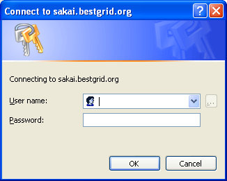
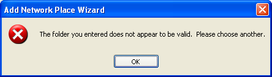
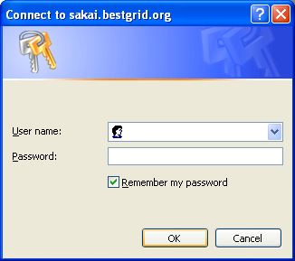
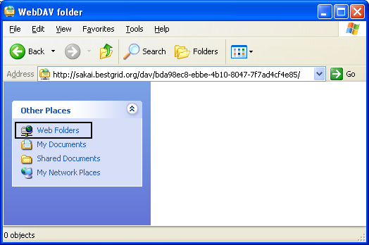
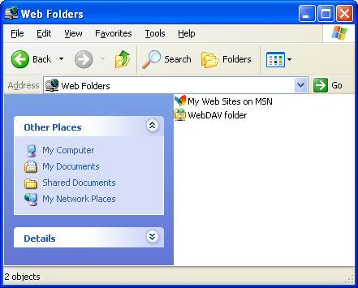
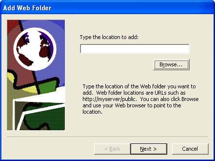

# WebDAV Folder in Windows

When accessing [Sakai](category-sakai.md) via WebDav, there is a problem with creating WebDAV folder in Windows XP for using **Upload-Download Multiple Resources**. Currently the reason of this problem is unknown. We can suggest two solutions how to skip this problem. When we have better solution of know the reason of this problem we will change this page.

## The first solution

When user attempts to create a WebDAV folder according description of the process on Sakai's page **Upload-Download Multiple Resources** than he can't pass paragraph 8. Windows displays at this point a window "Connect to sakai.bestgrid.org" and asks for user name and password in Sakai but doesn't allow go further.  

The suggestion is at this point click "Cancel" button and then click "Ok" button in a window with a message "The folder you've entered does not appear to be valid. Please choose another." 

In the window "Add Network Place Wizard" click "next" button again. A window "Connect to sakai.bestgrid.org" will appear again but in this case it consists a check box **"Remember my password"**. This is a distinguishing field from previous appearance of "Connect to..." window. 

In this window an additional text might be at the top in Windows XP Professional environment. 

Enter user name and password of Sakai and process goes to paragraph 9 of **Upload-Download Multiple Resources** description.

## The second solution

If there is at least one WebDAV folder created on user computer, he can use another procedure to skip the WebDAV problem.

- Open "My Network Places" and enter into any Web Folder.

>  **On the left side of the window in a group "Other places" new entry will appear:*Web Folders**
>  **On the left side of the window in a group "Other places" new entry will appear:*Web Folders**

Click on this entry and in the window a list of existing web folders will be displayed.

Right click on white background and choose **New/Web Folder**. A new window "Add Web Folder will be opened. Enter a link to your WebDav folder into a textbox and click "Next", enter the name of WebDAV folder and click "Finish". Later when you will get access to this new folder, user will be asked for his user name and password of Sakai Server.

