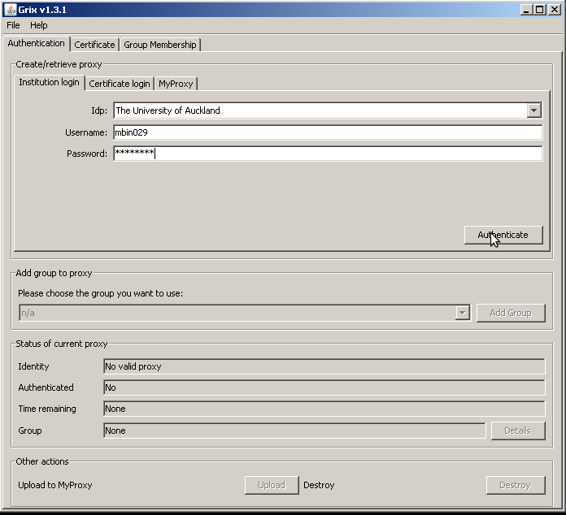
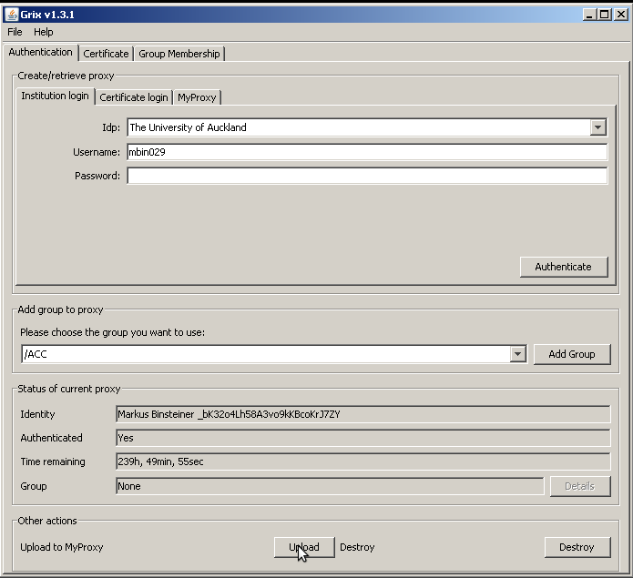
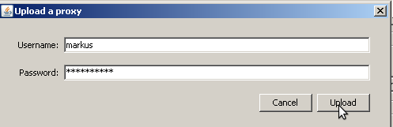
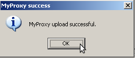
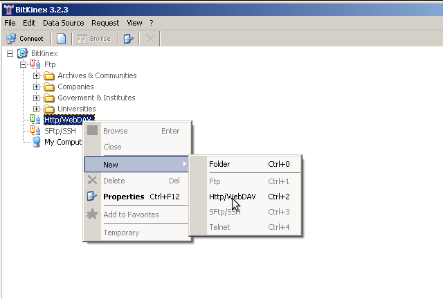
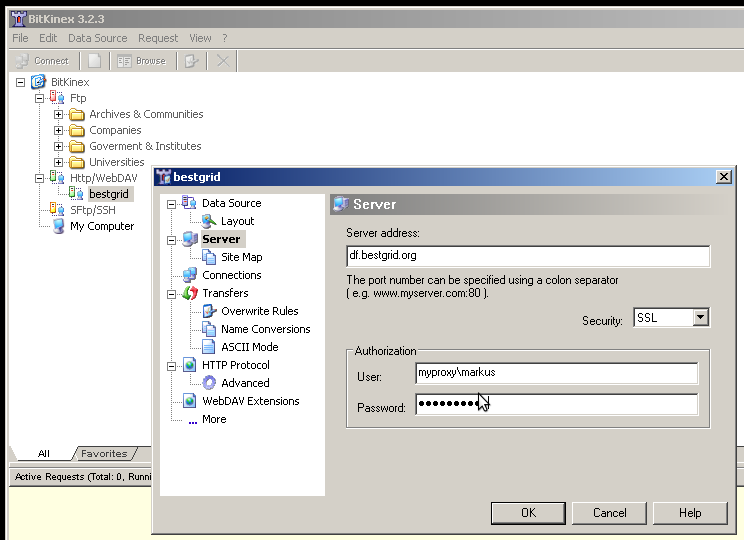
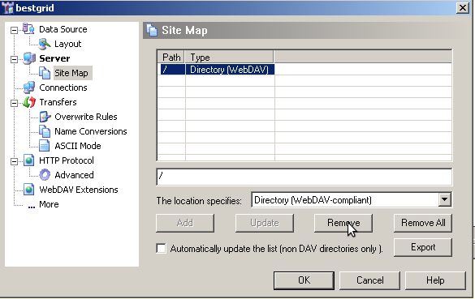
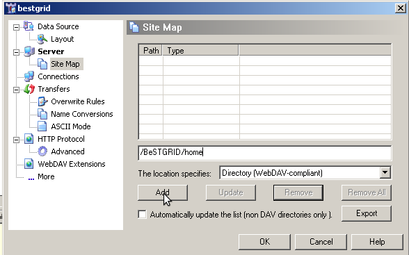
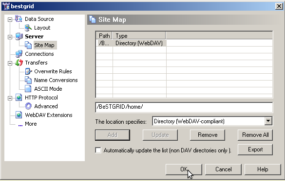
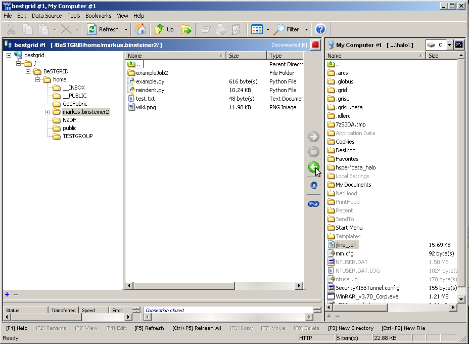

# WebDAV using BitKinex

This site contains instructions on how to install BitKinex on Windows and connect to the BeSTGRID datafabric.

BitKinex is a WebDAV client that supports large files and has good performance.

Walkthrough:

*To anonymously access the Christchurch Earthquake Data __skip*_ authentication and jump to installation and use `df.bestgrid.org/BeSTGRID/home/NZDF/CHCHEarthquake220211` as your server address._

**First, we need to do the authentication part:**

If your institution is not member of our shibboleth federation, you might need to apply for an account at the ARCS IdP (applicable esp. for earthquake response people). Go to:

[https://idp.arcs.org.au/idp_reg/](https://idp.arcs.org.au/idp_reg/)

Create an account and tell us or drop us an email (m.binsteiner@auckland.ac.nz) so we can fast-track your account approval.

Remeber the username and password, you'll need it in the next step.

Start Grix (a java webstart application – you need to have java installed):

- click: [http://ngportal.canterbury.ac.nz/grid/grix-jdk5-bestgrid.jnlp](http://ngportal.canterbury.ac.nz/grid/grix-jdk5-bestgrid.jnlp)
- Select "Authentication" tab
- Select "Institution login" tab
- Select your institution (or "ARCS IdP" if you have applied for an account there)
- Enter your institution (or "ARCS IdP") username
- Enter your institution (or "ARCS IdP") password
- Click the Authenticate button, this will create a local proxy certificate.

- Click the Upload button and pick a username and password of your liking (your username might already be taken, also, the application checks whether the password is reasonably secure so you might need to add a digit or two...). This will upload the certificate to MyProxy. Remeber this myproxy username and password because you'll need it in the next part.

**Now we install a WebDAV client application and connect it to the BeSTGRID data fabric:**

- Go to [http://www.bitkinex.com/](http://www.bitkinex.com/)
- Download [http://www.bitkinex.com/ftp/client/bitkinex323.exe](http://www.bitkinex.com/ftp/client/bitkinex323.exe)
- Install
- Start bitkinex
- Click through settings (defaults should be fine, unless you have a HTTP proxy)
- Right-click "Http/WebDAV"
- Select "New" -> "Http/WebDAV"

- Give it a name (e.g. "bestgrid")
- Enter server address: df.bestgrid.org
- Check security: "SSL"

>  **Username: myproxy*your myproxy username**
>  **Password:*your myproxy password**
>  **Username: myproxy*your myproxy username**
>  **Password:*your myproxy password**

- on the left, click "Site Map", check the entry called "/" and click remove

- in the textbox, enter: /BeSTGRID/home and click the "Add" button, then click "Ok"

To connect to the fileshare, double click the new entry (bestgrid).

Now copy files from/to the datafabric by selecting the source files and the target folder and clicking one of the green arrow button.

If you have problems, please don't hesitate to contact us directly:

Gene Soudlenkov:

email: g.soudlenkov@auckland.ac.nz

Markus Binsteiner:

email: m.binsteiner@auckland.ac.nz

skype: markus.binsteiner

jabber: makkus@gmail.com
